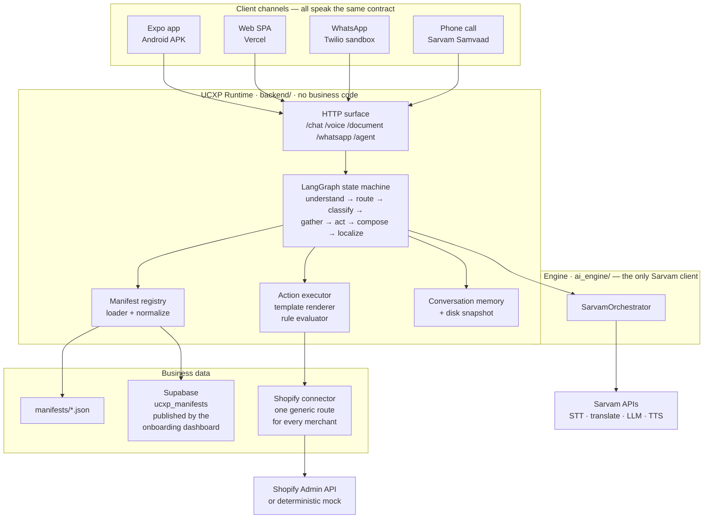
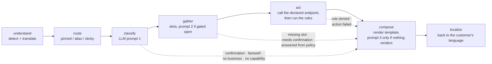
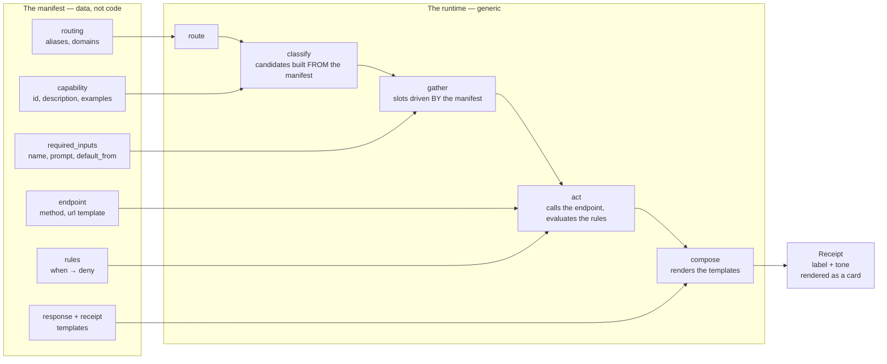

# Sahayak — a UCXP runtime

**UCXP is a protocol for customer resolution. This repository is a runtime that speaks it and contains zero business-specific code.**

Adding a business means adding one JSON manifest. It does not mean editing the
runtime, adding a branch, registering a handler, or deploying code. That claim is
the point of the project, so it is built to be checked rather than believed —
two `grep`s and two `curl`s, in §2.

| Surface | Where |
|---|---|
| Web app (live) | <https://sahayak-ucxp.vercel.app> |
| Android | release APK, built from the same Expo codebase |
| WhatsApp | Twilio sandbox → `POST /whatsapp/webhook` |
| Voice call | Sarvam Samvaad agent → `POST /agent/execute` |
| Deck | [Canva](https://canva.link/bcgrk9wfxtp9qw6) |
| Demo | [Google Drive](https://drive.google.com/file/d/1dSaY8hZvnzxXDwqozSHYTDSjnnU0nqdM/view) |

https://github.com/user-attachments/assets/ce71b48b-8d3c-4edc-8088-5113533392cf

https://github.com/user-attachments/assets/ede17ab2-73b6-46e2-9e45-6e043a5b5059

---

## Documentation

This README is the overview. The detail lives in [`docs/`](./docs/).

| Document | Covers |
|---|---|
| [**architecture.md**](./docs/architecture.md) | Context and container views, the layering rules as a dependency graph, component map, deployment topology, cross-cutting invariants, known debt |
| [**request-lifecycle.md**](./docs/request-lifecycle.md) | The LangGraph turn in depth — state diagram, every short-circuit, the three prompts and their gates, four sequence diagrams, failure semantics |
| [**manifest-spec.md**](./docs/manifest-spec.md) | Both manifest schemas, the complete `normalize.py` mapping table, template and rule grammar, the load path, what the published schema cannot express |
| [**channels.md**](./docs/channels.md) | The four clients compared, per-channel sequence diagrams, the WhatsApp 10 s constraint, the Samvaad tools, the business-pinning rule |
| [**data-and-memory.md**](./docs/data-and-memory.md) | The three memory layers, how a mid-flow confirmation survives a restart, fact propagation, the Supabase schema, known gaps |
| [**operations.md**](./docs/operations.md) | Local dev, Docker, Railway (including the `UCXP_PORT` loopback trap), Vercel, the APK, env vars, health checks, a symptom → cause → fix table |
| [**decisions.md**](./docs/decisions.md) | The engineering decision log as prose, grouped by theme, each with context → decision → trade-off |
| [**manifest-sync.md**](./docs/manifest-sync.md) | The dashboard ↔ runtime publishing contract |
| [**frontend/README.md**](./frontend/README.md) | The client: screen map, API layer, state, scoping rule, platform differences, build |
| [**PLAN.md**](./PLAN.md) | The append-only source of truth — scope, contracts, status board, the raw 50-row decision log |

---

## 1. The thesis

Everyone building AI customer support today builds a bot per company. The
company's policies, endpoints and edge cases end up inside the assistant. That
does not compose: the second company needs a second bot.

UCXP inverts it. A business publishes a **manifest** — a JSON document declaring
its capabilities, the inputs each one needs, the endpoint each one calls, the
rules that can block it, and the receipt the customer gets back. Any compliant
runtime can then serve that business without knowing it exists.

So the interesting engineering is not "we called an LLM". It is a **generic
reasoning graph** whose candidate set, slots, rules, templates and receipts are
all read out of a document at request time — and the discipline to keep it
generic while five real Shopify merchants, four client channels and a live phone
call all run through it.

**A job is only done when a receipt comes back.** A reply that explains a policy
and stops is a failure mode this system is designed against: on the voice-agent
path, `done` is literally `receipt is not None`.

---

## 2. Verify the claim

Two directional rules make this a protocol rather than an app
([details](./docs/architecture.md#4-the-layering-rules-as-a-dependency-graph)):

1. **Only `ai_engine/` talks to Sarvam.** The runtime imports
   `SarvamOrchestrator` and calls methods on it — never a model name, an HTTP
   client, a retry, or a key.
2. **Nothing in the runtime knows a business exists.** Business behaviour enters
   only through `manifests/*.json`.

```bash
# Rule 2 — no business name anywhere in the runtime.
grep -rniE "flipkart|airtel|apollo|ravi|lakshmi|meena|sri-pharma|anna-groceries" \
     backend/app/runtime/
# → no matches

# Rule 1 — no Sarvam wire access, model constant, or credential outside ai_engine/.
grep -rn "api\.sarvam\.ai\|SARVAM_API_KEY\|saarika\|bulbul\|sarvam-translate\|SARVAM_LLM_MODEL" \
     backend/
# → no matches
```

Then ask the runtime itself:

```bash
BASE=https://sahayak-ucxp-sarvam-production.up.railway.app
curl -s $BASE/businesses                    # the directory, comprehended from manifests
curl -s $BASE/manifests/ravi-electronics    # the document that produced it
```

`GET /businesses` has no list in it. It is a comprehension over whatever
manifests loaded.

---

## 3. System



The runtime and the AI Engine **deploy as one image and talk in-process** — they
share a lifecycle, and a network hop on the hottest path would buy nothing. Every
channel converges on the same `UcxpRuntime.run()`, which is why a photographed
order over WhatsApp and a typed message in the app produce the same receipt.

Full context, container, component and deployment views:
[`docs/architecture.md`](./docs/architecture.md).

---

## 4. One turn



The dotted edges are the point. A naive implementation calls the model three
times per turn. This one calls it **zero** times for a confirmation, a goodbye,
or a message with no business resolved; **once** for a normal completed job; and
three times only when a slot is missing *and* nothing renders.

Live, measured today:

```bash
curl -s -X POST $BASE/chat -H 'content-type: application/json' \
  -d '{"text":"where is my order 1001","business_id":"ravi-electronics"}'
```

```json
{"conversation_id":"e8a42f…","reply_text":"Your request is shipped, arriving Wednesday, 29 July.",
 "business_id":"ravi-electronics","capability":"track_order",
 "receipt":{"label":"shipped","tone":"success"},
 "needs":null,"state":"resolved","language":"en-IN","degraded":[],"latency_ms":13343.19}
```

The same capability through the Sarvam-free voice path returns the same receipt
in **0.40 s**.

State diagram, every short-circuit, and four detailed sequence diagrams:
[`docs/request-lifecycle.md`](./docs/request-lifecycle.md).

---

## 5. The manifest



```jsonc
{
  "ucxp_version": "0.1",
  "business":  { "id": "…", "name": "…", "category": "…", "languages": ["en-IN", "hi-IN"] },
  "routing":   { "aliases": ["…"], "domains": ["order", "refund"] },
  "capabilities": [{
    "id": "track_order",
    "description": "Find where a customer's order is and when it arrives.",
    "examples": ["where is my order", "मेरा ऑर्डर कहाँ है"],
    "required_inputs": [{ "name": "order_id", "type": "string",
                          "prompt": "What's your order ID?",
                          "default_from": "context.last_order_id" }],
    "rules":    [{ "id": "refund_window", "when": "result.days_since_delivery > 7",
                   "deny": "Refunds are only available within 7 days of delivery." }],
    "confirm":  false,
    "action":   "get_order_status",
    "response": "Your order {{order_id}} is {{result.status}} and arrives {{result.eta}}.",
    "receipt":  { "label": "Arriving {{result.eta}}", "tone": "success" }
  }],
  "endpoints": [{ "id": "get_order_status", "method": "GET",
                  "url": "{{connector_base}}/connectors/shopify/{{business_id}}/orders/{{order_id}}" }],
  "knowledge": [{ "id": "refund_policy", "text": "Refunds are processed within 5-7 business days." }]
}
```

The classifier's candidate list is built from `capabilities`. A missing template
key **raises** rather than rendering blank. Rules are evaluated by an AST walker
over an allow-list, never `eval`.

Both schemas, the full normalization mapping, and an honest account of what the
published schema cannot express:
[`docs/manifest-spec.md`](./docs/manifest-spec.md).

---

## 6. HTTP surface

Exactly what the live service reports at `/openapi.json`.

| Method | Path | Purpose |
|---|---|---|
| `POST` | `/chat` | text in, resolution out, with a receipt |
| `POST` | `/voice` | speech in, resolution out, spoken back |
| `POST` | `/transcribe` | STT only — so the app can show the customer their own words first |
| `POST` | `/document` | PDF or photo in; answers **200 even when unreadable** |
| `POST` | `/whatsapp/webhook` | Twilio; acks instantly, answers out of band |
| `GET` | `/businesses` · `/manifests/{id}` · `/health` · `/history` | protocol introspection |
| `POST` | `/manifests/reload` | adopt newly published manifests without a restart |
| `POST` | `/agent/resolve` · `/agent/execute` | Samvaad tools — full runtime, and the sub-second path |
| `GET` | `/agent/tool-spec` · `/agent/execute-spec` | tool definitions generated from live manifests |
| `GET/POST` | `/connectors/shopify/{business_id}/…` | the generic connector every merchant points at |

Per-channel behaviour, contracts and constraints:
[`docs/channels.md`](./docs/channels.md).

---

## 7. Engineering decisions worth reading

Eight of the fifty, with the reasoning; the rest are in
[`docs/decisions.md`](./docs/decisions.md).

| Decision | Why it matters |
|---|---|
| **LangGraph as a state machine, not an agent framework** | The turn genuinely branches — three nodes end it early, each persisting different state. The conditional edges become the specification |
| **Gated prompts: 58 s → ~10 s** | Prompt 2 runs only when a slot is missing *and* a regex says the text plausibly holds a value; prompt 3 only when no template renders. Determinism is a side effect, not a compromise |
| **Response templates synthesised from the manifest's declared shape** | Published manifests describe an API response, not a sentence — so `compose` fell through on every turn. Greeting 52 s → **2.1 s**, lookup 44 s → **8.6 s** |
| **A normalization adapter for a second published schema** | The graph, executor and renderer never learn there are two shapes, and `GET /manifests/{id}` still serves the original document. Its cost is real and documented |
| **One generic Shopify connector, real or mock on the same path** | Mock and live differ by a credential, not a branch — so the demo path *is* the production path |
| **Async WhatsApp replies** | Resolution takes 20–27 s; a Twilio webhook must answer in ~10 s. Ack in 0.4 s, deliver out of band |
| **`force_business_id` shared by four channels** | A merchant's WhatsApp number is its own support line. One parameter expresses that everywhere; the central chat is simply its absence |
| **Disk-persisted conversation memory** | A restart between "shall I go ahead?" and "Yes" used to lose the pending refund. Atomic snapshot after every turn, on a mounted volume |

---

## 8. Repository layout

| Path | What lives there |
|---|---|
| `ai_engine/` | The only Sarvam client. Orchestrator, speech, translation, LLM, TTS, prompts as `.md`, retries, graceful degradation. Interface frozen |
| `backend/app/main.py` | FastAPI surface and protocol introspection |
| `backend/app/runtime/` | `graph.py` (the seven nodes), `loader.py`, `normalize.py`, `executor.py`, `renderer.py`, `llm.py`, `prompts/` |
| `backend/app/connectors/` | One generic Shopify connector, real or mock |
| `backend/app/agent_tools/` | Samvaad tool surface and the sub-second execute path |
| `backend/app/api/whatsapp.py` | Twilio adapter — transport only |
| `backend/app/documents.py` | PDF + image OCR, shared by every channel |
| `backend/app/memory/` | Conversation state, disk snapshot, durable Supabase store |
| `manifests/` | The five published merchant manifests |
| `frontend/` | Expo SDK 57 → Android APK + web SPA + landing page |
| `tests/` | Offline suites, every network call faked |
| `db/`, `docs/` | Supabase schema and the documentation set |

---

## 9. Quickstart

```bash
# Backend
python3 -m venv .venv && .venv/bin/pip install -r requirements.txt
cp .env.example .env                        # add SARVAM_API_KEY
.venv/bin/python -m uvicorn backend.app.main:app --reload --port 8000

# Tests — no API key needed
.venv/bin/python -m pytest

# AI Engine against a fake Sarvam
.venv/bin/python tools/mock_sarvam.py       # :8099
SARVAM_BASE_URL=http://127.0.0.1:8099 SARVAM_API_KEY=mock \
  .venv/bin/python tools/demo.py text "मेरा ऑर्डर कहाँ है?"

# Frontend
cd frontend && npm install && npm run dev
```

> Exported shell variables beat `.env` — `unset SARVAM_BASE_URL SARVAM_API_KEY`
> before running against the real API.

Docker, Railway, Vercel, the release APK, environment variables and
troubleshooting: [`docs/operations.md`](./docs/operations.md).

---

## 10. Current status and limitations

Verified 2026-07-28 against the live deployment and the committed tree. Nothing
below is aspirational.

**Working and verified**

- Runtime live on Railway. `/health` reports 5 manifests, engine configured,
  `sarvam-105b`.
- `/chat` returns a receipt in **13.3 s** for a pinned merchant;
  `/agent/execute` returns the same receipt in **0.40 s**.
- Web SPA live on Vercel; release APK built and verified running standalone.
- WhatsApp verified end to end over the Twilio sandbox — text, voice note, PDF
  and photo in; async reply out.
- Five merchants with no runtime code behind them. Both greps in §2 return
  nothing.

**Known gaps — stated because a judge will find them anyway**

| Gap | Detail |
|---|---|
| `tests/test_runtime.py` is **red** — 11 failed, 8 passed | Targets the retired Flipkart/Airtel/Apollo set. The other three suites are green: **91 of 102 passing** overall |
| The **consistency harness does not exist** | `PLAN.md` §6 promises `POST /harness/run` and §8 a dashboard; `backend/app/harness/` was never created. Consistency is demonstrated, not measured |
| The **rule engine is inert in production** | `normalize.py` emits `rules: []` because the published schema has no rules field. The evaluator and its AST allow-list are unit-tested; no live capability exercises them — [detail](./docs/manifest-spec.md#6-what-the-published-schema-cannot-express) |
| The live deployment is currently serving **mock Shopify data** | The Supabase-published `ravi-electronics` row has no `store_subdomain`, and Supabase rows override local files, so the connector takes the mock branch — [detail](./docs/operations.md#the-live-shopify-issue-in-full) |
| `/agent/execute` is a **second implementation** of the resolution semantics | Reuses the executor, renderer and rule evaluator, but does not snapshot memory to disk or learn `last_<key>` facts — [detail](./docs/channels.md#5-samvaad-agent-tools) |
| **WhatsApp turns never reach the durable store** | `db/schema.sql` reserves `channel = 'whatsapp'` and `external_id`; neither is populated — [detail](./docs/data-and-memory.md#73-whatsapp-turns-never-reach-the-durable-store) |
| **Web voice is broken** | A browser recorder exists, but its hook exports `finish`/`loudness` while both call sites destructure `stop`. `tsc` cannot catch it — [detail](./frontend/README.md#10-known-issues-and-limitations) |
| The **live phone call has not been dialled** from a real Samvaad agent | Both tool endpoints are built, spec'd, unit-tested and verified over the public URL. The last mile is dashboard configuration |
| **Web search for unknown businesses is untested** against a live provider | No key was available when it was written. With no key the feature is off |
| `PLAN.md` §7 has **three duplicate decision ids** | #35, #42 and #43 each appear twice. The log is append-only by policy, so this is recorded rather than silently renumbered — [detail](./docs/decisions.md) |

Depth is deliberately five merchants and four languages (`en-IN`, `hi-IN`,
`te-IN`, `ta-IN`). The engine supports eleven; we do not claim them. See
[`PLAN.md`](./PLAN.md) §4 and §9 for what is deliberately not being built.
