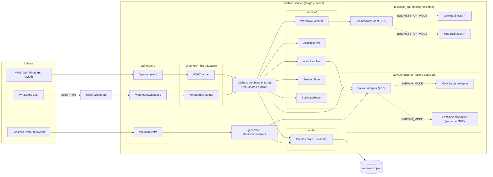
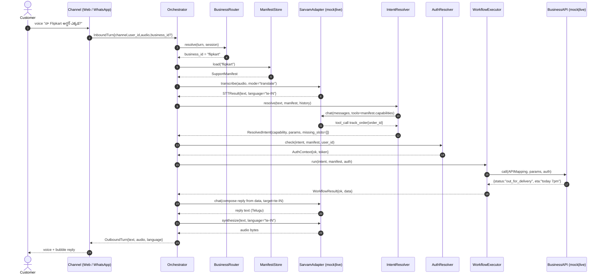

# 1. System Architecture

> Part of the **UCXP execution plan** · [Plan index](PLAN.md)

---

## 1. System topology

Both customer channels are deliberately **thin**. A channel's only jobs are (a) turn an inbound HTTP/webhook payload into a normalized `InboundTurn`, and (b) render an `OutboundTurn` back into the channel's wire format. Everything intelligent — STT, manifest resolution, intent, auth, workflow execution, reply composition, TTS — lives once inside the shared `Orchestrator`. Swapping a business = swapping which manifest the orchestrator loads; nothing else changes. That single fact is the interoperability punchline.

### Component diagram



### End-to-end request sequence (voice turn, either channel)



The two `CH` lanes (Web, WhatsApp) are the **only** difference between channels; every step from `O` onward is identical code.

## 2. Repository layout

```text
ucxp/
├── app/
│   ├── main.py                     # FastAPI factory; mounts routers, serves frontend/ static
│   ├── config.py                   # Pydantic Settings: SARVAM_MODE, business + Twilio config
│   ├── deps.py                     # DI providers: get_settings / get_orchestrator (singletons)
│   ├── api/
│   │   ├── web_chat.py             # POST /api/chat + WS: web turns -> WebChannel -> orchestrator
│   │   ├── whatsapp.py             # POST /webhooks/whatsapp: Twilio inbound -> WhatsAppChannel
│   │   ├── manifest.py             # GET/POST /api/manifest/*: list, fetch, generate manifests
│   │   └── health.py               # GET /health: mode + loaded-manifest readiness probe
│   ├── channels/
│   │   ├── base.py                 # Channel ABC: parse_inbound() / render_outbound()
│   │   ├── web.py                  # WebChannel: JSON/multipart <-> InboundTurn/OutboundTurn
│   │   └── whatsapp.py             # WhatsAppChannel: Twilio media + TwiML <-> turns
│   ├── runtime/
│   │   ├── orchestrator.py         # Orchestrator.handle_turn(): the ONE shared pipeline
│   │   ├── intent.py               # IntentResolver: manifest-driven intent + slot filling via LLM
│   │   ├── executor.py             # WorkflowExecutor: maps intent -> manifest workflow -> API call
│   │   ├── auth.py                 # AuthResolver: applies manifest.auth policy to the user
│   │   ├── reply.py                # ReplyComposer: turns WorkflowResult into user-language text
│   │   ├── session.py             # SessionStore: in-memory per (user_id,business_id) history
│   │   └── models.py               # InboundTurn, OutboundTurn, ResolvedIntent, WorkflowResult...
│   ├── sarvam/
│   │   ├── base.py                 # SarvamAdapter ABC + STTResult/ChatResponse dataclasses
│   │   ├── factory.py              # get_sarvam_adapter(settings) -> mock | live
│   │   ├── mock.py                 # MockSarvamAdapter: deterministic canned STT/TTS/translate/chat/OCR
│   │   ├── live.py                 # LiveSarvamAdapter: real sarvamai SDK (Saaras/Bulbul/Mayura/chat)
│   │   └── fixtures/               # canned transcripts, tone .wav, sample tool-call JSON
│   ├── manifest/
│   │   ├── schema.py               # SupportManifest Pydantic model = the UCXP spec the runtime reads
│   │   ├── store.py                # ManifestStore: load/list/save from manifests/ dir (cached)
│   │   ├── validator.py            # validate raw dict -> SupportManifest with a readable error report
│   │   └── router.py               # BusinessRouter: resolve business_id from channel + session
│   ├── generator/
│   │   ├── service.py              # ManifestGenerator: docs + OpenAPI -> support.manifest via LLM
│   │   ├── ingest.py               # parse PDF/txt/OpenAPI -> normalized knowledge + capability stubs
│   │   └── prompts.py              # LLM prompt templates for manifest synthesis
│   ├── business_api/
│   │   ├── client.py               # BusinessAPIClient ABC + get_business_api(settings) factory
│   │   ├── mock.py                 # MockBusinessAPI: track/refund/cancel/book/invoice handlers
│   │   ├── live.py                 # HttpBusinessAPI: real REST calls driven by manifest api_mappings
│   │   └── data/                   # seed orders.json, bookings.json, invoices.json
│   └── static/                     # built frontend assets served by FastAPI
├── manifests/
│   ├── flipkart.support.manifest.json
│   └── airtel.support.manifest.json          # the "swap-in second business" file
├── frontend/
│   ├── index.html                  # WhatsApp-styled customer chat: mic, bubbles, audio playback
│   ├── portal.html                 # Business portal: upload docs -> generate + preview manifest
│   ├── app.js                      # records audio, calls /api/chat, plays returned voice
│   └── styles.css
├── tests/
│   ├── test_orchestrator_e2e.py    # full mock pipeline audio->reply for BOTH channels
│   ├── test_business_switch.py     # same turn, two manifests -> two behaviors (interop proof)
│   ├── test_manifest_validator.py  # good/bad manifest fixtures
│   ├── test_mock_sarvam.py         # determinism of canned adapter
│   ├── test_business_api.py        # mock API handlers
│   └── test_whatsapp_webhook.py    # Twilio payload -> OutboundTurn (TwiML)
├── demo/
│   ├── seed.py                     # load manifests + seed business data into stores
│   ├── script.md                   # 8-step demo runbook
│   └── sample_audio/               # telugu/hindi .wav clips used live
├── .env.example                    # SARVAM_MODE=mock, keys blank (credit-free by default)
├── requirements.txt
├── Makefile                        # run / test / seed / ngrok / live targets
└── README.md
```

## 3. Core runtime interfaces

Everything below is what the rest of the codebase imports. Build these signatures first tonight; fill bodies feature-by-feature.

### `runtime/models.py` — the shared data contract

```python
from enum import Enum
from pydantic import BaseModel

class Channel(str, Enum):
    WEB = "web"
    WHATSAPP = "whatsapp"

class Modality(str, Enum):
    TEXT = "text"
    AUDIO = "audio"

class InboundTurn(BaseModel):
    channel: Channel
    user_id: str                       # web session id OR whatsapp E.164 number
    business_id: str | None = None     # None -> BusinessRouter resolves it
    modality: Modality
    text: str | None = None
    audio: bytes | None = None
    audio_mime: str | None = None
    preferred_language: str | None = None   # sarvam code e.g. "te-IN"; may be auto-detected

class OutboundTurn(BaseModel):
    text: str
    language: str
    audio: bytes | None = None
    audio_mime: str = "audio/wav"
    meta: dict = {}                    # intent, business_id, latency — for the demo HUD

class ResolvedIntent(BaseModel):
    capability: str                    # e.g. "track_order" (must exist in manifest.capabilities)
    params: dict
    missing_slots: list[str] = []
    confidence: float = 1.0

class AuthContext(BaseModel):
    ok: bool
    user_ref: str | None = None        # business-side customer id
    token: str | None = None
    reason: str | None = None          # populated when ok is False

class WorkflowResult(BaseModel):
    ok: bool
    data: dict = {}
    error: str | None = None
```

### `sarvam/base.py` — the one seam that gates all credits

```python
from abc import ABC, abstractmethod
from dataclasses import dataclass, field

@dataclass
class STTResult:
    text: str
    language: str                      # detected sarvam code, e.g. "te-IN"
    raw: dict = field(default_factory=dict)

@dataclass
class ChatResponse:
    content: str
    tool_calls: list[dict] = field(default_factory=list)   # OpenAI-style function calls
    raw: dict = field(default_factory=dict)

class SarvamAdapter(ABC):
    """Every Sarvam capability behind one interface. Mock and Live are drop-in."""

    @abstractmethod
    async def transcribe(self, audio: bytes, *, mode: str = "translate",
                         language: str | None = None) -> STTResult: ...    # Saaras v3

    @abstractmethod
    async def synthesize(self, text: str, *, language: str,
                         voice: str = "anushka", speed: float = 1.0) -> bytes: ...  # Bulbul v3

    @abstractmethod
    async def translate(self, text: str, *, source: str, target: str,
                        mode: str = "formal") -> str: ...                   # Mayura / sarvam-translate

    @abstractmethod
    async def chat(self, messages: list[dict], *, tools: list[dict] | None = None,
                   model: str = "sarvam-105b") -> ChatResponse: ...         # OpenAI-compatible chat

    @abstractmethod
    async def ocr_document(self, file: bytes, *, filename: str) -> str: ... # Sarvam Vision
```

### `runtime/orchestrator.py` — the single pipeline both channels hit

```python
class Orchestrator:
    def __init__(self, sarvam: SarvamAdapter, manifests: ManifestStore,
                 router: BusinessRouter, intents: IntentResolver,
                 auth: AuthResolver, executor: WorkflowExecutor,
                 reply: ReplyComposer, sessions: SessionStore) -> None: ...

    async def handle_turn(self, turn: InboundTurn) -> OutboundTurn:
        # 1. session   = sessions.get(turn.user_id, business_id)
        # 2. biz_id    = router.resolve(turn, session)
        # 3. manifest  = manifests.load(biz_id)
        # 4. if audio: stt = sarvam.transcribe(...); text, lang = stt.text, stt.language
        #    else:     text, lang = turn.text, turn.preferred_language or manifest.default_language
        # 5. intent    = intents.resolve(text, manifest, session.history)
        #    -> if intent.missing_slots: reply asking for the slot (no API call), return
        # 6. auth      = auth.check(intent, manifest, turn.user_id)
        #    -> if not auth.ok: reply with escalation/auth prompt, return
        # 7. result    = executor.run(intent, manifest, auth)
        # 8. text_out  = reply.compose(result, intent, manifest, target_lang=lang)
        # 9. audio_out = sarvam.synthesize(text_out, language=lang) if turn.modality==AUDIO
        # 10.sessions.append(...) ; return OutboundTurn(...)
        ...
```

### Supporting collaborators

```python
class IntentResolver:
    def __init__(self, sarvam: SarvamAdapter) -> None: ...
    async def resolve(self, text: str, manifest: "SupportManifest",
                      history: list[dict]) -> ResolvedIntent: ...
    # builds `tools=` from manifest.capabilities, calls sarvam.chat, parses tool_call

class AuthResolver:
    async def check(self, intent: ResolvedIntent, manifest: "SupportManifest",
                    user_id: str) -> AuthContext: ...
    # applies manifest.auth (e.g. phone-verified, order-id match); mock = always ok in demo

class WorkflowExecutor:
    def __init__(self, api: "BusinessAPIClient") -> None: ...
    async def run(self, intent: ResolvedIntent, manifest: "SupportManifest",
                  auth: AuthContext) -> WorkflowResult: ...
    # looks up manifest.workflows[intent.capability] -> api_mapping, calls api.call(...)

class BusinessAPIClient(ABC):
    @abstractmethod
    async def call(self, mapping: "APIMapping", params: dict,
                   auth: AuthContext) -> dict: ...

class ManifestStore:
    def load(self, business_id: str) -> "SupportManifest": ...
    def list(self) -> list["ManifestSummary"]: ...
    def save(self, manifest: "SupportManifest") -> None: ...

class BusinessRouter:
    def resolve(self, turn: InboundTurn, session: "Session") -> str: ...
    # web -> turn.business_id from dropdown; whatsapp -> session default or
    # "switch to <business>" command; fallback -> settings.default_business_id

class Channel(ABC):
    @abstractmethod
    async def parse_inbound(self, request) -> InboundTurn: ...
    @abstractmethod
    async def render_outbound(self, turn: OutboundTurn): ...   # JSON for web, TwiML+media for WA
```

### `manifest/schema.py` — the fields the runtime depends on

The full UCXP manifest spec is owned by the manifest team; the runtime only requires this shape to exist:

```python
class Capability(BaseModel):
    name: str                    # "track_order" — becomes an LLM tool name
    description: str
    params_schema: dict          # JSON Schema for slots -> drives intent slot filling

class APIMapping(BaseModel):
    method: str                  # "GET"
    path: str                    # "/orders/{order_id}"
    base_url: str | None = None  # None in mock mode -> routed to MockBusinessAPI
    body: dict | None = None
    response_map: dict = {}      # business fields -> canonical fields used by ReplyComposer

class Workflow(BaseModel):
    capability: str
    steps: list[APIMapping]

class SupportManifest(BaseModel):
    business_id: str
    name: str
    default_language: str = "en-IN"
    supported_languages: list[str] = ["en-IN"]
    auth: dict = {}
    capabilities: list[Capability]
    workflows: dict[str, Workflow]   # keyed by capability name
    knowledge: list[dict] = []       # FAQ chunks for RAG-style fallback answers
    escalation: dict = {}
```

## 4. Config: `SARVAM_MODE` and business selection

All swappable behavior is one factory call away from the code that uses it — nothing downstream of the factory knows or cares whether it is mock or live.

### `app/config.py`

```python
from pathlib import Path
from typing import Literal
from pydantic_settings import BaseSettings, SettingsConfigDict

class Settings(BaseSettings):
    # --- Sarvam ---
    sarvam_mode: Literal["mock", "live"] = "mock"          # THE credit gate
    sarvam_api_key: str = ""                               # api-subscription-key value
    sarvam_base_url: str = "https://api.sarvam.ai/v1"
    stt_model: str = "saaras:v3"
    tts_voice: str = "anushka"
    chat_model: str = "sarvam-105b"

    # --- Business API ---
    business_api_mode: Literal["mock", "live"] = "mock"    # independent of sarvam_mode
    default_business_id: str = "flipkart"
    manifest_dir: Path = Path("manifests")

    # --- WhatsApp / Twilio ---
    twilio_account_sid: str = ""
    twilio_auth_token: str = ""
    twilio_whatsapp_from: str = ""     # "whatsapp:+14155238886"

    default_language: str = "te-IN"

    model_config = SettingsConfigDict(env_file=".env", extra="ignore")
```

### Factories (the only place mode is read)

```python
# sarvam/factory.py
def get_sarvam_adapter(settings: Settings) -> SarvamAdapter:
    if settings.sarvam_mode == "live":
        return LiveSarvamAdapter(api_key=settings.sarvam_api_key,
                                 base_url=settings.sarvam_base_url,
                                 stt_model=settings.stt_model,
                                 tts_voice=settings.tts_voice,
                                 chat_model=settings.chat_model)
    return MockSarvamAdapter(fixtures_dir="app/sarvam/fixtures")

# business_api/client.py
def get_business_api(settings: Settings) -> BusinessAPIClient:
    return HttpBusinessAPI() if settings.business_api_mode == "live" else MockBusinessAPI()
```

`app/deps.py` builds one `Orchestrator` singleton at startup by calling both factories and injecting the result. **No other file imports `mock` or `live` directly** — this is what makes tomorrow's swap a one-line env change with zero code edits.

### `.env.example` (default = fully offline, zero credits)

```dotenv
SARVAM_MODE=mock
SARVAM_API_KEY=
BUSINESS_API_MODE=mock
DEFAULT_BUSINESS_ID=flipkart
DEFAULT_LANGUAGE=te-IN
TWILIO_ACCOUNT_SID=
TWILIO_AUTH_TOKEN=
TWILIO_WHATSAPP_FROM=
```

Tomorrow's go-live is literally: set `SARVAM_MODE=live`, paste `SARVAM_API_KEY`, restart. `BUSINESS_API_MODE` can stay `mock` for the demo even when Sarvam is live — the two seams are independent.

### Business selection at request time

| Channel | How `business_id` is chosen |
|---|---|
| Web app | Dropdown in `index.html` sends `business_id` in the request body; `WebChannel` copies it onto `InboundTurn`. |
| WhatsApp | `BusinessRouter` reads the session default; a message like "switch to Airtel" updates it; otherwise `settings.default_business_id`. (Optional: map distinct Twilio numbers → businesses.) |
| Fallback | `settings.default_business_id`. |

`BusinessRouter.resolve()` is the single decision point; the orchestrator never hardcodes a business, which is exactly what lets the "swap the manifest, same assistant serves it" demo work by dropping a second file into `manifests/`.

### What this architecture lets you build credit-free tonight

Everything except `LiveSarvamAdapter`'s bodies and the Twilio account wiring runs end-to-end **tonight** with `SARVAM_MODE=mock`: the full orchestrator pipeline, both channel adapters, manifest load/validate, intent routing, mock business API, reply composition, the web frontend, and `test_orchestrator_e2e.py` / `test_business_switch.py`. The mock adapter returns deterministic `STTResult`/`ChatResponse`/audio from `sarvam/fixtures/`, so the green e2e test tonight is the same code path that runs live tomorrow — only the adapter implementation behind the factory changes.

---

[← Plan index](PLAN.md) · [The UCXP Protocol — support.manifest Spec →](02-manifest-spec.md)
