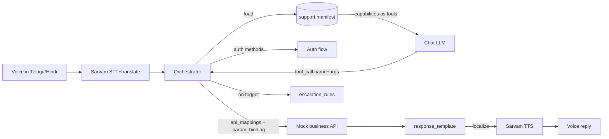

# 2. The UCXP Protocol — support.manifest Spec

> Part of the **UCXP execution plan** · [Plan index](PLAN.md)

---

# UCXP `support.manifest` Specification

## 1. Overview & Discovery

A `support.manifest` is a single JSON document that fully describes a business's support surface. A UCXP runtime loads it, exposes each `capability` to the LLM as a tool definition, and — when the model calls a tool — drives the matching `api_mapping`/`workflow` deterministically (auth → param binding → HTTP call → response templating → localized voice reply).

**Discovery order** (runtime resolves a business handle → manifest):
1. Well-known URL: `https://{business_domain}/.well-known/support.manifest.json`
2. UCXP registry lookup: `GET {registry}/manifests/{business_id}` (returns latest published manifest + ETag)
3. Local file (demo/offline): `manifests/{business_id}.json`

The manifest is **data, not code**: everything the orchestrator needs to act is declared as fields. No business-specific logic is hardcoded in the runtime.



---

## 2. Top-Level Structure

| Field | Type | Req | Purpose |
|---|---|---|---|
| `ucxp_version` | string (semver) | ✔ | Protocol version the manifest conforms to (e.g. `"0.1.0"`). |
| `manifest_version` | string (semver) | ✔ | Business content version; bumped on every republish. |
| `generated_at` | string (date-time) | ✔ | When the AI generator produced this manifest. |
| `business` | object | ✔ | Business metadata + `api_base_url`. |
| `auth` | object | ✔ | Auth methods + default. |
| `supported_languages` | string[] (BCP-47/ISO-639) | ✔ | e.g. `["en","hi","te"]`; first is primary. |
| `defaults` | object | ✖ | Global defaults (language, confirmation, timeouts). |
| `capabilities` | Capability[] | ✔ | The tools the assistant may call. |
| `api_mappings` | object<id,ApiMapping> | ✔ | HTTP recipes referenced by capabilities/workflows. |
| `workflows` | object<id,Workflow> | ✖ | Multi-step orchestrations for complex capabilities. |
| `knowledge` | object | ✖ | `faqs[]` + `policies[]` (grounding, no API call). |
| `escalation_rules` | EscalationRule[] | ✔ | Global human-handoff triggers (capabilities may add local ones). |
| `metadata` | object | ✖ | Free-form: source docs, generator model, checksums. |

---

## 3. JSON Schema (Draft 2020-12)

```json
{
  "$schema": "https://json-schema.org/draft/2020-12/schema",
  "$id": "https://ucxp.dev/schema/support.manifest-0.1.0.json",
  "title": "UCXP support.manifest",
  "type": "object",
  "required": ["ucxp_version","manifest_version","generated_at","business","auth","supported_languages","capabilities","api_mappings","escalation_rules"],
  "additionalProperties": false,
  "properties": {
    "ucxp_version": { "type": "string", "pattern": "^\\d+\\.\\d+\\.\\d+$" },
    "manifest_version": { "type": "string", "pattern": "^\\d+\\.\\d+\\.\\d+$" },
    "generated_at": { "type": "string", "format": "date-time" },

    "business": {
      "type": "object",
      "required": ["id","name","api_base_url"],
      "additionalProperties": false,
      "properties": {
        "id": { "type": "string", "pattern": "^[a-z0-9_-]{2,64}$" },
        "name": { "type": "string" },
        "domain": { "type": "string", "format": "hostname" },
        "logo_url": { "type": "string", "format": "uri" },
        "category": { "type": "string", "examples": ["ecommerce","telecom","travel","banking"] },
        "description": { "type": "string" },
        "support_hours": { "type": "string", "examples": ["24x7","Mon-Sat 9:00-21:00 IST"] },
        "api_base_url": { "type": "string", "format": "uri" }
      }
    },

    "auth": {
      "type": "object",
      "required": ["methods","default_method"],
      "additionalProperties": false,
      "properties": {
        "default_method": { "type": "string" },
        "methods": {
          "type": "array",
          "minItems": 1,
          "items": {
            "type": "object",
            "required": ["id","type","establishes"],
            "additionalProperties": false,
            "properties": {
              "id": { "type": "string" },
              "type": { "enum": ["otp","api_key","oauth2","session_token","none"] },
              "label": { "type": "string" },
              "identity_field": { "type": "string", "description": "Param the customer supplies to start auth (e.g. phone)." },
              "request_endpoint": { "$ref": "#/$defs/endpointRef", "description": "e.g. send OTP" },
              "verify_endpoint": { "$ref": "#/$defs/endpointRef", "description": "e.g. verify OTP → token" },
              "returns": {
                "type": "object",
                "additionalProperties": false,
                "properties": {
                  "token_field": { "type": "string" },
                  "token_location": { "enum": ["header","query","body","cookie"] },
                  "token_header": { "type": "string" },
                  "token_prefix": { "type": "string" }
                }
              },
              "establishes": {
                "type": "array",
                "items": { "type": "string" },
                "description": "Identity fields available to bindings via {from:'auth'} after success (e.g. customer_id, phone, token)."
              },
              "ttl_seconds": { "type": "integer", "minimum": 0 }
            }
          }
        }
      }
    },

    "supported_languages": {
      "type": "array", "minItems": 1,
      "items": { "type": "string", "pattern": "^[a-z]{2}(-[A-Z]{2})?$" }
    },

    "defaults": {
      "type": "object",
      "additionalProperties": false,
      "properties": {
        "language": { "type": "string" },
        "fallback_language": { "type": "string" },
        "confirmation_required_for_destructive": { "type": "boolean", "default": true },
        "request_timeout_ms": { "type": "integer", "default": 8000 },
        "max_auth_attempts": { "type": "integer", "default": 3 }
      }
    },

    "capabilities": {
      "type": "array", "minItems": 1,
      "items": {
        "type": "object",
        "required": ["name","description","parameters","action"],
        "additionalProperties": false,
        "properties": {
          "name": { "type": "string", "pattern": "^[a-z][a-z0-9_]{1,48}$", "description": "Unique; becomes the LLM tool name." },
          "description": { "type": "string", "description": "LLM-facing; when to use this tool." },
          "intent_examples": { "type": "array", "items": { "type": "string" }, "description": "Utterances (any language) that map here; aids routing." },
          "destructive": { "type": "boolean", "default": false },
          "requires_auth": { "type": "boolean", "default": true },
          "auth_method": { "type": "string", "description": "Overrides auth.default_method for this capability." },

          "parameters": {
            "type": "object",
            "required": ["type","properties"],
            "properties": {
              "type": { "const": "object" },
              "properties": {
                "type": "object",
                "additionalProperties": { "$ref": "#/$defs/paramSchema" }
              },
              "required": { "type": "array", "items": { "type": "string" } }
            },
            "description": "JSON-Schema subset passed verbatim as the tool's parameter schema to the LLM."
          },

          "action": {
            "type": "object",
            "oneOf": [
              { "required": ["api_mapping"] },
              { "required": ["workflow"] }
            ],
            "additionalProperties": false,
            "properties": {
              "api_mapping": { "type": "string", "description": "id in api_mappings for single-call capabilities." },
              "workflow": { "type": "string", "description": "id in workflows for multi-step capabilities." }
            }
          },

          "confirmation": { "$ref": "#/$defs/confirmation" },
          "escalation": { "type": "array", "items": { "$ref": "#/$defs/escalationRule" }, "description": "Capability-local escalation triggers." }
        }
      }
    },

    "api_mappings": {
      "type": "object",
      "additionalProperties": { "$ref": "#/$defs/apiMapping" }
    },

    "workflows": {
      "type": "object",
      "additionalProperties": { "$ref": "#/$defs/workflow" }
    },

    "knowledge": {
      "type": "object",
      "additionalProperties": false,
      "properties": {
        "faqs": {
          "type": "array",
          "items": {
            "type": "object",
            "required": ["id","question","answer"],
            "additionalProperties": false,
            "properties": {
              "id": { "type": "string" },
              "question": { "type": "string" },
              "answer": { "type": "string" },
              "tags": { "type": "array", "items": { "type": "string" } },
              "lang": { "type": "string", "description": "Source language; runtime localizes as needed." }
            }
          }
        },
        "policies": {
          "type": "array",
          "items": {
            "type": "object",
            "required": ["id","title","body"],
            "additionalProperties": false,
            "properties": {
              "id": { "type": "string" },
              "title": { "type": "string" },
              "category": { "type": "string", "examples": ["refund","cancellation","shipping","privacy"] },
              "body": { "type": "string", "description": "Plain-text policy the LLM can quote/summarize." },
              "source_url": { "type": "string", "format": "uri" },
              "rules": {
                "type": "array",
                "description": "Optional machine-checkable predicates for policy_check steps.",
                "items": {
                  "type": "object",
                  "required": ["id","expr","message"],
                  "additionalProperties": false,
                  "properties": {
                    "id": { "type": "string" },
                    "expr": { "type": "string", "description": "Boolean expression over context/response fields, e.g. 'response.days_since_delivery <= 7'." },
                    "message": { "type": "string", "description": "Shown when expr is false (ineligible)." }
                  }
                }
              }
            }
          }
        }
      }
    },

    "escalation_rules": { "type": "array", "items": { "$ref": "#/$defs/escalationRule" } },

    "metadata": { "type": "object" }
  },

  "$defs": {
    "paramSchema": {
      "type": "object",
      "required": ["type"],
      "additionalProperties": false,
      "properties": {
        "type": { "enum": ["string","integer","number","boolean"] },
        "description": { "type": "string" },
        "enum": { "type": "array" },
        "pattern": { "type": "string" },
        "format": { "type": "string", "examples": ["date","email","phone"] },
        "minimum": { "type": "number" },
        "maximum": { "type": "number" },
        "default": {},
        "example": {}
      }
    },

    "endpointRef": {
      "type": "object",
      "required": ["method","path"],
      "additionalProperties": false,
      "properties": {
        "method": { "enum": ["GET","POST","PUT","PATCH","DELETE"] },
        "path": { "type": "string", "description": "Relative to business.api_base_url; may contain {{...}} placeholders." },
        "body": { "type": "object", "description": "Templated body for auth endpoints." }
      }
    },

    "binding": {
      "type": "object",
      "required": ["from"],
      "additionalProperties": false,
      "properties": {
        "from": { "enum": ["param","auth","context","constant"] },
        "name": { "type": "string", "description": "Source key (capability param name, auth field, context key)." },
        "value": { "description": "Literal, used when from='constant'." },
        "template": { "type": "string", "description": "e.g. 'Bearer {{value}}'." },
        "default": {},
        "required": { "type": "boolean", "default": false },
        "transform": { "enum": ["upper","lower","trim","iso_date","digits_only"] }
      }
    },

    "apiMapping": {
      "type": "object",
      "required": ["method","path","response_template"],
      "additionalProperties": false,
      "properties": {
        "method": { "enum": ["GET","POST","PUT","PATCH","DELETE"] },
        "path": { "type": "string", "description": "Relative to api_base_url; {{name}} filled from request.path_params." },
        "request": {
          "type": "object",
          "additionalProperties": false,
          "properties": {
            "path_params":  { "type": "object", "additionalProperties": { "$ref": "#/$defs/binding" } },
            "query_params": { "type": "object", "additionalProperties": { "$ref": "#/$defs/binding" } },
            "headers":      { "type": "object", "additionalProperties": { "$ref": "#/$defs/binding" } },
            "body":         { "type": "object", "additionalProperties": { "$ref": "#/$defs/binding" } }
          }
        },
        "idempotency_key": { "$ref": "#/$defs/binding", "description": "For destructive/POST calls; runtime sends as Idempotency-Key header." },
        "timeout_ms": { "type": "integer" },
        "success_when": { "type": "string", "description": "Expr over http_status/response deciding success; default 'http_status < 300'." },
        "response_template": {
          "type": "object",
          "required": ["success"],
          "additionalProperties": false,
          "properties": {
            "success": { "$ref": "#/$defs/renderBlock" },
            "errors": {
              "type": "object",
              "description": "Keyed by HTTP status string or 'default'.",
              "additionalProperties": { "$ref": "#/$defs/renderBlock" }
            }
          }
        }
      }
    },

    "renderBlock": {
      "type": "object",
      "required": ["text"],
      "additionalProperties": false,
      "properties": {
        "text": { "type": "string", "description": "Mustache-style template over {{param.*}} and {{response.*}}." },
        "voice": { "type": "string", "description": "Optional shorter TTS variant; falls back to text." },
        "localize": { "type": "boolean", "default": true, "description": "If true, runtime translates to user language via Sarvam adapter." }
      }
    },

    "confirmation": {
      "type": "object",
      "required": ["required"],
      "additionalProperties": false,
      "properties": {
        "required": { "type": "boolean" },
        "prompt": { "$ref": "#/$defs/renderBlock", "description": "Read back to user before executing; must get explicit yes." },
        "require_reauth": { "type": "boolean", "default": false }
      }
    },

    "workflow": {
      "type": "object",
      "required": ["steps"],
      "additionalProperties": false,
      "properties": {
        "description": { "type": "string" },
        "steps": {
          "type": "array", "minItems": 1,
          "items": {
            "type": "object",
            "required": ["id","type"],
            "additionalProperties": true,
            "properties": {
              "id": { "type": "string" },
              "type": { "enum": ["auth","api_call","policy_check","confirm","respond","escalate","branch"] },
              "auth_method": { "type": "string" },
              "api_mapping": { "type": "string" },
              "policy": { "type": "string", "description": "policies[].id for policy_check." },
              "confirmation": { "$ref": "#/$defs/confirmation" },
              "render": { "$ref": "#/$defs/renderBlock" },
              "when": { "type": "string", "description": "Boolean expr gating this step." },
              "on_fail": { "enum": ["stop","escalate","continue"], "default": "stop" },
              "save_as": { "type": "string", "description": "Store api_call response into context under this key." }
            }
          }
        }
      }
    },

    "escalationRule": {
      "type": "object",
      "required": ["id","when","action"],
      "additionalProperties": false,
      "properties": {
        "id": { "type": "string" },
        "when": {
          "type": "string",
          "description": "Trigger: enum keyword or expression.",
          "examples": ["no_capability_match","auth_failed_max","api_error","negative_sentiment","user_requests_human","policy_ineligible"]
        },
        "action": { "enum": ["human_handoff","create_ticket","transfer_call"] },
        "target": { "type": "string", "description": "Queue name / phone / email depending on action." },
        "message": { "$ref": "#/$defs/renderBlock" }
      }
    }
  }
}
```

### Binding & templating semantics (for the loader)

- **`{from:"param"}`** → value comes from the LLM tool-call arguments (the capability's declared parameters).
- **`{from:"auth"}`** → value from an `establishes` field of the active auth session (e.g. `customer_id`, `token`).
- **`{from:"context"}`** → value saved by a prior workflow step (`save_as`) or session context (channel, phone).
- **`{from:"constant"}`** → literal `value`.
- Templates use `{{...}}`. In `binding.template`, `{{value}}` is the resolved source value. In `renderBlock`, dotted paths address `param.*` (tool args) and `response.*` (parsed JSON body of the api_call). Missing path with no `default` → validation/runtime error surfaced via the `errors.default` block.
- `localize:true` render blocks are produced in the manifest's primary language, then passed through the **Sarvam translate adapter** (mock tonight) into the user's detected language before TTS.

---

## 4. Worked Example — `ShopKart` (mock e-commerce)

```json
{
  "ucxp_version": "0.1.0",
  "manifest_version": "1.4.0",
  "generated_at": "2026-07-25T18:30:00+05:30",

  "business": {
    "id": "shopkart",
    "name": "ShopKart",
    "domain": "shopkart.example",
    "logo_url": "https://shopkart.example/logo.png",
    "category": "ecommerce",
    "description": "Online marketplace for electronics, fashion and groceries.",
    "support_hours": "24x7",
    "api_base_url": "https://mock.shopkart.example/api/v1"
  },

  "auth": {
    "default_method": "otp_phone",
    "methods": [
      {
        "id": "otp_phone",
        "type": "otp",
        "label": "Phone OTP",
        "identity_field": "phone",
        "request_endpoint": {
          "method": "POST", "path": "/auth/otp/request",
          "body": { "phone": "{{identity.phone}}" }
        },
        "verify_endpoint": {
          "method": "POST", "path": "/auth/otp/verify",
          "body": { "phone": "{{identity.phone}}", "otp": "{{otp}}" }
        },
        "returns": {
          "token_field": "session_token",
          "token_location": "header",
          "token_header": "Authorization",
          "token_prefix": "Bearer "
        },
        "establishes": ["customer_id", "phone", "session_token"],
        "ttl_seconds": 1800
      }
    ]
  },

  "supported_languages": ["en", "hi", "te"],

  "defaults": {
    "language": "en",
    "fallback_language": "en",
    "confirmation_required_for_destructive": true,
    "request_timeout_ms": 8000,
    "max_auth_attempts": 3
  },

  "capabilities": [
    {
      "name": "track_order",
      "description": "Get the current status and expected delivery date of a customer's order.",
      "intent_examples": [
        "Where is my order?",
        "నా ఆర్డర్ ఎక్కడ ఉంది?",
        "मेरा ऑर्डर कहाँ है?"
      ],
      "destructive": false,
      "requires_auth": true,
      "parameters": {
        "type": "object",
        "properties": {
          "order_id": {
            "type": "string",
            "description": "ShopKart order id, e.g. SK-2026-000842.",
            "pattern": "^SK-\\d{4}-\\d{6}$",
            "example": "SK-2026-000842"
          }
        },
        "required": ["order_id"]
      },
      "action": { "api_mapping": "get_order_status" }
    },

    {
      "name": "download_invoice",
      "description": "Get a downloadable invoice (PDF) link for a delivered or shipped order.",
      "intent_examples": ["Send me the invoice", "నా బిల్ కావాలి", "मुझे इनवॉइस चाहिए"],
      "destructive": false,
      "requires_auth": true,
      "parameters": {
        "type": "object",
        "properties": {
          "order_id": { "type": "string", "pattern": "^SK-\\d{4}-\\d{6}$", "example": "SK-2026-000842" }
        },
        "required": ["order_id"]
      },
      "action": { "api_mapping": "get_invoice" }
    },

    {
      "name": "cancel_order",
      "description": "Cancel an order that has not yet shipped. Destructive; requires confirmation.",
      "intent_examples": ["Cancel my order", "నా ఆర్డర్ రద్దు చేయి", "मेरा ऑर्डर कैंसल करो"],
      "destructive": true,
      "requires_auth": true,
      "parameters": {
        "type": "object",
        "properties": {
          "order_id": { "type": "string", "pattern": "^SK-\\d{4}-\\d{6}$", "example": "SK-2026-000842" },
          "reason": {
            "type": "string",
            "description": "Optional cancellation reason.",
            "enum": ["ordered_by_mistake", "found_cheaper", "delivery_too_late", "other"],
            "default": "other"
          }
        },
        "required": ["order_id"]
      },
      "action": { "api_mapping": "post_cancel_order" },
      "confirmation": {
        "required": true,
        "prompt": {
          "text": "You want to cancel order {{order_id}}. This cannot be undone. Shall I go ahead?",
          "voice": "Confirm: cancel order {{order_id}}? This can't be undone.",
          "localize": true
        }
      }
    },

    {
      "name": "refund",
      "description": "Request a refund for a delivered order. Runs eligibility check against the refund policy, confirms with the user, then files the refund.",
      "intent_examples": ["I want a refund", "రీఫండ్ కావాలి", "मुझे रिफंड चाहिए"],
      "destructive": true,
      "requires_auth": true,
      "parameters": {
        "type": "object",
        "properties": {
          "order_id": { "type": "string", "pattern": "^SK-\\d{4}-\\d{6}$", "example": "SK-2026-000842" },
          "reason": {
            "type": "string",
            "enum": ["damaged", "wrong_item", "not_as_described", "no_longer_needed"],
            "description": "Reason for the refund."
          }
        },
        "required": ["order_id", "reason"]
      },
      "action": { "workflow": "refund_flow" },
      "escalation": [
        {
          "id": "refund_high_value",
          "when": "response.amount > 20000",
          "action": "human_handoff",
          "target": "refunds_l2",
          "message": { "text": "This is a high-value refund. I'm connecting you to a specialist who will complete it.", "localize": true }
        }
      ]
    }
  ],

  "api_mappings": {
    "get_order_status": {
      "method": "GET",
      "path": "/orders/{{order_id}}",
      "request": {
        "path_params": { "order_id": { "from": "param", "name": "order_id", "required": true } },
        "headers": {
          "Authorization": { "from": "auth", "name": "session_token", "template": "Bearer {{value}}", "required": true }
        }
      },
      "success_when": "http_status == 200",
      "response_template": {
        "success": {
          "text": "Order {{param.order_id}} is currently '{{response.status}}'. Expected delivery: {{response.eta}}. Last update: {{response.last_update}} at {{response.location}}.",
          "voice": "Your order is {{response.status}}, arriving by {{response.eta}}.",
          "localize": true
        },
        "errors": {
          "404": { "text": "I couldn't find order {{param.order_id}}. Please double-check the order number.", "localize": true },
          "401": { "text": "I need to verify you first before I can show order details.", "localize": true },
          "default": { "text": "Sorry, I couldn't fetch that order right now. Please try again shortly.", "localize": true }
        }
      }
    },

    "get_invoice": {
      "method": "GET",
      "path": "/orders/{{order_id}}/invoice",
      "request": {
        "path_params": { "order_id": { "from": "param", "name": "order_id", "required": true } },
        "headers": {
          "Authorization": { "from": "auth", "name": "session_token", "template": "Bearer {{value}}", "required": true }
        }
      },
      "success_when": "http_status == 200",
      "response_template": {
        "success": {
          "text": "Here is the invoice for order {{param.order_id}} (₹{{response.amount}}): {{response.invoice_url}}",
          "voice": "I've sent the invoice for order {{param.order_id}} to this chat.",
          "localize": true
        },
        "errors": {
          "404": { "text": "No invoice is available yet for order {{param.order_id}}.", "localize": true },
          "409": { "text": "The invoice generates after the order ships. This one hasn't shipped yet.", "localize": true },
          "default": { "text": "I couldn't retrieve the invoice right now. Please try again shortly.", "localize": true }
        }
      }
    },

    "post_cancel_order": {
      "method": "POST",
      "path": "/orders/{{order_id}}/cancel",
      "request": {
        "path_params": { "order_id": { "from": "param", "name": "order_id", "required": true } },
        "headers": {
          "Authorization": { "from": "auth", "name": "session_token", "template": "Bearer {{value}}", "required": true }
        },
        "body": {
          "reason": { "from": "param", "name": "reason", "default": "other" }
        }
      },
      "idempotency_key": { "from": "param", "name": "order_id" },
      "success_when": "http_status == 200",
      "response_template": {
        "success": {
          "text": "Done — order {{param.order_id}} is cancelled. Any amount paid will be refunded to your original payment method within {{response.refund_eta_days}} days.",
          "voice": "Your order {{param.order_id}} is cancelled.",
          "localize": true
        },
        "errors": {
          "409": { "text": "Order {{param.order_id}} has already shipped, so it can't be cancelled. You can refuse delivery or request a return instead.", "localize": true },
          "404": { "text": "I couldn't find order {{param.order_id}} to cancel.", "localize": true },
          "default": { "text": "The cancellation didn't go through. Nothing was changed. Please try again.", "localize": true }
        }
      }
    },

    "get_order_for_refund": {
      "method": "GET",
      "path": "/orders/{{order_id}}",
      "request": {
        "path_params": { "order_id": { "from": "param", "name": "order_id", "required": true } },
        "headers": {
          "Authorization": { "from": "auth", "name": "session_token", "template": "Bearer {{value}}", "required": true }
        }
      },
      "success_when": "http_status == 200",
      "response_template": {
        "success": { "text": "Order {{param.order_id}} loaded.", "localize": false },
        "errors": {
          "404": { "text": "I couldn't find order {{param.order_id}}.", "localize": true },
          "default": { "text": "I couldn't check that order right now.", "localize": true }
        }
      }
    },

    "post_refund": {
      "method": "POST",
      "path": "/orders/{{order_id}}/refund",
      "request": {
        "path_params": { "order_id": { "from": "param", "name": "order_id", "required": true } },
        "headers": {
          "Authorization": { "from": "auth", "name": "session_token", "template": "Bearer {{value}}", "required": true }
        },
        "body": {
          "reason": { "from": "param", "name": "reason", "required": true },
          "customer_id": { "from": "auth", "name": "customer_id", "required": true }
        }
      },
      "idempotency_key": { "from": "param", "name": "order_id" },
      "success_when": "http_status == 200",
      "response_template": {
        "success": {
          "text": "Your refund of ₹{{response.amount}} for order {{param.order_id}} is approved (ref {{response.refund_id}}). It reaches your account in {{response.refund_eta_days}} days.",
          "voice": "Refund of {{response.amount}} rupees approved for order {{param.order_id}}.",
          "localize": true
        },
        "errors": {
          "422": { "text": "This order isn't eligible for a refund: {{response.reason}}.", "localize": true },
          "404": { "text": "I couldn't find order {{param.order_id}}.", "localize": true },
          "default": { "text": "The refund couldn't be filed right now. No charge was made. Please try again.", "localize": true }
        }
      }
    }
  },

  "workflows": {
    "refund_flow": {
      "description": "Verify order, check refund-window eligibility, confirm, then file refund.",
      "steps": [
        {
          "id": "verify_customer",
          "type": "auth",
          "auth_method": "otp_phone",
          "on_fail": "escalate"
        },
        {
          "id": "load_order",
          "type": "api_call",
          "api_mapping": "get_order_for_refund",
          "save_as": "order",
          "on_fail": "stop"
        },
        {
          "id": "eligibility",
          "type": "policy_check",
          "policy": "refund_policy",
          "on_fail": "escalate"
        },
        {
          "id": "confirm_refund",
          "type": "confirm",
          "confirmation": {
            "required": true,
            "prompt": {
              "text": "I'll file a refund of ₹{{context.order.amount}} for order {{param.order_id}} because it was '{{param.reason}}'. Confirm?",
              "voice": "File a refund of {{context.order.amount}} rupees for order {{param.order_id}}? Confirm.",
              "localize": true
            }
          },
          "on_fail": "stop"
        },
        {
          "id": "file_refund",
          "type": "api_call",
          "api_mapping": "post_refund",
          "on_fail": "escalate"
        }
      ]
    }
  },

  "knowledge": {
    "faqs": [
      {
        "id": "faq_refund_time",
        "question": "How long do refunds take?",
        "answer": "Refunds are approved instantly and credited to the original payment method within 5-7 business days.",
        "tags": ["refund", "timing"],
        "lang": "en"
      },
      {
        "id": "faq_cancel_window",
        "question": "Can I cancel after it ships?",
        "answer": "Orders can only be cancelled before they ship. After shipping, refuse delivery or request a return.",
        "tags": ["cancel", "shipping"],
        "lang": "en"
      }
    ],
    "policies": [
      {
        "id": "refund_policy",
        "title": "Refund Eligibility",
        "category": "refund",
        "body": "Delivered orders are refundable within 7 days of delivery. Groceries and perishable items are non-refundable. Damaged or wrong-item claims are refundable within 7 days regardless of category.",
        "source_url": "https://shopkart.example/policies/refund.pdf",
        "rules": [
          {
            "id": "within_window",
            "expr": "context.order.days_since_delivery <= 7",
            "message": "This order was delivered more than 7 days ago, so it's outside the refund window."
          },
          {
            "id": "refundable_category",
            "expr": "context.order.category != 'grocery' || param.reason == 'damaged' || param.reason == 'wrong_item'",
            "message": "Grocery items are only refundable when damaged or the wrong item was sent."
          }
        ]
      }
    ]
  },

  "escalation_rules": [
    {
      "id": "user_asks_human",
      "when": "user_requests_human",
      "action": "human_handoff",
      "target": "support_general",
      "message": { "text": "Sure — connecting you to a human agent now. Please stay on this chat.", "localize": true }
    },
    {
      "id": "auth_lockout",
      "when": "auth_failed_max",
      "action": "human_handoff",
      "target": "identity_desk",
      "message": { "text": "I couldn't verify you after several tries. A support agent will help you verify.", "localize": true }
    },
    {
      "id": "unknown_intent",
      "when": "no_capability_match",
      "action": "create_ticket",
      "target": "support_general",
      "message": { "text": "I can't handle that one myself yet. I've logged a ticket and a human will follow up.", "localize": true }
    },
    {
      "id": "api_down",
      "when": "api_error",
      "action": "human_handoff",
      "target": "support_general",
      "message": { "text": "Our systems are briefly unavailable. Let me connect you to an agent.", "localize": true }
    }
  ],

  "metadata": {
    "generated_by": "ucxp-manifest-generator",
    "generator_model": "sarvam-105b",
    "source_documents": ["refund_policy.pdf", "shopkart_openapi.json", "faq_export.csv"],
    "checksum_sha256": "b1946ac92492d2347c6235b4d2611184..."
  }
}
```

**Interoperability check:** swapping `manifests/shopkart.json` for `manifests/airtel.json` (same schema, different `capabilities`/`api_mappings`) makes the identical runtime serve Airtel — nothing in the orchestrator changes.

---

## 5. Validation Rules

Enforced by the loader at publish-time and at load-time (fail closed — reject the manifest, don't half-load).

**Structural**
- Validate against the JSON Schema (Draft 2020-12) above; `additionalProperties:false` everywhere it appears.
- `ucxp_version` must be a version the runtime supports (see §6 compatibility).

**Referential integrity (hard errors)**
1. Every `capabilities[].action.api_mapping` exists as a key in `api_mappings`.
2. Every `capabilities[].action.workflow` exists in `workflows`.
3. Every workflow step `api_mapping` / `policy` / `auth_method` resolves to a defined `api_mappings` key / `policies[].id` / `auth.methods[].id`.
4. `auth.default_method` and every `capabilities[].auth_method` resolve to an `auth.methods[].id`.
5. Every `binding` with `from:"auth"` references a `name` that appears in some `auth.methods[].establishes`.
6. Every `binding` with `from:"context"` references a key that some prior workflow step declares via `save_as` (or a runtime-reserved context key: `channel`, `phone`, `user_language`).
7. Every `{{name}}` placeholder in an `api_mappings[].path` has a matching `request.path_params.name` binding.
8. Every `{{param.X}}` in a render/confirmation template maps to a declared parameter of the owning capability; every `{{response.X}}` is allowed (unchecked, runtime-resolved) but must have a fallback via an `errors` block.

**Uniqueness & naming**
9. `capabilities[].name` unique across the manifest and matches `^[a-z][a-z0-9_]{1,48}$` (valid LLM tool name).
10. `business.id` matches `^[a-z0-9_-]{2,64}$`; ids in `api_mappings`, `workflows`, `faqs`, `policies`, `escalation_rules` are unique within their collection.

**Safety invariants (hard errors)**
11. If `defaults.confirmation_required_for_destructive` is true (default) and a capability has `destructive:true`, it **must** define `confirmation.required:true` either on the capability or, for workflow-backed ones, in a `confirm` step. (In the example: `cancel_order` → capability confirmation; `refund` → `confirm_refund` step.)
12. Any `api_mappings` entry with method `POST/PUT/PATCH/DELETE` used by a `destructive` capability **must** declare an `idempotency_key`.
13. Every capability with `requires_auth:true` must have all its api_mappings supply the auth token binding required by its `auth_method.returns` (e.g. an `Authorization` header binding `from:"auth"`).
14. Every `response_template` must have a `success` block and an `errors.default` block (so no code path is un-templated).

**Warnings (non-blocking)**
- A `supported_language` with no localizable knowledge/renderBlocks (all `localize:false`) → warn.
- FAQ/policy `body` longer than a configured token budget → warn (grounding may truncate).
- Capability with no `intent_examples` → warn (weaker routing).

**Expression sandbox** — `when` / `success_when` / `expr` are evaluated in a restricted evaluator (no attribute access beyond `param.*`, `response.*`, `context.*`, `http_status`; operators `== != < <= > >= && || !`, string/number literals). Anything else → validation error. This keeps manifests declarative and injection-safe.

---

## 6. Versioning

Two independent version axes:

| Axis | Field | Semantics |
|---|---|---|
| **Protocol** | `ucxp_version` | Shape of the schema itself. Owned by UCXP. |
| **Business content** | `manifest_version` | The business's own revisions (new capability, changed API path, edited policy). Bump on every republish. |

**Protocol compatibility (semver on `ucxp_version`)**
- **MAJOR** — breaking schema change (field removed/renamed, semantics changed). Runtime rejects manifests whose MAJOR it doesn't implement.
- **MINOR** — additive, backward-compatible (new optional field). Runtime accepts any `manifest.MINOR <= runtime.MINOR` within the same MAJOR; unknown newer-minor optional fields are ignored with a warning.
- **PATCH** — clarifications/doc only; always compatible.
- Runtime advertises a range, e.g. `supports ucxp >=0.1.0 <0.2.0`.

**Manifest content versioning**
- `manifest_version` is monotonic semver per business. `generated_at` breaks ties.
- Loader/registry serve an **ETag** derived from `metadata.checksum_sha256`; runtime caches by `(business_id, ETag)` and revalidates with `If-None-Match`. This lets the demo hot-swap ShopKart → Airtel without restart.
- **Deprecation:** to retire a capability without breaking in-flight sessions, keep it and add `metadata.deprecated_capabilities: ["old_name"]`; the runtime hides deprecated tools from the LLM but still honors direct calls for one `manifest_version` MINOR cycle.
- **Rollback:** because manifests are content-addressed by checksum, the registry keeps prior versions; `GET {registry}/manifests/{business_id}?version=1.3.0` fetches an exact prior manifest.

**Minimal version-negotiation contract**

```
Runtime load:
  fetch manifest → parse ucxp_version
  if MAJOR unsupported          -> reject ("upgrade runtime")
  if MINOR > runtime.MINOR      -> load, ignore unknown optional fields, log warning
  else                          -> load normally
  run full validation (§5); any hard error -> reject, do not partially load
```

---

[← System Architecture](01-architecture.md) · [Runtime Orchestrator →](03-orchestrator.md)
