# 4. Sarvam Adapter (Mock + Live)

> Part of the **UCXP execution plan** · [Plan index](PLAN.md)

---

# Sarvam Adapter (mock + live)

The single seam between the UCXP runtime and Sarvam. The runtime **only ever imports `SarvamAdapter`** (the ABC) and obtains a concrete instance from `get_adapter()`. It never touches `sarvamai`, `requests`, or an API key directly. This guarantees tonight's credit-free groundwork and tomorrow's live swap differ by exactly one env var.

## Design contract

- **One interface, two implementations, one factory.** `SARVAM_MODE=mock` (default) → `MockSarvamAdapter`; `SARVAM_MODE=live` → `LiveSarvamAdapter`.
- **Normalized return types** (dataclasses) so mock and live are byte-for-shape identical. Callers branch on `.intent` / `.tool_calls`, never on which impl produced them.
- **Async everywhere.** FastAPI is async; the live SDK calls run in a threadpool via `anyio.to_thread`, the mock returns immediately. Same `await` on the call site.
- **Deterministic mock.** Same input hint → same transcript/plan/audio every run, so demos and pytest are reproducible with zero network.

```mermaid
flowchart LR
    subgraph Runtime["UCXP runtime (channel-agnostic)"]
        O[Orchestrator] --> AD[SarvamAdapter ABC]
    end
    F[get_adapter&#40;&#41;<br/>SARVAM_MODE] -.picks.-> AD
    AD -->|mock| M[MockSarvamAdapter<br/>fixtures, no network]
    AD -->|live| L[LiveSarvamAdapter<br/>sarvamai SDK / REST]
    L --> S[(api.sarvam.ai/v1)]
    M --> FX[/fixtures: wavs,<br/>phrasebook, transcripts/]
```



## Folder layout

```
app/
  sarvam/
    __init__.py          # exports get_adapter, SarvamAdapter, types
    types.py             # dataclasses: STTResult, ChatResponse, ToolCall, ...
    base.py              # SarvamAdapter ABC
    live.py              # LiveSarvamAdapter (needs credits)
    mock.py              # MockSarvamAdapter (tonight)
    factory.py           # get_adapter()
    fixtures/
      transcripts.json   # input-hint -> canned transcript+lang
      phrasebook.json    # (src,tgt,text) -> translation
      plans.json         # intent rules for mock chat planner
      ocr_flipkart.txt   # canned OCR extract
      tts_silent.wav     # 0.4s silent 22.05kHz mono wav (fallback)
      tts_te_order.wav   # optional pre-recorded lines for the demo
```

## 1. Normalized types — `app/sarvam/types.py`

```python
from __future__ import annotations
from dataclasses import dataclass, field
from typing import Any, Literal, Optional

# Sarvam-style BCP-47 codes used across the whole project.
LangCode = str  # e.g. "te-IN", "hi-IN", "en-IN", or "auto" for STT autodetect


@dataclass
class STTResult:
    text: str
    lang_detected: LangCode          # what Saaras reports; mock echoes the hint
    raw: dict[str, Any] = field(default_factory=dict)


@dataclass
class TTSResult:
    audio: bytes                     # WAV bytes, ready to stream/attach
    mime: str = "audio/wav"
    sample_rate: int = 22050
    lang: LangCode = "en-IN"


@dataclass
class ToolCall:
    """A business-workflow call the planner wants the runtime to execute."""
    name: str                        # e.g. "track_order", "cancel_service"
    arguments: dict[str, Any]
    id: str = "call_0"


@dataclass
class ChatResponse:
    text: str                        # natural-language reply (may be "" if tool-only)
    tool_calls: list[ToolCall] = field(default_factory=list)
    finish: Literal["stop", "tool_calls"] = "stop"
    raw: dict[str, Any] = field(default_factory=dict)


@dataclass
class Message:
    role: Literal["system", "user", "assistant", "tool"]
    content: str
    name: Optional[str] = None       # tool name when role == "tool"
    tool_call_id: Optional[str] = None
```

> **Why `ChatResponse` and not the raw OpenAI dict:** the runtime's orchestrator loop reads `resp.tool_calls` to decide whether to call the business API, then feeds a `role="tool"` message back. The mock planner produces the *same* `ToolCall` shape without an LLM, so the orchestrator code is written once and never knows which brain answered.

## 2. Abstract interface — `app/sarvam/base.py`

```python
from __future__ import annotations
from abc import ABC, abstractmethod
from typing import Sequence
from .types import STTResult, TTSResult, ChatResponse, Message, LangCode


class SarvamAdapter(ABC):
    """The ONLY Sarvam surface the runtime is allowed to import."""

    mode: str = "abstract"

    @abstractmethod
    async def stt(self, audio: bytes, lang: LangCode = "auto",
                  hint: str | None = None) -> STTResult:
        """Speech -> text. `hint` lets the mock pick a canned transcript;
        live ignores it. `lang='auto'` = let Saaras detect."""

    @abstractmethod
    async def tts(self, text: str, lang: LangCode = "en-IN",
                  speaker: str | None = None, speed: float = 1.0) -> TTSResult:
        """Text -> spoken WAV bytes."""

    @abstractmethod
    async def translate(self, text: str, src: LangCode, tgt: LangCode,
                        formal: bool = False) -> str:
        """Indic <-> Indic/English text translation.
        formal=False -> Mayura (colloquial); True -> sarvam-translate."""

    @abstractmethod
    async def chat(self, messages: Sequence[Message],
                   tools: list[dict] | None = None,
                   model: str | None = None) -> ChatResponse:
        """Reasoning + workflow planning. `tools` are OpenAI-style function
        schemas describing the current business's workflows."""

    @abstractmethod
    async def ocr(self, file: bytes, filename: str = "doc.pdf") -> str:
        """PDF/scan -> extracted text (for manifest generation)."""

    async def aclose(self) -> None:   # optional lifecycle hook
        return None
```

## 3. Live reference implementation — `app/sarvam/live.py`

Ready-to-fill, exact calls. **Requires credits** (100 rupees free on signup at dashboard.sarvam.ai) — do not wire this into tonight's pipeline.

```python
from __future__ import annotations
import os, io, base64
from typing import Sequence
import anyio
import httpx
from sarvamai import SarvamAI
from .base import SarvamAdapter
from .types import (STTResult, TTSResult, ChatResponse, ToolCall, Message, LangCode)

BASE_URL = "https://api.sarvam.ai/v1"
AUTH_HEADER = "api-subscription-key"   # NOT Authorization/Bearer

# Target model IDs (confirm exact strings against the dashboard tomorrow).
STT_MODEL       = "saaras:v3"
TTS_MODEL       = "bulbul:v3"
TR_COLLOQUIAL   = "mayura:v1"
TR_FORMAL       = "sarvam-translate:v1"
CHAT_MODEL      = "sarvam-105b"         # or sarvam-30b / sarvam-m


class LiveSarvamAdapter(SarvamAdapter):
    mode = "live"

    def __init__(self, api_key: str | None = None):
        self.api_key = api_key or os.environ["SARVAM_API_KEY"]
        # SDK client for STT/TTS/translate; raw httpx for OpenAI-compat chat.
        self.client = SarvamAI(api_subscription_key=self.api_key)
        self.http = httpx.AsyncClient(
            base_url=BASE_URL,
            headers={AUTH_HEADER: self.api_key},
            timeout=60.0,
        )

    # ---- STT: Saaras v3 -------------------------------------------------
    async def stt(self, audio: bytes, lang: LangCode = "auto",
                  hint: str | None = None) -> STTResult:
        def _call():
            return self.client.speech_to_text.transcribe(
                file=("audio.wav", io.BytesIO(audio), "audio/wav"),
                model=STT_MODEL,
                language_code=None if lang == "auto" else lang,
                mode="transcribe",           # transcribe|translate|verbatim|translit|codemix
            )
        r = await anyio.to_thread.run_sync(_call)
        return STTResult(
            text=r.transcript,
            lang_detected=getattr(r, "language_code", lang) or lang,
            raw=r.__dict__ if hasattr(r, "__dict__") else {},
        )

    # ---- TTS: Bulbul v3 -------------------------------------------------
    async def tts(self, text: str, lang: LangCode = "en-IN",
                  speaker: str | None = None, speed: float = 1.0) -> TTSResult:
        def _call():
            return self.client.text_to_speech.convert(
                text=text,
                model=TTS_MODEL,
                target_language_code=lang,
                speaker=speaker or "default",
                pace=speed,                  # 0.5 .. 2.0
            )
        r = await anyio.to_thread.run_sync(_call)
        # SDK returns base64 wav chunk(s); concatenate then decode.
        b64 = "".join(r.audios) if hasattr(r, "audios") else r.audio
        return TTSResult(audio=base64.b64decode(b64), lang=lang)

    # ---- Translate: Mayura / sarvam-translate --------------------------
    async def translate(self, text: str, src: LangCode, tgt: LangCode,
                        formal: bool = False) -> str:
        model = TR_FORMAL if formal else TR_COLLOQUIAL
        def _call():
            return self.client.text.translate(
                input=text,
                source_language_code=src,
                target_language_code=tgt,
                model=model,
            )
        r = await anyio.to_thread.run_sync(_call)
        return r.translated_text

    # ---- Chat: OpenAI-compatible /chat/completions ---------------------
    async def chat(self, messages: Sequence[Message],
                   tools: list[dict] | None = None,
                   model: str | None = None) -> ChatResponse:
        payload = {
            "model": model or CHAT_MODEL,
            "messages": [self._msg(m) for m in messages],
        }
        if tools:
            payload["tools"] = tools
            payload["tool_choice"] = "auto"
        resp = await self.http.post("/chat/completions", json=payload)
        resp.raise_for_status()
        data = resp.json()
        choice = data["choices"][0]
        msg = choice["message"]
        tool_calls = [
            ToolCall(id=tc["id"], name=tc["function"]["name"],
                     arguments=_json_loads(tc["function"]["arguments"]))
            for tc in msg.get("tool_calls", []) or []
        ]
        return ChatResponse(
            text=msg.get("content") or "",
            tool_calls=tool_calls,
            finish="tool_calls" if tool_calls else "stop",
            raw=data,
        )

    # ---- OCR: Sarvam Vision document intelligence ----------------------
    async def ocr(self, file: bytes, filename: str = "doc.pdf") -> str:
        # ~10 pages/job; job API returns extracted text/markdown.
        def _call():
            job = self.client.document_intelligence.create(
                file=(filename, io.BytesIO(file), "application/pdf"),
            )
            return job.wait()  # or poll job.status until "completed"
        result = await anyio.to_thread.run_sync(_call)
        return getattr(result, "text", None) or getattr(result, "markdown", "")

    @staticmethod
    def _msg(m: Message) -> dict:
        d = {"role": m.role, "content": m.content}
        if m.name: d["name"] = m.name
        if m.tool_call_id: d["tool_call_id"] = m.tool_call_id
        return d

    async def aclose(self):
        await self.http.aclose()


def _json_loads(s):
    import json
    try:
        return json.loads(s) if isinstance(s, str) else (s or {})
    except Exception:
        return {}
```

> **Fill-in checklist for tomorrow (5 min once credits land):** confirm the four model-ID strings against the dashboard, confirm the TTS response field (`audios` list vs `audio` string) and whether it is base64 or raw, and confirm the document-intelligence poll/wait shape. Everything else is stable. Keep `AUTH_HEADER = "api-subscription-key"` — it is not `Authorization: Bearer`.

## 4. Mock implementation — `app/sarvam/mock.py`

No network, no key, fully deterministic. This is what runs tonight and in CI.

```python
from __future__ import annotations
import json, hashlib, wave, struct, io
from pathlib import Path
from typing import Sequence
from .base import SarvamAdapter
from .types import (STTResult, TTSResult, ChatResponse, ToolCall, Message, LangCode)

FIX = Path(__file__).parent / "fixtures"


def _load(name: str) -> dict:
    return json.loads((FIX / name).read_text(encoding="utf-8"))


def _silent_wav(seconds: float = 0.4, rate: int = 22050) -> bytes:
    buf = io.BytesIO()
    with wave.open(buf, "wb") as w:
        w.setnchannels(1); w.setsampwidth(2); w.setframerate(rate)
        w.writeframes(struct.pack("<" + "h" * int(rate * seconds),
                                  *([0] * int(rate * seconds))))
    return buf.getvalue()


class MockSarvamAdapter(SarvamAdapter):
    mode = "mock"

    def __init__(self):
        self.transcripts = _load("transcripts.json")   # hint -> {text, lang}
        self.phrasebook  = _load("phrasebook.json")     # "src|tgt|text" -> out
        self.plans       = _load("plans.json")          # keyword -> plan
        self._silent     = _silent_wav()

    # ---- STT ----------------------------------------------------------
    async def stt(self, audio: bytes, lang: LangCode = "auto",
                  hint: str | None = None) -> STTResult:
        # Priority: explicit hint -> content hash -> default.
        key = hint or hashlib.md5(audio).hexdigest()[:8]
        entry = self.transcripts.get(key) or self.transcripts["_default"]
        detected = entry.get("lang", "te-IN") if lang == "auto" else lang
        return STTResult(text=entry["text"], lang_detected=detected,
                         raw={"mock_key": key})

    # ---- TTS ----------------------------------------------------------
    async def tts(self, text: str, lang: LangCode = "en-IN",
                  speaker: str | None = None, speed: float = 1.0) -> TTSResult:
        # Prefer a bundled pre-recorded line if one is registered for this
        # lang; else return deterministic silence so the player still works.
        wav_path = FIX / f"tts_{lang.split('-')[0]}_demo.wav"
        audio = wav_path.read_bytes() if wav_path.exists() else self._silent
        return TTSResult(audio=audio, lang=lang)

    # ---- Translate ----------------------------------------------------
    async def translate(self, text: str, src: LangCode, tgt: LangCode,
                        formal: bool = False) -> str:
        key = f"{src}|{tgt}|{text.strip()}"
        if key in self.phrasebook:
            return self.phrasebook[key]
        if src == tgt:
            return text
        # Believable fallback: tag so demos never show a raw blank.
        return self.phrasebook.get(f"_default|{tgt}", text)

    # ---- Chat (rule-based planner) ------------------------------------
    async def chat(self, messages: Sequence[Message],
                   tools: list[dict] | None = None,
                   model: str | None = None) -> ChatResponse:
        last_user = next((m for m in reversed(messages)
                          if m.role == "user"), None)
        last_tool = next((m for m in reversed(messages)
                          if m.role == "tool"), None)

        # If a tool result just came back, verbalize it (turn 2 of the loop).
        if last_tool is not None:
            return ChatResponse(
                text=self.plans["_verbalize"].format(result=last_tool.content),
                finish="stop",
            )

        text = (last_user.content if last_user else "").lower()
        for rule in self.plans["rules"]:
            if any(kw in text for kw in rule["keywords"]):
                if rule.get("tool"):
                    return ChatResponse(
                        text="",
                        tool_calls=[ToolCall(
                            name=rule["tool"],
                            arguments=rule.get("arguments", {}),
                        )],
                        finish="tool_calls",
                    )
                return ChatResponse(text=rule["reply"], finish="stop")

        return ChatResponse(text=self.plans["_fallback"], finish="stop")

    # ---- OCR ----------------------------------------------------------
    async def ocr(self, file: bytes, filename: str = "doc.pdf") -> str:
        stem = Path(filename).stem.lower()
        candidate = FIX / f"ocr_{stem}.txt"
        if candidate.exists():
            return candidate.read_text(encoding="utf-8")
        return (FIX / "ocr_flipkart.txt").read_text(encoding="utf-8")
```

### Fixture examples

`fixtures/transcripts.json` — STT keyed by an input hint (the channel passes `hint="te_flipkart_order"` when it plays a known demo clip; unknown audio falls back to the content hash then `_default`):

```json
{
  "te_flipkart_order": { "text": "నా ఫ్లిప్‌కార్ట్ ఆర్డర్ ఎక్కడ ఉంది?", "lang": "te-IN" },
  "hi_airtel_cancel":  { "text": "मेरा एयरटेल फाइबर कैंसिल कर दो", "lang": "hi-IN" },
  "_default":          { "text": "నా ఆర్డర్ స్టేటస్ చెప్పండి", "lang": "te-IN" }
}
```

`fixtures/plans.json` — the rule-based planner; keyword → either a `tool` call (drives the mock business API) or a direct `reply`:

```json
{
  "rules": [
    { "keywords": ["order", "ఆర్డర్", "ऑर्डर", "track", "ఎక్కడ"],
      "tool": "track_order", "arguments": { "order_id": "OD123456789" } },
    { "keywords": ["cancel", "కాన్సిల్", "कैंसिल", "fiber", "fibre"],
      "tool": "cancel_service", "arguments": { "service": "airtel_fiber" } },
    { "keywords": ["refund", "రీఫండ్", "रिफंड"],
      "tool": "initiate_refund", "arguments": {} }
  ],
  "_verbalize": "మీ అభ్యర్థన పూర్తయింది: {result}",
  "_fallback": "క్షమించండి, మళ్ళీ చెప్పగలరా?"
}
```

`fixtures/phrasebook.json` — tiny translate table (only what the demo lines need):

```json
{
  "te-IN|en-IN|నా ఫ్లిప్‌కార్ట్ ఆర్డర్ ఎక్కడ ఉంది?": "Where is my Flipkart order?",
  "en-IN|te-IN|Your order is out for delivery.": "మీ ఆర్డర్ డెలివరీకి బయలుదేరింది.",
  "_default|te-IN": "మీ అభ్యర్థన స్వీకరించబడింది."
}
```

## 5. Factory — `app/sarvam/factory.py`

```python
from __future__ import annotations
import os, functools
from .base import SarvamAdapter

@functools.lru_cache(maxsize=1)
def get_adapter() -> SarvamAdapter:
    mode = os.getenv("SARVAM_MODE", "mock").strip().lower()
    if mode == "live":
        from .live import LiveSarvamAdapter
        return LiveSarvamAdapter()          # reads SARVAM_API_KEY
    if mode == "mock":
        from .mock import MockSarvamAdapter
        return MockSarvamAdapter()
    raise ValueError(f"Unknown SARVAM_MODE={mode!r} (use 'mock' or 'live')")
```

`app/sarvam/__init__.py`:

```python
from .base import SarvamAdapter
from .factory import get_adapter
from .types import STTResult, TTSResult, ChatResponse, ToolCall, Message
__all__ = ["SarvamAdapter", "get_adapter", "STTResult", "TTSResult",
           "ChatResponse", "ToolCall", "Message"]
```

FastAPI wiring (one dependency, shared by the web-app and WhatsApp routers):

```python
from fastapi import Depends
from app.sarvam import get_adapter, SarvamAdapter

def sarvam_dep() -> SarvamAdapter:
    return get_adapter()

@app.post("/turn")
async def turn(..., sarvam: SarvamAdapter = Depends(sarvam_dep)):
    stt = await sarvam.stt(audio, hint=req.hint)
    plan = await sarvam.chat(messages, tools=manifest_tools)
    ...
```

`.env`:

```bash
SARVAM_MODE=mock            # tonight; flip to `live` tomorrow
# SARVAM_API_KEY=sk_...     # only needed when SARVAM_MODE=live
```

## 6. How mock and live stay behaviorally interchangeable

- **Identical signatures and return types.** Both subclass `SarvamAdapter` and return the same dataclasses. The orchestrator only ever sees `STTResult.text`, `ChatResponse.tool_calls`, `TTSResult.audio` — never a provider-specific shape. Swapping impls cannot change the call sites.
- **Same async contract.** Both are `async def`; live offloads blocking SDK work to a threadpool so neither blocks the event loop. Callers `await` identically.
- **Same language-code vocabulary.** Both use Sarvam BCP-47 codes (`te-IN`, `hi-IN`, `en-IN`, `auto`). Fixtures are authored in those codes so a `lang` value that works in mock works in live unchanged.
- **The `hint` escape hatch is live-safe.** `stt(hint=...)` lets the mock pick a canned transcript; `LiveSarvamAdapter.stt` accepts and ignores it. Demo code can always pass a hint without an `if mode==...` branch.
- **Tool schemas are the shared contract.** The `tools` list (OpenAI-style function schemas derived from the business manifest's workflows) is passed to both. Live forwards them to the LLM; mock's planner emits the *same* `ToolCall.name`s. Keep mock's `plans.json` tool names in exact sync with the manifest workflow names — this is the one thing that can drift, so lint it.
- **Contract test both impls with one test body.** A single parametrized pytest asserts shape-level invariants against both, so behavioral drift fails CI:

```python
import pytest
from app.sarvam.mock import MockSarvamAdapter
from app.sarvam.types import ChatResponse, Message

adapters = [MockSarvamAdapter()]          # add LiveSarvamAdapter() when credits exist

@pytest.mark.parametrize("sa", adapters)
@pytest.mark.asyncio
async def test_chat_returns_toolcall_for_order(sa):
    r = await sa.chat([Message("user", "where is my order")],
                      tools=[{"type": "function",
                              "function": {"name": "track_order"}}])
    assert isinstance(r, ChatResponse)
    assert r.finish in ("stop", "tool_calls")
    assert all(tc.name for tc in r.tool_calls)

@pytest.mark.parametrize("sa", adapters)
@pytest.mark.asyncio
async def test_tts_returns_wav_bytes(sa):
    out = await sa.tts("hello", lang="te-IN")
    assert out.audio[:4] == b"RIFF" and out.mime == "audio/wav"
```

- **Degrade, never crash.** Every mock method has a `_default` / `_fallback` path (unknown audio → default transcript, unknown phrase → tagged fallback, missing wav → deterministic silence). The pipeline always completes a full loop, even for inputs no fixture anticipated — which is what makes tonight's end-to-end run reliable and tomorrow's swap a one-line change.

---

[← Runtime Orchestrator](03-orchestrator.md) · [Mock Business APIs & Seed Data →](05-mock-business.md)
