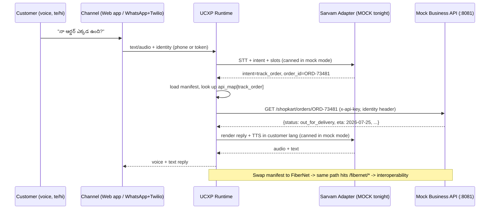

# 5. Mock Business APIs & Seed Data

> Part of the **UCXP execution plan** · [Plan index](PLAN.md)

---

## Mock business layer — ShopKart + FiberNet

Two throwaway FastAPI apps that stand in for "the real business backends". The UCXP runtime never talks to them directly by hardcoded URL — it talks to whatever the loaded `support.manifest` says under `api_map`. Swapping the manifest (ShopKart → FiberNet) is the entire interoperability punchline, and these two services are what make that swap produce real, deterministic results tonight with **zero credits and zero external network**.

### 0. Folder layout

```
mock_business/
  __init__.py
  app.py                 # FastAPI app; mounts both business routers + /health
  auth.py                # simulated auth: business API key + customer identity resolution
  seed.py                # ALL deterministic fixtures (customers, tokens, orders, bills…)
  pdf.py                 # dependency-free minimal PDF builder for invoices
  shopkart/
    __init__.py
    router.py            # /shopkart/*  -> track_order, refund, cancel_order, download_invoice
  fibernet/
    __init__.py
    router.py            # /fibernet/*  -> check_usage, pay_bill, cancel_connection, raise_complaint
  tests/
    test_demo_flows.py   # asserts every demo utterance resolves deterministically
```

Run it: `uvicorn mock_business.app:app --port 8081 --reload`
No DB, no migrations — state lives in module-level dicts and resets on restart (which is what you want between demo runs).

---

### 1. Auth simulation (assignment part 4)

There are **two independent** auth concerns, and the mock models both because the demo needs to show "the assistant authenticated the user" without any real OTP/OAuth.

| Layer | What it represents | How the mock checks it | Demo default |
|---|---|---|---|
| **Business API key** | The credential the manifest declares so the UCXP runtime is allowed to call the business backend (this is the `manifest.auth` block the business portal generated). | Header `x-api-key` must equal the business's key. | Enforcement **off** by default (`AUTH_ENFORCE=false`) so the demo never stalls; flip on to show the check working. |
| **Customer identity** | Which end-user is making the request. On WhatsApp this is the phone number Twilio hands us; on the web app it's a pre-issued persona token. | `Authorization: Bearer <token>` **or** `X-Customer-Phone: +91…`. Both resolve to the same customer record. | Deterministic static tokens seeded ahead of time — no OTP flow to click through. |

Key design choice: **identity is keyed on phone number**, and the same phone maps to a customer in *both* businesses. That is deliberate — it's what makes "the same assistant, same user, now serving FiberNet" land. WhatsApp gives you the phone for free; the web app just picks a persona.

```python
# mock_business/auth.py
import os
from fastapi import Header, HTTPException
from .seed import CUSTOMER_TOKENS, CUSTOMERS, BUSINESS_API_KEYS

AUTH_ENFORCE = os.getenv("AUTH_ENFORCE", "false").lower() == "true"

def require_business_key(business: str):
    """Manifest-declared business credential. Runtime presents it as x-api-key."""
    def _dep(x_api_key: str = Header(default="")):
        if AUTH_ENFORCE and x_api_key != BUSINESS_API_KEYS.get(business):
            raise HTTPException(status_code=401, detail=f"invalid api key for {business}")
        return True
    return _dep

def resolve_customer(authorization: str = Header(default=""),
                     x_customer_phone: str = Header(default="")):
    """Resolve the end-user from a Bearer token (web app) OR a phone (WhatsApp)."""
    phone = None
    if authorization.lower().startswith("bearer "):
        phone = CUSTOMER_TOKENS.get(authorization.split(" ", 1)[1].strip())
    if not phone and x_customer_phone:
        phone = x_customer_phone.strip()
    if not phone or phone not in CUSTOMERS:
        raise HTTPException(status_code=401,
            detail="unknown customer; supply Authorization: Bearer <token> or X-Customer-Phone")
    return {"phone": phone, **CUSTOMERS[phone]}
```

Ownership is enforced per-resource: an order/account is only visible to the customer whose phone owns it, and a mismatch returns `404` (not `403`) so the mock never leaks that another customer's order exists.

---

### 2. Seed fixtures (assignment part 3)

Every value here is chosen so the scripted demo utterances resolve to a **known** answer. Nothing is random.

```python
# mock_business/seed.py
"""Deterministic in-memory seed data for the UCXP mock businesses.
Credit-free, network-free. Mutated at runtime; resets on process restart."""

# ---- Customers: shared identity across businesses (same phone = same person) ----
CUSTOMERS = {
    "+919876543210": {"name": "Ravi Kumar",   "lang": "te"},  # Telugu demo persona
    "+919812345678": {"name": "Priya Sharma",  "lang": "hi"},  # Hindi demo persona
}

# ---- Pre-issued demo tokens (no OTP). token -> phone ----
CUSTOMER_TOKENS = {
    "SKT-RAVI":  "+919876543210",  "SKT-PRIYA": "+919812345678",  # ShopKart web personas
    "FNT-RAVI":  "+919876543210",  "FNT-PRIYA": "+919812345678",  # FiberNet web personas
}

# ---- Business (manifest-declared) API keys the runtime presents ----
BUSINESS_API_KEYS = {
    "shopkart": "sk_live_demo_shopkart",
    "fibernet": "fn_live_demo_fibernet",
}

# =======================  SHOPKART (e-commerce)  =======================
# status drives eligibility deterministically:
#   refund  allowed iff status == "delivered"
#   cancel  allowed iff status in {"processing", "shipped"}
SHOPKART_ORDERS = {
    "ORD-73481": {  # Ravi — TRACK demo (out for delivery, arriving today)
        "owner": "+919876543210", "item": "boAt Rockerz 450 Headphones",
        "status": "out_for_delivery", "amount": 1499, "currency": "INR",
        "placed_on": "2026-07-20", "eta": "2026-07-25",
        "courier": "Delhivery", "tracking_id": "DLV73481IN",
    },
    "ORD-73482": {  # Ravi — REFUND + INVOICE demo (delivered, in return window)
        "owner": "+919876543210", "item": "Prestige Induction Cooktop",
        "status": "delivered", "amount": 2799, "currency": "INR",
        "placed_on": "2026-07-14", "delivered_on": "2026-07-18",
        "return_window_until": "2026-07-25",
        "courier": "BlueDart", "tracking_id": "BD73482IN",
    },
    "ORD-73490": {  # Priya — CANCEL demo variant (shipped, still cancelable)
        "owner": "+919812345678", "item": "Levi's 511 Jeans",
        "status": "shipped", "amount": 2199, "currency": "INR",
        "placed_on": "2026-07-22", "eta": "2026-07-27",
        "courier": "Ekart", "tracking_id": "EK73490IN",
    },
    "ORD-73495": {  # Priya — CANCEL demo (processing, cleanly cancelable)
        "owner": "+919812345678", "item": "Nykaa Luxe Gift Box",
        "status": "processing", "amount": 999, "currency": "INR",
        "placed_on": "2026-07-24", "eta": "2026-07-29",
        "courier": None, "tracking_id": None,
    },
}
SHOPKART_SUBSCRIPTIONS = {
    "SUB-5001": {"owner": "+919876543210", "plan": "ShopKart Plus",
                 "status": "active", "price": 499, "renews_on": "2026-08-15"},
}
# Side-effect stores (start empty; endpoints append here)
SHOPKART_REFUNDS: dict = {}
SHOPKART_CANCELLATIONS: dict = {}

# =======================  FIBERNET (telecom)  =======================
FIBERNET_ACCOUNTS = {
    "FN-AC-88231": {  # Ravi — usage + bill + cancel + complaint demos
        "owner": "+919876543210", "plan": "FiberNet Blaze 200 Mbps",
        "monthly_price": 799, "status": "active",
        "cycle_start": "2026-07-01", "cycle_end": "2026-07-31",
        "fup_gb": 3300, "used_gb": 342.6, "unlimited": True,
    },
    "FN-AC-88232": {  # Priya — second account (bill already paid)
        "owner": "+919812345678", "plan": "FiberNet Lite 100 Mbps",
        "monthly_price": 599, "status": "active",
        "cycle_start": "2026-07-01", "cycle_end": "2026-07-31",
        "fup_gb": 1500, "used_gb": 210.2, "unlimited": True,
    },
}
FIBERNET_BILLS = {
    "FN-AC-88231": {"invoice_no": "FN-INV-072026",   "amount": 799,
                    "due_on": "2026-07-28", "status": "unpaid"},   # PAY demo target
    "FN-AC-88232": {"invoice_no": "FN-INV-072026-P", "amount": 599,
                    "due_on": "2026-07-28", "status": "paid"},
}
# Side-effect stores
FIBERNET_COMPLAINTS: dict = {}
FIBERNET_CANCELLATIONS: dict = {}
```

**Demo-critical constants to memorize** (the utterance script depends on them):

| What | Value |
|---|---|
| Telugu persona | Ravi Kumar, `+919876543210`, tokens `SKT-RAVI` / `FNT-RAVI` |
| Hindi persona | Priya Sharma, `+919812345678`, tokens `SKT-PRIYA` / `FNT-PRIYA` |
| Track order | `ORD-73481` → out for delivery, arriving 2026-07-25, Delhivery `DLV73481IN` |
| Refund + invoice | `ORD-73482` → delivered, ₹2799, return window until 2026-07-25 |
| Cancel order | `ORD-73495` → processing, ₹999 (clean cancel) |
| FiberNet usage | `FN-AC-88231` → 342.6 GB used this cycle, unlimited (FUP 3300 GB) |
| FiberNet unpaid bill | `FN-INV-072026`, ₹799, due 2026-07-28 |

---

### 3. ShopKart mock API (assignment part 1)

Backs `track_order`, `refund`, `cancel_order`, `download_invoice`. Every endpoint is customer-scoped via the `resolve_customer` dependency.

```python
# mock_business/shopkart/router.py
from fastapi import APIRouter, Depends, HTTPException
from fastapi.responses import Response
from pydantic import BaseModel
from ..auth import resolve_customer, require_business_key
from ..pdf import build_invoice_pdf
from .. import seed

router = APIRouter(prefix="/shopkart", tags=["shopkart"],
                   dependencies=[Depends(require_business_key("shopkart"))])

class RefundReq(BaseModel):
    reason: str = "not specified"

class CancelReq(BaseModel):
    reason: str = "not specified"

def _owned_order(order_id: str, cust: dict) -> dict:
    o = seed.SHOPKART_ORDERS.get(order_id)
    if not o or o["owner"] != cust["phone"]:
        raise HTTPException(404, "order not found for this customer")
    return o

# --- track_order (also: list "my orders" when no ID was spoken) ---
@router.get("/orders")
def list_orders(cust: dict = Depends(resolve_customer)):
    items = [{"order_id": oid, **{k: v for k, v in o.items() if k != "owner"}}
             for oid, o in seed.SHOPKART_ORDERS.items() if o["owner"] == cust["phone"]]
    items.sort(key=lambda x: x["placed_on"], reverse=True)
    return {"customer": cust["name"], "orders": items}

@router.get("/orders/{order_id}")
def track_order(order_id: str, cust: dict = Depends(resolve_customer)):
    o = _owned_order(order_id, cust)
    return {"order_id": order_id, "item": o["item"], "status": o["status"],
            "amount": o["amount"], "currency": o["currency"],
            "eta": o.get("eta"), "delivered_on": o.get("delivered_on"),
            "courier": o.get("courier"), "tracking_id": o.get("tracking_id")}

# --- refund (allowed iff delivered) ---
@router.post("/orders/{order_id}/refund")
def refund(order_id: str, body: RefundReq, cust: dict = Depends(resolve_customer)):
    o = _owned_order(order_id, cust)
    if order_id in seed.SHOPKART_REFUNDS:                       # idempotent
        return {"already": True, **seed.SHOPKART_REFUNDS[order_id]}
    if o["status"] != "delivered":
        raise HTTPException(409, detail={
            "code": "REFUND_NOT_ELIGIBLE",
            "message": f"Order is '{o['status']}'; refunds start after delivery."})
    rec = {"refund_id": f"RFND-{order_id.split('-')[1]}", "order_id": order_id,
           "amount": o["amount"], "currency": o["currency"], "status": "initiated",
           "method": "original_payment", "eta_days": 5, "reason": body.reason}
    o["status"] = "refund_initiated"
    seed.SHOPKART_REFUNDS[order_id] = rec
    return rec

# --- cancel_order (allowed iff processing/shipped) ---
@router.post("/orders/{order_id}/cancel")
def cancel_order(order_id: str, body: CancelReq, cust: dict = Depends(resolve_customer)):
    o = _owned_order(order_id, cust)
    if order_id in seed.SHOPKART_CANCELLATIONS:                 # idempotent
        return {"already": True, **seed.SHOPKART_CANCELLATIONS[order_id]}
    if o["status"] not in ("processing", "shipped"):
        raise HTTPException(409, detail={
            "code": "CANCEL_NOT_ELIGIBLE",
            "message": f"Order is '{o['status']}' and can no longer be cancelled."})
    rec = {"cancellation_id": f"CXL-{order_id.split('-')[1]}", "order_id": order_id,
           "status": "cancelled", "refund_amount": o["amount"],
           "currency": o["currency"], "reason": body.reason}
    o["status"] = "cancelled"
    seed.SHOPKART_CANCELLATIONS[order_id] = rec
    return rec

# --- download_invoice (metadata + a real downloadable PDF url) ---
@router.get("/orders/{order_id}/invoice")
def download_invoice(order_id: str, cust: dict = Depends(resolve_customer)):
    o = _owned_order(order_id, cust)
    return {"order_id": order_id, "invoice_no": f"INV-{order_id.split('-')[1]}",
            "item": o["item"], "amount": o["amount"], "currency": o["currency"],
            "issued_on": o.get("delivered_on") or o["placed_on"],
            "download_url": f"/shopkart/orders/{order_id}/invoice.pdf"}

@router.get("/orders/{order_id}/invoice.pdf")
def invoice_pdf(order_id: str, cust: dict = Depends(resolve_customer)):
    o = _owned_order(order_id, cust)
    pdf = build_invoice_pdf([
        "ShopKart - Tax Invoice",
        f"Invoice No: INV-{order_id.split('-')[1]}",
        f"Order ID:   {order_id}",
        f"Customer:   {cust['name']}",
        f"Item:       {o['item']}",
        f"Amount:     INR {o['amount']}",
        f"Issued On:  {o.get('delivered_on') or o['placed_on']}",
    ])
    return Response(content=pdf, media_type="application/pdf")
```

**Request / response examples**

```jsonc
// track_order  ->  GET /shopkart/orders/ORD-73481
//   headers: X-Customer-Phone: +919876543210   (or Authorization: Bearer SKT-RAVI)
{
  "order_id": "ORD-73481", "item": "boAt Rockerz 450 Headphones",
  "status": "out_for_delivery", "amount": 1499, "currency": "INR",
  "eta": "2026-07-25", "delivered_on": null,
  "courier": "Delhivery", "tracking_id": "DLV73481IN"
}

// refund  ->  POST /shopkart/orders/ORD-73482/refund   body: {"reason":"stopped working"}
{
  "refund_id": "RFND-73482", "order_id": "ORD-73482", "amount": 2799,
  "currency": "INR", "status": "initiated", "method": "original_payment",
  "eta_days": 5, "reason": "stopped working"
}

// refund on ineligible order  ->  POST /shopkart/orders/ORD-73481/refund   (409)
{ "detail": { "code": "REFUND_NOT_ELIGIBLE",
              "message": "Order is 'out_for_delivery'; refunds start after delivery." } }

// cancel_order  ->  POST /shopkart/orders/ORD-73495/cancel   body: {"reason":"changed mind"}
{
  "cancellation_id": "CXL-73495", "order_id": "ORD-73495", "status": "cancelled",
  "refund_amount": 999, "currency": "INR", "reason": "changed mind"
}

// download_invoice  ->  GET /shopkart/orders/ORD-73482/invoice
{
  "order_id": "ORD-73482", "invoice_no": "INV-73482",
  "item": "Prestige Induction Cooktop", "amount": 2799, "currency": "INR",
  "issued_on": "2026-07-18", "download_url": "/shopkart/orders/ORD-73482/invoice.pdf"
}
```

On WhatsApp, the runtime turns `download_url` into a Twilio media attachment; on the web app it's a link. The `.pdf` route returns a real one-page PDF built with no third-party dependency (see §6).

---

### 4. FiberNet mock API — the interoperability swap (assignment part 2)

Same shape, same auth dependencies, different verbs. Backs `check_usage`, `pay_bill`, `cancel_connection`, `raise_complaint`. Because the same phones own accounts here, the identical customer (Ravi) is served by the identical assistant the moment the FiberNet manifest is loaded.

```python
# mock_business/fibernet/router.py
from fastapi import APIRouter, Depends, HTTPException
from pydantic import BaseModel
from ..auth import resolve_customer, require_business_key
from .. import seed

router = APIRouter(prefix="/fibernet", tags=["fibernet"],
                   dependencies=[Depends(require_business_key("fibernet"))])

class CancelReq(BaseModel):
    reason: str = "not specified"

class ComplaintReq(BaseModel):
    category: str = "general"          # e.g. "no_internet", "slow_speed", "billing"
    description: str = ""

def _account(cust: dict) -> tuple[str, dict]:
    for acc_id, a in seed.FIBERNET_ACCOUNTS.items():
        if a["owner"] == cust["phone"]:
            return acc_id, a
    raise HTTPException(404, "no FiberNet account for this customer")

# --- check_usage ---
@router.get("/usage")
def check_usage(cust: dict = Depends(resolve_customer)):
    acc_id, a = _account(cust)
    remaining = None if a["unlimited"] else round(a["fup_gb"] - a["used_gb"], 1)
    return {"account_id": acc_id, "plan": a["plan"], "used_gb": a["used_gb"],
            "fup_gb": a["fup_gb"], "unlimited": a["unlimited"],
            "remaining_gb": remaining,
            "cycle": {"start": a["cycle_start"], "end": a["cycle_end"]}}

# --- pay_bill ---
@router.post("/bill/pay")
def pay_bill(cust: dict = Depends(resolve_customer)):
    acc_id, _ = _account(cust)
    bill = seed.FIBERNET_BILLS[acc_id]
    if bill["status"] == "paid":
        return {"already": True, "invoice_no": bill["invoice_no"], "status": "paid"}
    bill["status"] = "paid"
    return {"receipt_id": f"RCPT-{acc_id.split('-')[-1]}", "invoice_no": bill["invoice_no"],
            "amount": bill["amount"], "currency": "INR", "status": "paid",
            "method": "upi"}

# --- cancel_connection ---
@router.post("/connection/cancel")
def cancel_connection(body: CancelReq, cust: dict = Depends(resolve_customer)):
    acc_id, a = _account(cust)
    if acc_id in seed.FIBERNET_CANCELLATIONS:
        return {"already": True, **seed.FIBERNET_CANCELLATIONS[acc_id]}
    rec = {"cancellation_id": f"FCXL-{acc_id.split('-')[-1]}", "account_id": acc_id,
           "status": "scheduled", "effective_on": a["cycle_end"], "reason": body.reason}
    a["status"] = "cancellation_scheduled"
    seed.FIBERNET_CANCELLATIONS[acc_id] = rec
    return rec

# --- raise_complaint ---
@router.post("/complaint")
def raise_complaint(body: ComplaintReq, cust: dict = Depends(resolve_customer)):
    acc_id, _ = _account(cust)
    n = len(seed.FIBERNET_COMPLAINTS) + 1
    rec = {"ticket_id": f"CMP-{acc_id.split('-')[-1]}-{n:03d}", "account_id": acc_id,
           "category": body.category, "description": body.description,
           "status": "open", "sla_hours": 24}
    seed.FIBERNET_COMPLAINTS[rec["ticket_id"]] = rec
    return rec
```

**Request / response examples**

```jsonc
// check_usage  ->  GET /fibernet/usage    (Authorization: Bearer FNT-RAVI)
{
  "account_id": "FN-AC-88231", "plan": "FiberNet Blaze 200 Mbps",
  "used_gb": 342.6, "fup_gb": 3300, "unlimited": true, "remaining_gb": null,
  "cycle": { "start": "2026-07-01", "end": "2026-07-31" }
}

// pay_bill  ->  POST /fibernet/bill/pay
{ "receipt_id": "RCPT-88231", "invoice_no": "FN-INV-072026",
  "amount": 799, "currency": "INR", "status": "paid", "method": "upi" }

// cancel_connection  ->  POST /fibernet/connection/cancel   body: {"reason":"moving cities"}
{ "cancellation_id": "FCXL-88231", "account_id": "FN-AC-88231",
  "status": "scheduled", "effective_on": "2026-07-31", "reason": "moving cities" }

// raise_complaint  ->  POST /fibernet/complaint   body: {"category":"slow_speed","description":"speed drops at night"}
{ "ticket_id": "CMP-88231-001", "account_id": "FN-AC-88231",
  "category": "slow_speed", "description": "speed drops at night",
  "status": "open", "sla_hours": 24 }
```

---

### 5. How the UCXP runtime reaches these (the manifest binding)

The runtime resolves each intent through the loaded manifest's `api_map`, so nothing about ShopKart vs FiberNet is hardcoded in the orchestrator. These are the two `api_map` blocks the business portal's generator would emit.

```jsonc
// support.manifest (ShopKart) — excerpt
"auth": { "type": "api_key", "header": "x-api-key", "key_ref": "shopkart" },
"base_url_ref": "MOCK_SHOPKART_BASE",   // -> http://localhost:8081
"api_map": {
  "track_order":      { "method": "GET",  "path": "/shopkart/orders/{order_id}" },
  "refund":           { "method": "POST", "path": "/shopkart/orders/{order_id}/refund",
                        "body": { "reason": "{reason}" } },
  "cancel_order":     { "method": "POST", "path": "/shopkart/orders/{order_id}/cancel",
                        "body": { "reason": "{reason}" } },
  "download_invoice": { "method": "GET",  "path": "/shopkart/orders/{order_id}/invoice" }
}
```

```jsonc
// support.manifest (FiberNet) — excerpt  (swap this in, same runtime)
"auth": { "type": "api_key", "header": "x-api-key", "key_ref": "fibernet" },
"base_url_ref": "MOCK_FIBERNET_BASE",   // -> http://localhost:8081
"api_map": {
  "check_usage":        { "method": "GET",  "path": "/fibernet/usage" },
  "pay_bill":           { "method": "POST", "path": "/fibernet/bill/pay" },
  "cancel_connection":  { "method": "POST", "path": "/fibernet/connection/cancel",
                          "body": { "reason": "{reason}" } },
  "raise_complaint":    { "method": "POST", "path": "/fibernet/complaint",
                          "body": { "category": "{category}", "description": "{description}" } }
}
```

The runtime injects `x-api-key` from `key_ref` and forwards customer identity as `Authorization: Bearer <token>` (web) or `X-Customer-Phone` (WhatsApp).



The mock business layer is fully independent of Sarvam — it runs and returns real data tonight whether the Sarvam adapter is in `mock` or `live` mode.

---

### 6. Dependency-free invoice PDF + app wiring

```python
# mock_business/pdf.py
def build_invoice_pdf(lines: list[str]) -> bytes:
    """Minimal, valid single-page PDF. No external dependency (credit/offline friendly)."""
    def esc(s): return s.replace("\\", r"\\").replace("(", r"\(").replace(")", r"\)")
    content = b"BT /F1 12 Tf 50 800 Td 16 TL\n"
    for ln in lines:
        content += f"({esc(ln)}) Tj T*\n".encode("latin-1", "replace")
    content += b"ET"
    objects = [
        b"<< /Type /Catalog /Pages 2 0 R >>",
        b"<< /Type /Pages /Kids [3 0 R] /Count 1 >>",
        b"<< /Type /Page /Parent 2 0 R /MediaBox [0 0 595 842] "
        b"/Resources << /Font << /F1 4 0 R >> >> /Contents 5 0 R >>",
        b"<< /Type /Font /Subtype /Type1 /BaseFont /Helvetica >>",
        b"<< /Length %d >>\nstream\n" % len(content) + content + b"\nendstream",
    ]
    pdf, offsets = b"%PDF-1.4\n", []
    for i, body in enumerate(objects, start=1):
        offsets.append(len(pdf))
        pdf += b"%d 0 obj\n" % i + body + b"\nendobj\n"
    xref = len(pdf)
    pdf += b"xref\n0 %d\n0000000000 65535 f \n" % (len(objects) + 1)
    for off in offsets:
        pdf += b"%010d 00000 n \n" % off
    pdf += b"trailer\n<< /Size %d /Root 1 0 R >>\nstartxref\n%d\n%%%%EOF" % (
        len(objects) + 1, xref)
    return pdf
```

```python
# mock_business/app.py
from fastapi import FastAPI
from .shopkart.router import router as shopkart_router
from .fibernet.router import router as fibernet_router

app = FastAPI(title="UCXP Mock Businesses")
app.include_router(shopkart_router)
app.include_router(fibernet_router)

@app.get("/health")
def health():
    return {"ok": True, "businesses": ["shopkart", "fibernet"]}
```

---

### 7. Demo utterance → deterministic resolution (smoke test)

Every scripted line lands on a fixed, repeatable response.

| Spoken (persona) | Intent + slots | Call | Deterministic result |
|---|---|---|---|
| "నా ఆర్డర్ ఎక్కడ ఉంది?" (Ravi) | track_order `ORD-73481` | `GET /shopkart/orders/ORD-73481` | out_for_delivery, arriving 2026-07-25, Delhivery |
| "इस कुकटॉप का रिफंड चाहिए" (Ravi) | refund `ORD-73482` | `POST …/refund` | `RFND-73482` initiated, ₹2799, 5 days |
| "मेरा गिफ्ट बॉक्स ऑर्डर कैंसिल करो" (Priya) | cancel_order `ORD-73495` | `POST …/cancel` | `CXL-73495` cancelled, ₹999 refund |
| "invoice భేజండి" (Ravi) | download_invoice `ORD-73482` | `GET …/invoice` | `INV-73482` + PDF link |
| "నా డేటా వాడకం ఎంత?" (Ravi) | check_usage | `GET /fibernet/usage` | 342.6 GB used, unlimited |
| "मेरा बिल भर दो" (Ravi) | pay_bill | `POST /fibernet/bill/pay` | `RCPT-88231` paid, ₹799 |
| "కనెక్షన్ క్యాన్సిల్ చెయ్యి" (Ravi) | cancel_connection | `POST /fibernet/connection/cancel` | `FCXL-88231` scheduled 2026-07-31 |
| "इंटरनेट धीमा है, complaint" (Ravi) | raise_complaint slow_speed | `POST /fibernet/complaint` | `CMP-88231-001` open, 24h SLA |

```bash
# one-line offline sanity check (no Sarvam, no credits)
curl -s localhost:8081/shopkart/orders/ORD-73481 -H "X-Customer-Phone: +919876543210"
curl -s -X POST localhost:8081/fibernet/bill/pay   -H "Authorization: Bearer FNT-RAVI"
```

`tests/test_demo_flows.py` should assert each row above (status codes + the eligibility 409s for `ORD-73481` refund and `ORD-73482` cancel) so a broken seed is caught before you're on stage.

---

[← Sarvam Adapter (Mock + Live)](04-sarvam-adapter.md) · [AI Manifest Generator (Business Portal) →](06-manifest-generator.md)
