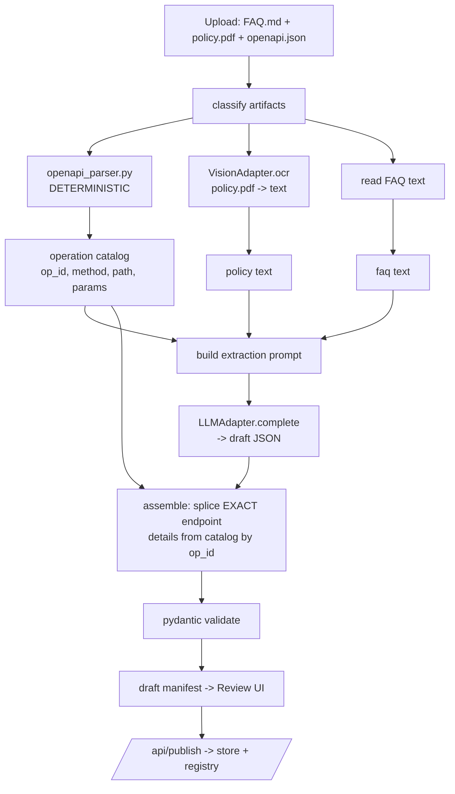

# 6. AI Manifest Generator (Business Portal)

> Part of the **UCXP execution plan** · [Plan index](PLAN.md)

---

# AI Manifest Generator & Business Portal

The business portal turns unstructured artifacts (FAQs, policy PDFs, an OpenAPI spec) into a validated `support.manifest.json` with **one click**. The wow moment: *"we never wrote a config file — the AI read our docs and API and wrote the protocol."* Everything below runs tonight with `SARVAM_MODE=mock` (zero credits, zero network) and flips to live tomorrow by changing one env var.

## 1. Folder layout

```
business_portal/
├── app.py                       # FastAPI app + all routes
├── config.py                    # SARVAM_MODE, MANIFEST_STORE path, keys
├── adapters/
│   ├── base.py                  # VisionAdapter / LLMAdapter Protocols
│   ├── sarvam_vision.py         # OCR: MockVision + LiveVision
│   ├── sarvam_llm.py            # Chat LLM: MockLLM + LiveLLM
│   └── factory.py               # picks mock vs live from SARVAM_MODE
├── extract/
│   ├── schema.py                # pydantic models = the manifest contract
│   ├── openapi_parser.py        # DETERMINISTIC spec -> operation catalog
│   ├── prompt.py                # extraction system+user prompt templates
│   └── pipeline.py              # OCR + parse + LLM + assemble + validate
├── store/
│   ├── store.py                 # load/save/publish + registry
│   ├── registry.json            # business_id/domain -> manifest path (SHARED w/ runtime)
│   └── manifests/
│       └── shopkart/support.manifest.json
├── mocks/
│   ├── fixtures/                # shopkart_faq.md, shopkart_policy.pdf, shopkart_openapi.json
│   └── responses/
│       ├── shopkart_ocr.txt     # canned OCR of the policy PDF
│       └── shopkart_manifest.json  # the golden sample manifest
├── static/
│   ├── portal.html              # upload + review/edit UI
│   └── portal.js
└── requirements.txt             # fastapi uvicorn pydantic python-multipart httpx pyyaml sarvamai
```

**`store/`** is the integration boundary with the runtime section: both sides read `MANIFEST_STORE` (default `./store`) and use the same `registry.json`. See §10.

## 2. The `support.manifest` contract (`extract/schema.py`)

This is what the generator emits and what the runtime consumes. Pydantic doubles as the validator used by `/api/validate`.

```python
from pydantic import BaseModel, Field
from typing import Literal, Optional
from enum import Enum

class ParamSource(str, Enum):
    user = "user"        # ask the customer
    auth = "auth"        # comes from the authenticated session (e.g. phone)
    context = "context"  # inferred from earlier turns

class Parameter(BaseModel):
    name: str
    type: Literal["string", "number", "boolean", "date"] = "string"
    required: bool = True
    source: ParamSource = ParamSource.user
    prompt: str                       # what the assistant asks, e.g. "What's your order ID?"
    example: Optional[str] = None

class ApiMapping(BaseModel):
    operation_id: str                 # MUST exist in the OpenAPI catalog
    method: Literal["GET","POST","PUT","PATCH","DELETE"]
    path: str                         # exact, copied from spec (never LLM-authored)
    path_params: dict[str, str] = {}  # {"order_id": "$.order_id"} JSONPath into collected params
    query_params: dict[str, str] = {}
    body: Optional[dict[str, str]] = None
    response_map: dict[str, str] = {} # {"status": "$.data.status"} -> what to speak back

class Capability(BaseModel):
    id: str                           # snake_case: track_order, cancel_order, refund_status...
    title: str
    description: str
    requires_auth: bool = True
    parameters: list[Parameter] = []
    api_mapping: ApiMapping

class KnowledgeItem(BaseModel):
    q: str
    a: str
    tags: list[str] = []
    source: str                       # "faq.md" | "policy.pdf#p3"

class ApiConfig(BaseModel):
    base_url: str
    auth_type: Literal["none","api_key","bearer","oauth2"] = "api_key"
    auth_header: str = "x-api-key"
    secret_ref: str = "SHOPKART_API_KEY"   # env var name; NEVER the secret itself

class Escalation(BaseModel):
    triggers: list[str] = ["human_request","low_confidence","unsupported_capability"]
    channels: list[dict] = []         # [{"type":"phone","target":"1800..."}]
    hours: Optional[str] = None       # "Mon-Sat 09:00-21:00 IST"

class Business(BaseModel):
    id: str
    name: str
    domains: list[str] = []
    description: Optional[str] = None

class SupportManifest(BaseModel):
    ucxp_version: str = "0.1"
    business: Business
    languages: dict = Field(default_factory=lambda: {
        "supported": ["en-IN","hi-IN","te-IN","ta-IN","kn-IN","ml-IN","mr-IN","bn-IN","gu-IN"],
        "default": "en-IN"})
    api: ApiConfig
    auth: dict = Field(default_factory=lambda: {"type":"otp","identifiers":["phone"]})
    capabilities: list[Capability]
    knowledge: list[KnowledgeItem] = []
    escalation: Escalation = Field(default_factory=Escalation)
```

## 3. Generation pipeline

**Design principle: the LLM does *semantics*, deterministic code does *facts*.** Exact endpoints, methods, and paths are copied verbatim from the parsed OpenAPI spec — the LLM only *chooses which operation_id maps to which capability* and *authors the natural-language prompts/knowledge*. This makes hallucinated URLs structurally impossible.



## 4. FastAPI backend (`app.py`)

```python
from fastapi import FastAPI, UploadFile, File, HTTPException
from fastapi.responses import JSONResponse, FileResponse
from fastapi.staticfiles import StaticFiles
from extract.pipeline import generate_manifest
from extract.schema import SupportManifest
from store.store import publish, load_manifest, list_registry
from config import settings

app = FastAPI(title="UCXP Business Portal")
app.mount("/static", StaticFiles(directory="static"), name="static")

@app.post("/api/generate")
async def api_generate(files: list[UploadFile] = File(...)):
    """Multipart upload of FAQ / policy PDF / OpenAPI spec -> draft manifest."""
    payload = [{"filename": f.filename, "bytes": await f.read()} for f in files]
    try:
        manifest, warnings = generate_manifest(payload)   # returns dict + list[str]
    except Exception as e:
        raise HTTPException(422, f"generation failed: {e}")
    return {"draft": manifest, "warnings": warnings, "mode": settings.SARVAM_MODE}

@app.post("/api/validate")
async def api_validate(body: dict):
    try:
        SupportManifest.model_validate(body)
        return {"valid": True, "errors": []}
    except Exception as e:
        return {"valid": False, "errors": str(e).splitlines()}

@app.post("/api/publish")
async def api_publish(body: dict):
    m = SupportManifest.model_validate(body)          # reject invalid before writing
    url = publish(m.model_dump())                      # writes store + registry
    return {"business_id": m.business.id, "manifest_url": url}

@app.get("/api/registry")                              # demo swap + runtime discovery
async def api_registry():
    return list_registry()

@app.get("/manifests/{business_id}/support.manifest.json")
async def api_manifest(business_id: str):
    m = load_manifest(business_id)
    if not m: raise HTTPException(404, "no manifest")
    return JSONResponse(m)

@app.get("/")
async def root(): return FileResponse("static/portal.html")
```

## 5. Adapters — the single mock/live seam (`adapters/`)

Every Sarvam call goes through these Protocols. Nothing else in the codebase imports `sarvamai`.

```python
# adapters/base.py
from typing import Protocol

class VisionAdapter(Protocol):
    def ocr(self, file_bytes: bytes, filename: str) -> str: ...

class LLMAdapter(Protocol):
    def complete(self, system: str, user: str) -> str: ...   # returns raw JSON string
```

```python
# adapters/factory.py
from config import settings
from adapters.sarvam_vision import MockVision, LiveVision
from adapters.sarvam_llm import MockLLM, LiveLLM

def get_vision() -> "VisionAdapter":
    return LiveVision() if settings.SARVAM_MODE == "live" else MockVision()

def get_llm() -> "LLMAdapter":
    return LiveLLM() if settings.SARVAM_MODE == "live" else MockLLM()
```

```python
# adapters/sarvam_llm.py
import json, hashlib, pathlib
from config import settings

MOCKS = pathlib.Path(__file__).parent.parent / "mocks" / "responses"

class MockLLM:
    """Deterministic. Pure function of input -> canned draft. No network, no timestamps."""
    def complete(self, system: str, user: str) -> str:
        # 1) Known fixture (ShopKart) -> golden draft
        if "ShopKart" in user or "shopkart" in user.lower():
            return (MOCKS / "shopkart_manifest.json").read_text()
        # 2) Unknown input -> still succeed: build a structural draft from the op catalog
        #    embedded in the prompt, so ANY upload demos end-to-end tonight.
        return _structural_fallback(user)

class LiveLLM:
    def __init__(self):
        from sarvamai import SarvamAI
        self.client = SarvamAI(api_subscription_key=settings.SARVAM_KEY)
    def complete(self, system: str, user: str) -> str:
        r = self.client.chat.completions(               # OpenAI-compatible /chat/completions
            model="sarvam-105b",
            messages=[{"role":"system","content":system},
                      {"role":"user","content":user}],
            temperature=0, response_format={"type":"json_object"})
        return r.choices[0].message.content
```

```python
# adapters/sarvam_vision.py
import pathlib
from config import settings
MOCKS = pathlib.Path(__file__).parent.parent / "mocks" / "responses"

class MockVision:
    def ocr(self, file_bytes: bytes, filename: str) -> str:
        # keyed by filename stem; falls back to decoding text-ish uploads
        cand = MOCKS / f"{pathlib.Path(filename).stem}_ocr.txt"
        if cand.exists(): return cand.read_text()
        if filename.endswith((".md",".txt",".json")): return file_bytes.decode("utf-8","ignore")
        return (MOCKS / "shopkart_ocr.txt").read_text()   # safe default for demo PDFs

class LiveVision:
    def __init__(self):
        from sarvamai import SarvamAI
        self.client = SarvamAI(api_subscription_key=settings.SARVAM_KEY)
    def ocr(self, file_bytes: bytes, filename: str) -> str:
        # document_intelligence job API, ~10 pages/job; poll then concat page text
        job = self.client.document_intelligence.create(file=(filename, file_bytes))
        job.wait()
        return "\n".join(p.text for p in job.result.pages)
```

## 6. Deterministic OpenAPI parser (`extract/openapi_parser.py`)

Produces the **operation catalog** — the ground truth of endpoints. The LLM may only reference `operation_id`s that appear here.

```python
import json, yaml

def parse_openapi(raw: bytes) -> dict:
    spec = yaml.safe_load(raw)                      # handles JSON and YAML
    base = (spec.get("servers") or [{}])[0].get("url", "")
    ops = []
    for path, methods in spec.get("paths", {}).items():
        for method, op in methods.items():
            if method.lower() not in {"get","post","put","patch","delete"}: continue
            oid = op.get("operationId") or f"{method}_{path}".strip("/").replace("/","_").replace("{","").replace("}","")
            params = [{"name":p["name"],"in":p["in"],"required":p.get("required",False),
                       "type":(p.get("schema") or {}).get("type","string")}
                      for p in op.get("parameters", [])]
            ops.append({
                "operation_id": oid,
                "method": method.upper(),
                "path": path,
                "summary": op.get("summary") or op.get("description",""),
                "tags": op.get("tags", []),
                "params": params,
                "has_body": "requestBody" in op,
            })
    return {"base_url": base, "operations": ops}
```

The catalog is (a) injected into the prompt as a compact menu, and (b) kept server-side so assembly can splice exact `method`/`path`/`params` back in — the LLM never sees a chance to invent a URL.

## 7. Extraction prompt & assembly (`extract/prompt.py`, `pipeline.py`)

The LLM returns a **draft** that references `operation_id`s (not endpoints). We then splice exact endpoint facts from the catalog.

**System prompt:**

```
You are UCXP-Extractor. You convert a business's support documents and API catalog
into a UCXP support.manifest. You output ONLY a single valid JSON object, no prose.

RULES:
1. Emit one capability per customer support action the business actually supports
   (e.g. track_order, cancel_order, refund_status, book_slot, get_invoice).
2. Every capability's "operation_id" MUST be copied verbatim from the OPERATION CATALOG
   below. If no operation matches an action, DO NOT create that capability.
3. Do NOT write URLs, HTTP methods, or paths — only the operation_id. The system fills
   endpoint details from the catalog.
4. Parameters: list only what the customer must provide. Give each a natural, friendly
   "prompt" in English. Mark identity fields (phone, email) as source:"auth".
5. Map response fields the customer cares about in "response_map" using JSONPath.
6. knowledge: turn FAQ/policy text into concise q/a pairs with a "source" tag.
7. languages.supported: keep the provided Indic default set unless the docs restrict it.
8. escalation: extract support hours and contact channels from the policy text if present.
9. Output must match this skeleton exactly (fill the arrays):
```

**User prompt template:**

```python
USER_TMPL = """BUSINESS: {business_name}

=== OPERATION CATALOG (the ONLY valid operation_ids) ===
{catalog}                       # e.g. "- getOrderStatus  GET /orders/{{order_id}}  params: order_id(path)"

=== FAQ TEXT ===
{faq_text}

=== POLICY TEXT (OCR) ===
{policy_text}

Return the JSON manifest draft now. Reference only operation_ids from the catalog.
Draft skeleton:
{{"business":{{"id":"...","name":"...","domains":[]}},
  "languages":{{"supported":[...],"default":"en-IN"}},
  "auth":{{"type":"otp","identifiers":["phone"]}},
  "capabilities":[{{"id":"...","title":"...","description":"...","requires_auth":true,
     "parameters":[{{"name":"...","type":"string","required":true,"source":"user","prompt":"..."}}],
     "operation_id":"...","response_map":{{"...":"$.data..."}}}}],
  "knowledge":[{{"q":"...","a":"...","tags":[],"source":"..."}}],
  "escalation":{{"channels":[{{"type":"phone","target":"..."}}],"hours":"..."}}}}
"""
```

**Pipeline + assembly (`extract/pipeline.py`):**

```python
import json
from adapters.factory import get_vision, get_llm
from extract.openapi_parser import parse_openapi
from extract.prompt import SYSTEM, USER_TMPL
from extract.schema import SupportManifest

def _classify(files):
    faq = policy = spec = None
    for f in files:
        n = f["filename"].lower()
        if n.endswith((".json",".yaml",".yml")) and _looks_openapi(f["bytes"]): spec = f
        elif n.endswith(".pdf"): policy = f
        else: faq = f
    return faq, policy, spec

def generate_manifest(files):
    vision, llm = get_vision(), get_llm()
    warnings = []
    faq, policy, spec = _classify(files)

    catalog = parse_openapi(spec["bytes"]) if spec else {"base_url":"","operations":[]}
    if not spec: warnings.append("No OpenAPI spec: capabilities will be knowledge-only.")

    faq_text    = vision.ocr(faq["bytes"], faq["filename"]) if faq else ""
    policy_text = vision.ocr(policy["bytes"], policy["filename"]) if policy else ""

    catalog_txt = "\n".join(
        f"- {o['operation_id']}  {o['method']} {o['path']}  "
        f"params: {', '.join(p['name']+'('+p['in']+')' for p in o['params']) or 'none'}"
        for o in catalog["operations"])
    business_name = _guess_name(faq_text, policy_text) or "Business"

    raw = llm.complete(SYSTEM, USER_TMPL.format(
        business_name=business_name, catalog=catalog_txt or "(none)",
        faq_text=faq_text[:6000], policy_text=policy_text[:6000]))
    draft = json.loads(raw)

    manifest = _assemble(draft, catalog, warnings)      # splice exact endpoints
    SupportManifest.model_validate(manifest)            # raises on invalid
    return manifest, warnings

def _assemble(draft, catalog, warnings):
    by_id = {o["operation_id"]: o for o in catalog["operations"]}
    caps = []
    for c in draft.get("capabilities", []):
        oid = c.get("operation_id")
        op = by_id.get(oid)
        if not op:                                       # LLM referenced unknown op -> drop, warn
            warnings.append(f"Dropped capability '{c.get('id')}': operation_id '{oid}' not in spec.")
            continue
        path_params = {p["name"]: f"$.{p['name']}" for p in op["params"] if p["in"]=="path"}
        query_params= {p["name"]: f"$.{p['name']}" for p in op["params"] if p["in"]=="query"}
        c["api_mapping"] = {                             # FACTS from catalog, not from LLM
            "operation_id": oid, "method": op["method"], "path": op["path"],
            "path_params": path_params, "query_params": query_params,
            "body": {"__from_params__": True} if op["has_body"] else None,
            "response_map": c.pop("response_map", {})}
        caps.append(c)
    draft["capabilities"] = caps
    draft.setdefault("api", {})
    draft["api"] = {"base_url": catalog["base_url"] or "https://mock.local",
                    "auth_type":"api_key","auth_header":"x-api-key",
                    "secret_ref": f"{draft['business']['id'].upper()}_API_KEY"}
    return draft
```

## 8. Mock-mode path — ShopKart yields the golden manifest tonight

The demo is fully deterministic and credit-free:

1. `mocks/fixtures/` holds `shopkart_faq.md`, `shopkart_policy.pdf`, `shopkart_openapi.json`.
2. `mocks/responses/shopkart_ocr.txt` is the pre-baked OCR of the policy PDF; `MockVision` returns it.
3. `MockLLM.complete()` detects `"ShopKart"` in the prompt and returns `mocks/responses/shopkart_manifest.json` verbatim → after `_assemble` splices the real endpoints from the parsed (real) OpenAPI spec, you get the exact golden manifest, byte-stable across runs.
4. **Robustness bonus:** for *any other* upload tonight, `MockLLM` falls back to `_structural_fallback()` which builds one capability per catalog operation (id from `operation_id`, prompts templated from param names). So a judge uploading a random Swagger file still sees a live end-to-end generation — no credits, no crash.

`mocks/responses/shopkart_manifest.json` (the golden draft the MockLLM returns) — capabilities reference `operation_id`s only:

```json
{
  "business": {"id":"shopkart","name":"ShopKart","domains":["shopkart.example.com"]},
  "languages": {"supported":["en-IN","hi-IN","te-IN","ta-IN","kn-IN"],"default":"en-IN"},
  "auth": {"type":"otp","identifiers":["phone"]},
  "capabilities": [
    {"id":"track_order","title":"Track order","description":"Get live status of an order",
     "requires_auth":true,
     "parameters":[{"name":"order_id","type":"string","required":true,"source":"user",
                    "prompt":"What is your order ID?","example":"SK10231"}],
     "operation_id":"getOrderStatus",
     "response_map":{"status":"$.data.status","eta":"$.data.expected_delivery"}},
    {"id":"cancel_order","title":"Cancel order","description":"Cancel an undelivered order",
     "requires_auth":true,
     "parameters":[{"name":"order_id","type":"string","required":true,"source":"user",
                    "prompt":"Which order ID should I cancel?"}],
     "operation_id":"cancelOrder","response_map":{"result":"$.data.cancelled"}}
  ],
  "knowledge": [
    {"q":"What is the refund window?","a":"Refunds are processed within 5-7 business days.",
     "tags":["refund"],"source":"policy.pdf"}
  ],
  "escalation": {"channels":[{"type":"phone","target":"1800-266-1234"}],
                 "hours":"Mon-Sat 09:00-21:00 IST"}
}
```

## 9. Review / edit UI (`static/portal.html` + `portal.js`)

Single page, no build step. Three states: **upload → review → published.**

```html
<!-- portal.html (body content) -->
<h1>UCXP · Publish your support protocol</h1>

<section id="upload">
  <p>Drop your FAQ, policy PDF, and OpenAPI spec.</p>
  <input type="file" id="files" multiple>
  <button onclick="generate()">✨ Generate manifest</button>
  <span id="mode-badge"></span>
</section>

<section id="review" hidden>
  <div class="split">
    <div class="summary">                <!-- human-readable, auto-rendered from JSON -->
      <h3>Capabilities</h3><ul id="caps"></ul>
      <h3>Languages</h3><p id="langs"></p>
      <h3>Warnings</h3><ul id="warns"></ul>
    </div>
    <div class="editor">                 <!-- raw editable JSON -->
      <textarea id="json" spellcheck="false" rows="30"></textarea>
      <button onclick="validate()">Validate</button>
      <button onclick="publish()">Publish ▲</button>
      <p id="status"></p>
    </div>
  </div>
</section>

<section id="done" hidden>
  <p>Published ✔ &nbsp; <a id="url" target="_blank"></a></p>
  <p>Now open the customer app and ask in Telugu — same assistant, this business.</p>
</section>
```

```javascript
// portal.js
async function generate() {
  const fd = new FormData();
  for (const f of document.getElementById('files').files) fd.append('files', f);
  const r = await (await fetch('/api/generate', {method:'POST', body:fd})).json();
  document.getElementById('json').value = JSON.stringify(r.draft, null, 2);
  renderSummary(r.draft, r.warnings);
  document.getElementById('mode-badge').textContent = `mode: ${r.mode}`;
  show('review');
}
function renderSummary(m, warnings=[]) {
  caps.innerHTML  = m.capabilities.map(c => `<li><b>${c.id}</b> → ${c.api_mapping.method} ${c.api_mapping.path}</li>`).join('');
  langs.textContent = m.languages.supported.join(', ');
  warns.innerHTML = warnings.map(w => `<li>${w}</li>`).join('') || '<li>none</li>';
}
async function validate() {
  const body = JSON.parse(document.getElementById('json').value);
  const r = await (await fetch('/api/validate',{method:'POST',headers:{'Content-Type':'application/json'},body:JSON.stringify(body)})).json();
  status.textContent = r.valid ? '✅ valid' : '❌ ' + r.errors.join(' | ');
}
async function publish() {
  const body = JSON.parse(document.getElementById('json').value);
  const r = await (await fetch('/api/publish',{method:'POST',headers:{'Content-Type':'application/json'},body:JSON.stringify(body)})).json();
  const a = document.getElementById('url'); a.href = r.manifest_url; a.textContent = r.manifest_url;
  show('done');
}
```

The editor is intentionally a raw JSON textarea + `Validate` (round-trips pydantic errors) + live summary — enough for a human to fix a wrong prompt or drop a capability in 20 seconds, no heavy JSON-schema form builder needed for the hackathon.

## 10. Storage & runtime handoff (`store/store.py`)

Both the portal and the runtime section import this module (or read the same files). `registry.json` is the discovery contract.

```python
import json, pathlib
from config import settings

ROOT = pathlib.Path(settings.MANIFEST_STORE)          # default ./store
MANIFESTS = ROOT / "manifests"
REGISTRY  = ROOT / "registry.json"

def publish(manifest: dict) -> str:
    bid = manifest["business"]["id"]
    d = MANIFESTS / bid; d.mkdir(parents=True, exist_ok=True)
    (d / "support.manifest.json").write_text(json.dumps(manifest, indent=2))
    reg = _read_registry()
    reg[bid] = {"path": str(d / "support.manifest.json"),
                "name": manifest["business"]["name"],
                "domains": manifest["business"].get("domains", []),
                "status": "published"}
    REGISTRY.write_text(json.dumps(reg, indent=2))
    return f"/manifests/{bid}/support.manifest.json"

def load_manifest(business_id: str) -> dict | None:    # <- runtime calls this
    p = MANIFESTS / business_id / "support.manifest.json"
    return json.loads(p.read_text()) if p.exists() else None

def list_registry() -> dict:                           # <- runtime "swap business" reads this
    return _read_registry()

def _read_registry() -> dict:
    return json.loads(REGISTRY.read_text()) if REGISTRY.exists() else {}
```

**`registry.json` shape** (the interoperability index — the punchline "swap in a second manifest" is just adding a second key here):

```json
{
  "shopkart": {"path":"store/manifests/shopkart/support.manifest.json",
               "name":"ShopKart","domains":["shopkart.example.com"],"status":"published"},
  "airtel":   {"path":"store/manifests/airtel/support.manifest.json",
               "name":"Airtel","domains":["airtel.example.com"],"status":"published"}
}
```

The runtime resolves an incoming request ("Where is my ShopKart order?") to a `business_id` via name/domain match against `registry.json`, then `load_manifest(business_id)` — the **same** runtime now serves any published business with zero code change. That is the interoperability demo, and the manifest generator is what fills the registry.

---

[← Mock Business APIs & Seed Data](05-mock-business.md) · [Web App (WhatsApp-styled) →](07-web-app.md)
