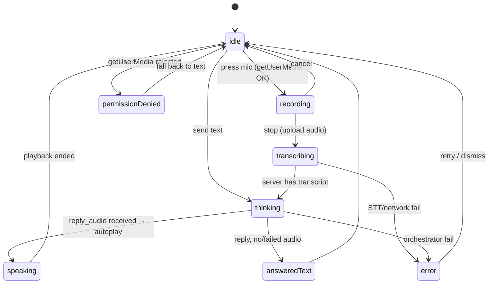

# 7. Web App (WhatsApp-styled)

> Part of the **UCXP execution plan** · [Plan index](PLAN.md)

---

## Web App (WhatsApp-styled) UI

Customer-facing chat client. Pure static frontend served by FastAPI `StaticFiles`; talks to the **same orchestrator** the WhatsApp channel uses, over one channel-agnostic turn contract. Runs fully tonight against the mock backend (canned STT text + canned TTS `.wav`), zero credits.

### 1. ASCII Wireframe — Chat Screen

```
┌───────────────────────────────────────────────┐
│ ☰  ⟨logo⟩  Flipkart Support        [తెలుగు ▾] │  ← header: switcher · biz name/logo · lang
│         online · UCXP protocol                 │
├───────────────────────────────────────────────┤
│                                                │
│   ┌───────────────────────────────┐            │
│   │ నమస్కారం! మీ ఆర్డర్ గురించి    │  ← incoming (assistant), left, white
│   │ అడగండి.                        │            │
│   │                         10:02  │            │
│   └───────────────────────────────┘            │
│                                                │
│            ┌──────────────────────────────┐    │
│  outgoing→ │ ▶ ▁▃▅▂▇▄▁▃  0:04             │    │  ← user VOICE bubble, right, green
│  (voice)   │                    10:02 ✓✓  │    │     waveform + play + duration
│            └──────────────────────────────┘    │
│            ┌──────────────────────────────┐    │
│            │ "నా ఆర్డర్ ఎక్కడ ఉంది?"      │    │  ← STT transcript shown under it
│            │  (transcript)          10:02 │    │     (small, italic, muted)
│            └──────────────────────────────┘    │
│                                                │
│   ┌───────────────────────────────┐            │
│   │ ▶ ▁▃▇▅▂▄▆▁  0:06     🔊       │  ← assistant VOICE reply (auto-playing)
│   │ మీ ఆర్డర్ రేపు వస్తుంది.       │            │     waveform + text caption
│   │                         10:02  │            │
│   └───────────────────────────────┘            │
│                                                │
│   ┌─────────┐                                  │
│   │ ● ● ●   │  ← typing / “thinking” indicator │
│   └─────────┘                                  │
│                                                │
├───────────────────────────────────────────────┤
│  [ Type a message…            ]  [ 🎤 ] [ ➤ ] │  ← composer: text · mic · send
└───────────────────────────────────────────────┘

Business switcher (☰ tap → sheet):
┌─────────────────────────────┐
│  Switch business            │
│  ● Flipkart      (loaded)   │
│  ○ Airtel                   │
│  ○ IRCTC                    │
│  “Same assistant, new       │
│   manifest” — demo punchline│
└─────────────────────────────┘

Mic held / recording state (composer swaps):
│  🔴 0:03  ▁▃▅▇▅▃▁   [◼ stop]  [✕ cancel] │
```

Layout rules: max-width 480px column centered on desktop; WhatsApp palette (`#efeae2` chat bg / doodle, `#005c4b` outgoing bubble, `#ffffff` incoming, `#075e54`/`#128c7e` header). Every turn renders **two stacked bubbles** on voice: the audio bubble + a muted transcript/caption bubble, so the demo shows STT and TTS working.

### 2. Component & State Breakdown

Single-file reactive tree, one state object, one `render()`:

```
App
├─ Header
│   ├─ BizSwitcherButton (☰)         → opens BizSheet
│   ├─ BizIdentity (logo + name + presence)
│   └─ LangSelect (dropdown: auto/te/hi/en/…)
├─ MessageList
│   └─ Bubble[]  (variant: text | audio | transcript | typing | system)
│        └─ AudioBubble (play/pause, waveform, duration, 🔊 while playing)
├─ Composer
│   ├─ TextInput
│   ├─ MicButton      (idle → press → recording)
│   ├─ RecordingBar   (timer, live meter, stop, cancel)
│   └─ SendButton
├─ BizSheet (bottom sheet: business list, current highlighted)
└─ Toast (errors, mic-permission, offline)
```

**Global state**

```js
state = {
  businessId: "flipkart",
  businesses: [/* from GET /api/businesses */],
  language: "auto",          // header selection
  sessionId: "web-abc123",
  messages: [/* {id, side, type, text, audioUrl, dur, ts, status} */],
  phase: "idle",             // <-- the machine below
  micPermission: "unknown",  // unknown | granted | denied
  error: null
}
```

**UI state machine** (`phase`) — drives the whole screen:



Per-phase visuals:

| phase | header | composer | list |
|---|---|---|---|
| `idle` | normal | text + mic + send | history |
| `recording` | “recording…” | RecordingBar (timer + meter + stop/cancel) | — |
| `transcribing` | “transcribing…” | disabled + spinner on mic | user audio bubble appended (status ⏳) |
| `thinking` | “thinking…” | disabled | typing indicator `● ● ●` |
| `speaking` | “speaking…” | disabled | assistant audio bubble, 🔊 pulsing, autoplay |
| `answeredText` | online | enabled | text reply bubble |
| `error` | online | enabled | inline “⚠ retry” + Toast |
| `permissionDenied` | online | mic greyed, text only | Toast “Enable mic or type” |

The single fetch call transitions `transcribing → thinking → speaking` off timestamps in the response (or off WS status events if used); with plain REST, show `thinking` locally while the one request is in flight, then `speaking` when audio starts.

### 3. Browser Voice Implementation

Target **Chrome** (`audio/webm;codecs=opus`). Capture → POST → receive audio → autoplay; text always available as fallback.

**Unlock audio once** (autoplay policy) — on first mic/send tap:
```js
let audioCtxUnlocked = false;
function unlockAudio() {
  if (audioCtxUnlocked) return;
  const a = new Audio(); a.muted = true; a.play().catch(()=>{});
  audioCtxUnlocked = true;
}
```

**Record:**
```js
let mediaRecorder, chunks = [];
async function startRecording() {
  unlockAudio();
  let stream;
  try { stream = await navigator.mediaDevices.getUserMedia({ audio: true }); }
  catch { setPhase("permissionDenied"); return; }
  state.micPermission = "granted";
  chunks = [];
  mediaRecorder = new MediaRecorder(stream, { mimeType: "audio/webm;codecs=opus" });
  mediaRecorder.ondataavailable = e => chunks.push(e.data);
  mediaRecorder.onstop = () => stream.getTracks().forEach(t => t.stop());
  mediaRecorder.start();
  setPhase("recording");
}

async function stopRecording() {
  await new Promise(res => { mediaRecorder.onstop = res; mediaRecorder.stop(); });
  const blob = new Blob(chunks, { type: "audio/webm" });
  appendUserAudioBubble(URL.createObjectURL(blob));   // show immediately
  await sendTurn({ type: "audio", blob });
}
```

**Send turn (audio or text) — one function, one endpoint:**
```js
async function sendTurn({ type, blob, text }) {
  setPhase(type === "audio" ? "transcribing" : "thinking");
  const fd = new FormData();
  fd.append("channel", "web");
  fd.append("business_id", state.businessId);
  fd.append("session_id", state.sessionId);
  fd.append("language", state.language);
  fd.append("input_type", type);
  if (type === "audio") fd.append("audio", blob, "clip.webm");
  else fd.append("text", text);

  let res;
  try { res = await fetch("/api/turn", { method: "POST", body: fd }).then(r => r.json()); }
  catch { setPhase("error"); return; }

  if (res.transcript) appendTranscriptCaption(res.transcript);   // under user bubble
  setPhase("thinking");
  if (res.reply_audio_b64) {
    appendAssistantAudioBubble(res.reply_text, res.reply_audio_b64, res.reply_audio_mime);
    playBase64Audio(res.reply_audio_b64, res.reply_audio_mime);  // autoplay
  } else {
    appendAssistantTextBubble(res.reply_text);
    setPhase("idle");
  }
}
```

**Play returned TTS:**
```js
function playBase64Audio(b64, mime = "audio/wav") {
  const bytes = Uint8Array.from(atob(b64), c => c.charCodeAt(0));
  const url = URL.createObjectURL(new Blob([bytes], { type: mime }));
  const audio = new Audio(url);
  setPhase("speaking");
  audio.onended = () => { setPhase("idle"); URL.revokeObjectURL(url); };
  audio.play().catch(() => setPhase("idle"));  // if blocked, bubble still has a play ▶ button
}
```

Notes: keep audio as **base64 in JSON** for the hackathon (no file hosting needed, works offline). Waveform can be faked with random bars driven by `audio.currentTime` — don’t spend time on real FFT. Safari fallback: feature-detect `MediaRecorder.isTypeSupported`; if webm unsupported, hide mic and force text (acceptable for demo).

### 4. Client ↔ Server Contract (shared with WhatsApp)

One normalized turn envelope. Web calls `/api/turn` directly; WhatsApp’s Twilio webhook builds the **same** envelope and calls the **same** `handle_turn()`.

**`POST /api/turn`** — `multipart/form-data`

| field | type | notes |
|---|---|---|
| `channel` | str | `"web"` \| `"whatsapp"` |
| `business_id` | str | selected manifest |
| `session_id` | str | web session; WhatsApp uses phone as `user_ref` |
| `language` | str | `"auto"` or BCP-ish `te`/`hi`/`en` |
| `input_type` | str | `"audio"` \| `"text"` |
| `audio` | file | present if audio (webm/opus) |
| `text` | str | present if text |

**Response — `TurnResult` (JSON), identical shape both channels:**
```json
{
  "turn_id": "t_017",
  "transcript": "నా ఆర్డర్ ఎక్కడ ఉంది?",
  "detected_language": "te",
  "reply_text": "మీ ఆర్డర్ రేపు వస్తుంది.",
  "reply_audio_b64": "UklGR....",
  "reply_audio_mime": "audio/wav",
  "state": "answered",
  "trace": [
    {"step": "stt",        "detail": "saaras(mock) → te text"},
    {"step": "manifest",   "detail": "flipkart.support.manifest#track_order"},
    {"step": "workflow",   "detail": "GET /orders/{id} (mock) → out_for_delivery"},
    {"step": "tts",        "detail": "bulbul(mock) → wav"}
  ],
  "ui_hint": { "quick_replies": ["Cancel order", "Talk to agent"] }
}
```
`state ∈ {answered, needs_auth, escalated, error}`. On `needs_auth`, `ui_hint` carries an auth prompt; on `escalated`, render a system bubble. `trace` is shown in a collapsible “protocol” drawer for judges (visible proof the manifest/workflow ran).

**Supporting endpoints**
```
GET  /api/businesses            → [{id, name, logo_url, languages, tagline}]
POST /api/session               → {session_id}          (or client-generated uuid)
GET  /api/manifest/{id}         → capability summary (optional, for header/quick-replies)
```

**WhatsApp parity** (for the shared-runtime story): Twilio webhook downloads media → base64 → builds the same envelope → `handle_turn()` → `TurnResult`; then `reply_text` goes out as a WhatsApp text and `reply_audio_b64` is written to a hosted `.ogg`/`.mp3` and returned as a Twilio media message. Web keeps audio inline; WhatsApp swaps to a media URL — **only the transport differs, the core is one function.**

**Optional WS (stretch, not required tonight):** `GET /ws/{session_id}` emitting `{"event":"state","value":"transcribing|thinking|speaking"}` then `{"event":"turn", ...TurnResult}`. Lets the phase machine reflect real server steps instead of a local guess. MVP ships without it — the single REST round-trip plus local `thinking` indicator is enough.

### 5. Tech Choice + Tonight’s Pre-Build

**Choice: vanilla HTML + CSS + one `app.js`, no build step.** Justification: zero `npm install`/bundler/config at a timed 8-hour event; served straight from FastAPI `StaticFiles`; a single state object + `render()` covers this screen’s complexity; MediaRecorder/`fetch`/`Audio` are native. If reactivity friction shows up, drop in **Alpine.js via one `<script>`** (still no build). Avoid React/Vite — setup cost outweighs benefit here.

**Folder layout**
```
frontend/
├─ index.html          # shell: header, #messages, composer
├─ styles.css          # WhatsApp palette + bubbles + states
├─ app.js              # state, render(), state machine
├─ voice.js            # MediaRecorder capture + playBase64Audio
├─ api.js              # sendTurn(), getBusinesses()  (BASE_URL swappable)
└─ assets/{flipkart.png, airtel.png, chat-bg.png}
```
Served by backend:
```python
app.mount("/", StaticFiles(directory="frontend", html=True), name="web")
```

**Build tonight against the mock backend (credit-free, deterministic):**
1. Full static UI: header + switcher, bubble list, composer, all CSS states rendered from a hardcoded `messages` array (visual pass first).
2. Wire `api.js` to the **mock `/api/turn`** — mock returns a fixed `transcript`, `reply_text`, and a **canned base64 `.wav`** so playback is real with zero Sarvam.
3. Full mic path end-to-end: `getUserMedia` → record → upload → receive canned audio → autoplay. Verify the autoplay unlock + Chrome permission flow on the real machine tonight.
4. Business switcher against `GET /api/businesses` returning **2 canned businesses** (e.g. Flipkart + Airtel); switching swaps header identity, `businessId`, and clears/reseeds greeting — this is the interoperability punchline, pre-wired.
5. State-machine harness: a hidden `?debug=1` panel with buttons to force each phase (`recording/transcribing/thinking/speaking/error`) so every visual state is verified without the backend.
6. Language dropdown → sets `state.language`, passed through on every turn (mock echoes it in `detected_language`).

Everything above runs offline tonight; tomorrow only `SARVAM_MODE=mock→live` flips on the backend — **the frontend needs no change.**

---

[← AI Manifest Generator (Business Portal)](06-manifest-generator.md) · [WhatsApp Channel (Twilio) →](08-whatsapp-channel.md)
