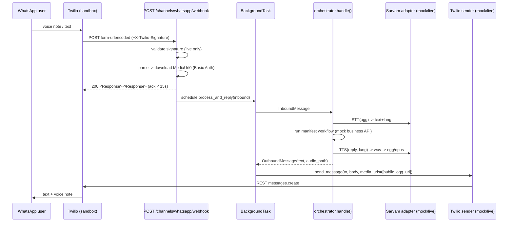

# 8. WhatsApp Channel (Twilio)

> Part of the **UCXP execution plan** · [Plan index](PLAN.md)

---

## WhatsApp Channel (Twilio)

The WhatsApp channel is a thin adapter: it normalizes Twilio's HTTP payloads into a shared `InboundMessage`, hands off to the **same** `orchestrator.handle()` the web app uses, then renders the returned `OutboundMessage` back through Twilio. Both Sarvam and Twilio sit behind mode-switched adapters (`mock`/`live`), so the entire path runs offline tonight.

### Folder layout

```
app/
  main.py                     # FastAPI app, mounts static + routers
  config.py                   # env-driven settings (SARVAM_MODE, TWILIO_MODE, ...)
  models.py                   # InboundMessage / OutboundMessage dataclasses
  orchestrator.py             # SHARED: handle(InboundMessage) -> OutboundMessage
  channels/
    whatsapp/
      webhook.py              # POST /channels/whatsapp/webhook
      media.py                # download inbound media + transcode outbound audio
      twilio_client.py        # outbound sender adapter (mock | live)
    app_web/routes.py         # web "WhatsApp-style" app -> same orchestrator
  adapters/sarvam/
      base.py mock.py live.py factory.py
  static/media/
      in/                     # downloaded inbound voice notes
      out/                    # synthesized replies, served publicly via tunnel
      samples/                # canned oggs used by mock TTS + simulator
scripts/
  fake_twilio_inbound.py      # offline simulator (posts Twilio-shaped payloads)
  fixtures/inbound_text.json  inbound_voice.json  sample_voice_te.ogg
```

### Shared message contract (`app/models.py`)

```python
from dataclasses import dataclass, field

@dataclass
class InboundMessage:
    channel: str                 # "whatsapp" | "app"
    user_id: str                 # WhatsApp WaId (E.164 no +) or web session id
    text: str | None = None      # typed text; None if it was a voice note
    audio_path: str | None = None  # local path to downloaded voice note
    profile_name: str | None = None
    raw: dict = field(default_factory=dict)

@dataclass
class OutboundMessage:
    text: str                    # reply text in the user's language
    audio_path: str | None = None  # local path to synthesized ogg/opus voice note
    lang: str = "en-IN"
```

The orchestrator is channel-agnostic: if `audio_path` is set it calls Sarvam STT to get text+lang; otherwise it uses `text`. It then runs the UCXP manifest workflow and calls Sarvam TTS to produce `audio_path` on the way out. The WhatsApp adapter never touches Sarvam directly — it only produces/consumes these two structs, exactly like the web app.

### Inbound + outbound flow



### (1) Inbound webhook (`app/channels/whatsapp/webhook.py`)

Twilio POSTs **`application/x-www-form-urlencoded`** (not JSON). Voice notes arrive as media: `NumMedia="1"`, `MediaContentType0="audio/ogg"`, `MediaUrl0=<twilio url requiring Basic Auth>`. We ack immediately and process in a `BackgroundTask` because the STT→LLM→TTS pipeline easily exceeds Twilio's ~15 s webhook timeout.

```python
from fastapi import APIRouter, Request, Response, BackgroundTasks
from twilio.request_validator import RequestValidator
from app.config import settings
from app.models import InboundMessage
from app.orchestrator import orchestrator
from app.channels.whatsapp.media import download_media
from app.channels.whatsapp.twilio_client import send_whatsapp_reply

router = APIRouter(prefix="/channels/whatsapp", tags=["whatsapp"])

@router.post("/webhook")
async def whatsapp_webhook(request: Request, background: BackgroundTasks):
    form = dict(await request.form())

    # Signature validation — live only (mock simulator sends none)
    if settings.TWILIO_MODE == "live":
        validator = RequestValidator(settings.TWILIO_AUTH_TOKEN)
        url = settings.PUBLIC_BASE_URL + "/channels/whatsapp/webhook"
        sig = request.headers.get("X-Twilio-Signature", "")
        if not validator.validate(url, form, sig):
            return Response(status_code=403)

    inbound = await parse_twilio_inbound(form)

    # DEBUG hook for offline tests: run synchronously and return the result
    if settings.TWILIO_MODE == "mock" and form.get("__sync") == "1":
        out = await orchestrator.handle(inbound)
        await send_whatsapp_reply(inbound.user_id, out)
        return Response(content="<Response></Response>", media_type="application/xml")

    background.add_task(process_and_reply, inbound)
    return Response(content="<Response></Response>", media_type="application/xml")


async def parse_twilio_inbound(form: dict) -> InboundMessage:
    wa_id = form.get("WaId") or form.get("From", "").replace("whatsapp:", "")
    num_media = int(form.get("NumMedia", "0"))
    text, audio_path = form.get("Body") or None, None
    if num_media > 0 and form.get("MediaContentType0", "").startswith("audio/"):
        audio_path = await download_media(form["MediaUrl0"],
                                          form["MediaContentType0"])
        text = None  # a voice note supersedes any empty Body
    return InboundMessage(channel="whatsapp", user_id=wa_id, text=text,
                          audio_path=audio_path,
                          profile_name=form.get("ProfileName"), raw=form)


async def process_and_reply(inbound: InboundMessage):
    out = await orchestrator.handle(inbound)   # SAME orchestrator as web app
    await send_whatsapp_reply(inbound.user_id, out)
```

Media download + inbound transcode (`app/channels/whatsapp/media.py`). Twilio's `MediaUrl0` needs Basic Auth (`AccountSid:AuthToken`) and 307-redirects to a pre-signed S3 URL; `httpx` drops the auth header on the cross-host redirect automatically, which is what we want. Saaras accepts ogg/opus, but keep a wav fallback in case a codec misbehaves.

```python
import httpx, uuid, subprocess, os
from app.config import settings

MIME_EXT = {"audio/ogg": "ogg", "audio/mpeg": "mp3", "audio/mp4": "m4a",
            "audio/amr": "amr", "audio/aac": "aac"}

async def download_media(url: str, content_type: str) -> str:
    ext = MIME_EXT.get(content_type, "ogg")
    dest = os.path.join(settings.MEDIA_IN_DIR, f"{uuid.uuid4()}.{ext}")
    # mock: MediaUrl0 points at our own static file -> no auth needed
    auth = None if settings.TWILIO_MODE == "mock" else (
        settings.TWILIO_ACCOUNT_SID, settings.TWILIO_AUTH_TOKEN)
    async with httpx.AsyncClient(follow_redirects=True, timeout=30) as c:
        r = await c.get(url, auth=auth)
        r.raise_for_status()
    with open(dest, "wb") as f:
        f.write(r.content)
    return dest

def to_wav16k(src: str) -> str:  # optional STT fallback
    wav = src.rsplit(".", 1)[0] + ".16k.wav"
    subprocess.run(["ffmpeg", "-y", "-i", src, "-ar", "16000",
                    "-ac", "1", wav], check=True)
    return wav
```

### (2) Outbound reply path (`app/channels/whatsapp/twilio_client.py`)

We use the **REST API** (not TwiML) for the reply, because the response is produced asynchronously after the webhook already returned its empty ack, and because outbound media must be delivered as a fetchable public URL. TTS returns wav; we transcode to **ogg/opus** so WhatsApp renders a real voice note (waveform + inline play) rather than a file attachment. The synthesized file is copied into `static/media/out/` and served over the tunnel so Twilio can fetch it.

```python
import shutil, os, subprocess
from twilio.rest import Client
from app.config import settings
from app.models import OutboundMessage

def _to_whatsapp_voice(wav_path: str) -> str:
    ogg = wav_path.rsplit(".", 1)[0] + ".ogg"
    subprocess.run(["ffmpeg", "-y", "-i", wav_path, "-c:a", "libopus",
                    "-b:a", "32k", "-ar", "48000", "-ac", "1", ogg], check=True)
    return ogg

def _publish(local_path: str) -> str:
    # opus already? copy as-is; wav? transcode first
    ogg = local_path if local_path.endswith(".ogg") else _to_whatsapp_voice(local_path)
    name = os.path.basename(ogg)
    shutil.copy(ogg, os.path.join(settings.MEDIA_OUT_DIR, name))
    return f"{settings.PUBLIC_BASE_URL}/media/out/{name}"   # publicly reachable

class _MockSender:
    def send(self, to, body, media_urls):
        import json, datetime
        rec = {"ts": datetime.datetime.utcnow().isoformat(), "to": to,
               "body": body, "media_urls": media_urls}
        with open(settings.OUTBOX_PATH, "a") as f:
            f.write(json.dumps(rec) + "\n")   # inspectable / assertable offline
        print("MOCK WA OUT ->", rec)

class _LiveSender:
    def __init__(self):
        self.client = Client(settings.TWILIO_ACCOUNT_SID, settings.TWILIO_AUTH_TOKEN)
    def send(self, to, body, media_urls):
        self.client.messages.create(from_=settings.TWILIO_WHATSAPP_FROM, to=to,
                                    body=body or None, media_url=media_urls or None)

_sender = _MockSender() if settings.TWILIO_MODE == "mock" else _LiveSender()

async def send_whatsapp_reply(wa_id: str, out: OutboundMessage):
    to = wa_id if wa_id.startswith("whatsapp:") else f"whatsapp:+{wa_id}"
    media_urls = []
    if out.audio_path:
        media_urls.append(_publish(out.audio_path))
    _sender.send(to, out.text, media_urls)
```

In **mock mode** `_publish` still transcodes and writes to `static/media/out/`, and `_MockSender` appends the outbound (text + local-style media URL) to `outbox.jsonl` — so the offline test asserts against a real file with real bytes without ever calling Twilio.

Mock Sarvam TTS returns a canned ogg directly, so no ffmpeg/credits needed tonight:

```python
# app/adapters/sarvam/mock.py (TTS portion)
class MockSarvam:
    async def stt(self, audio_path):     # deterministic
        return {"text": "Where is my Flipkart order?", "lang": "te-IN"}
    async def tts(self, text, lang):
        return "app/static/media/samples/sample_reply_te.ogg"  # pre-canned opus
```

### (3) Built + tested tonight, zero credits / zero network

`scripts/fake_twilio_inbound.py` posts Twilio-shaped **form-urlencoded** payloads to the live local webhook. For the voice case, `MediaUrl0` points at our **own** `static/media/samples/...` file, so `download_media` fetches it locally with no Twilio auth. `TWILIO_MODE=mock` + `SARVAM_MODE=mock` make the full inbound→orchestrator→outbound chain run offline; assertions read `outbox.jsonl`.

```python
# scripts/fake_twilio_inbound.py
import httpx, sys, json, time, os

WEBHOOK = os.environ.get("WEBHOOK", "http://localhost:8000/channels/whatsapp/webhook")
BASE    = os.environ.get("PUBLIC_BASE_URL", "http://localhost:8000")

TEXT = {"MessageSid": "SMmock1", "AccountSid": "ACmock",
        "From": "whatsapp:+919876543210", "To": "whatsapp:+14155238886",
        "WaId": "919876543210", "ProfileName": "Manideep",
        "Body": "Where is my Flipkart order?", "NumMedia": "0", "__sync": "1"}

VOICE = {"MessageSid": "SMmock2", "AccountSid": "ACmock",
         "From": "whatsapp:+919876543210", "To": "whatsapp:+14155238886",
         "WaId": "919876543210", "ProfileName": "Manideep", "Body": "",
         "NumMedia": "1", "MediaContentType0": "audio/ogg",
         "MediaUrl0": f"{BASE}/media/samples/sample_voice_te.ogg", "__sync": "1"}

def post(payload):
    r = httpx.post(WEBHOOK, data=payload, timeout=60)  # data= -> form-urlencoded
    print(payload["MessageSid"], "->", r.status_code, r.text[:60])

if __name__ == "__main__":
    case = sys.argv[1] if len(sys.argv) > 1 else "both"
    if case in ("text", "both"):  post(TEXT)
    if case in ("voice", "both"): post(VOICE)
```

Run tonight:

```bash
brew install ffmpeg                       # needed for outbound transcode
export SARVAM_MODE=mock TWILIO_MODE=mock
export PUBLIC_BASE_URL=http://localhost:8000
uvicorn app.main:app --reload &
python scripts/fake_twilio_inbound.py both
tail -n 5 outbox.jsonl                     # verify text reply + media_urls entry
ls app/static/media/in app/static/media/out   # inbound saved, outbound ogg produced
```

The `__sync=1` flag makes the mock webhook run the orchestrator synchronously and reply before returning, so the test is deterministic (no polling a background task). This verifies: form parsing, media download, orchestrator routing, TTS transcode/publish, and the exact outbound payload shape Twilio will receive tomorrow — all with no credits and no internet.

Add one pytest around it:

```python
def test_whatsapp_voice_path(tmp_path):
    open("outbox.jsonl", "w").close()
    httpx.post(WEBHOOK, data=VOICE)
    last = json.loads(open("outbox.jsonl").read().splitlines()[-1])
    assert last["to"] == "whatsapp:+919876543210"
    assert last["media_urls"] and last["media_urls"][0].endswith(".ogg")
    assert last["body"]                       # non-empty reply text
```

### (4) Hackathon-morning setup checklist

```bash
# 0. one-time deps (if not done tonight)
brew install ffmpeg

# 1. Sarvam live
#    Sign up dashboard.sarvam.ai -> copy api-subscription-key (Rs.100 free)
export SARVAM_MODE=live
export SARVAM_API_KEY=<key>

# 2. Twilio WhatsApp sandbox
#    Console -> Messaging -> Try it out -> Send a WhatsApp message
#    Sandbox number: +1 415 523 8886  (this is TWILIO_WHATSAPP_FROM)
#    From EACH tester phone, WhatsApp the sandbox:  join <two-word-code>
#    (each phone must join individually; re-join if idle > 72h)
export TWILIO_MODE=live
export TWILIO_ACCOUNT_SID=AC...
export TWILIO_AUTH_TOKEN=...
export TWILIO_WHATSAPP_FROM=whatsapp:+14155238886

# 3. Public tunnel (outbound media + webhook both need HTTPS)
ngrok http 8000                 # or: cloudflared tunnel --url http://localhost:8000
export PUBLIC_BASE_URL=https://<subdomain>.ngrok-free.app

# 4. Point the sandbox at us
#    Sandbox settings -> "When a message comes in":
#      https://<subdomain>.ngrok-free.app/channels/whatsapp/webhook   (POST)  -> Save

# 5. Boot + smoke test
uvicorn app.main:app --host 0.0.0.0 --port 8000
#   WhatsApp the sandbox a text: "Where is my Flipkart order?"  -> text + voice reply
#   WhatsApp a Telugu voice note                                -> voice reply
```

**Hot-swap to live** is purely the two env vars flipped from `mock` to `live`, plus filling the keys above — no code change. Because `PUBLIC_BASE_URL` is baked into `_publish()` and into signature validation, set it **before** starting uvicorn (or read it lazily per-request). Keep `mock` as the fallback: if Sarvam rate-limits or a phone won't join, flip `SARVAM_MODE=mock` and the demo still runs the full pipeline with canned audio.

### (5) Media / format gotchas

- **Inbound is ogg/opus.** WhatsApp voice notes arrive as `audio/ogg` (Opus). Saaras accepts it; if a specific clip fails, run `to_wav16k()` (mono 16 kHz) before STT.
- **Inbound MediaUrl needs Basic Auth + follows a redirect.** Authenticate with `(AccountSid, AuthToken)`; the URL 307-redirects to a pre-signed S3 link — let `httpx` follow redirects and *not* forward the auth header cross-host (its default). Never log the token.
- **Outbound audio must be a public HTTPS URL.** Twilio fetches `media_url` from its own servers, so `localhost` fails — it must be the tunnel URL. This is why synthesized replies are copied into `static/media/out/` served at `PUBLIC_BASE_URL/media/out/...`.
- **Send opus for a true voice note.** `audio/ogg` (libopus) renders as a playable voice note with waveform; `audio/mpeg` (mp3) shows as a downloadable file. Transcode TTS wav → `libopus 32k, 48 kHz, mono`.
- **Size limits.** WhatsApp media max ~16 MB (Twilio recommends staying small); keep replies to a few sentences. At 32 kbps opus a 30 s reply is ~120 KB — fine.
- **Unique filenames.** Twilio/WhatsApp cache media by URL; always emit a fresh `uuid` filename per reply so a re-asked question doesn't replay a stale cached clip.
- **Respond fast, reply async.** The webhook must return within ~15 s; return empty `<Response></Response>` immediately and deliver the real answer via REST from the background task. Never block the webhook on STT/TTS.
- **Signature URL must match exactly.** `RequestValidator` hashes the full public URL (scheme, host, path, and any query string) plus sorted POST params. Use `PUBLIC_BASE_URL` verbatim as configured in the sandbox; a trailing-slash or http/https mismatch causes silent 403s. Disable validation in `mock`.
- **Form, not JSON.** Parse `await request.form()`; a JSON body parser will see an empty payload.
- **24-hour session window.** The user must message the sandbox first; free-form replies are allowed only inside the 24 h window (always true in a live demo, but note it if a reply is delayed).

---

[← Web App (WhatsApp-styled)](07-web-app.md) · [Execution Timeline & Task Board →](09-timeline.md)
