# 9. Execution Timeline & Task Board

> Part of the **UCXP execution plan** · [Plan index](PLAN.md)

---

# Execution Timeline & Task Board

## 1. TONIGHT (25 Jul) — Credit-Free Groundwork Checklist

**Goal:** the entire pipeline runs end-to-end on a laptop with `SARVAM_MODE=mock`, zero network to Sarvam, zero credits. By end of night, both channels (Web App + WhatsApp simulator) drive the same orchestrator and produce a scripted refund/order-tracking answer.

**Ordered — each block gates the next. Owner column maps to §4 roles.**

### Phase T0 — Foundation (do first, everyone unblocked after this)
| # | Task | Output / Definition of Done | Owner |
|---|------|-----------------------------|-------|
| ☐ 1 | Create repo + folder scaffold (see layout below) | `git init`, pushed, README with run steps | BE |
| ☐ 2 | `requirements.txt` + `.env.example` (`SARVAM_MODE=mock`, `TWILIO_*`, `PORT`) | `pip install -r` succeeds in fresh venv | BE |
| ☐ 3 | FastAPI boots: `GET /health` → `{"ok":true}` | `uvicorn app.main:app --reload` returns 200 | BE |
| ☐ 4 | `make dev` / `run.sh` one-command boot (backend + static frontend) | Single command brings whole stack up | BE |

### Phase T1 — Contracts (define the seams so parallel work can't diverge)
| # | Task | Output / Definition of Done | Owner |
|---|------|-----------------------------|-------|
| ☐ 5 | **Manifest JSON Schema** finalized (`schema/support.manifest.schema.json`) | Validates with `jsonschema`; covers auth, languages, faqs, workflows, api_mappings, escalation | BE lead |
| ☐ 6 | **Sample manifest #1: Flipkart** (`manifests/flipkart.json`) | Passes schema validation; has `track_order`, `refund`, `cancel` workflows | BE lead |
| ☐ 7 | **Sarvam Adapter interface** (`app/adapters/sarvam.py`) with 4 methods: `stt()`, `tts()`, `translate()`, `chat()` + `document_ocr()` | Abstract base + `MockSarvam` + `LiveSarvam` stub (raises `NotImplemented` until key) | Sarvam owner |
| ☐ 8 | **Adapter factory** reads `SARVAM_MODE` env → returns Mock or Live | `get_sarvam()` returns MockSarvam by default | Sarvam owner |

### Phase T2 — Mock implementations (this is what makes tonight work)
| # | Task | Output / Definition of Done | Owner |
|---|------|-----------------------------|-------|
| ☐ 9 | `MockSarvam.stt()` returns canned transcript keyed by fixture id (Telugu/Hindi audio → known text + detected `lang`) | Deterministic; no network | Sarvam owner |
| ☐ 10 | `MockSarvam.tts()` returns a **pre-recorded WAV/MP3** path from `assets/audio/` (not synthesized) | Returns bytes/path, plays in browser | Sarvam owner |
| ☐ 11 | `MockSarvam.translate()` + `chat()` return scripted strings from `fixtures/canned_responses.json` | Deterministic per intent | Sarvam owner |
| ☐ 12 | **Mock Business API** (`app/mock_business/flipkart_api.py`): `get_order(id)`, `cancel_order(id)`, `refund_status(id)` over in-memory dict | FastAPI sub-router `/mock/flipkart/*` returns realistic JSON | BE |
| ☐ 13 | Seed data: 3 orders, 1 refund-in-progress, 1 delivered (`fixtures/orders.json`) | Loaded at startup | BE |

### Phase T3 — Orchestrator / Runtime (the heart)
| # | Task | Output / Definition of Done | Owner |
|---|------|-----------------------------|-------|
| ☐ 14 | **Manifest loader + registry** (`app/runtime/registry.py`): loads all `manifests/*.json`, selects by business name/keyword | `resolve_business("flipkart")` → manifest | BE lead |
| ☐ 15 | **Mock planner** (`app/runtime/planner.py`): text → `{intent, business, entities}` via keyword/regex rules (NO LLM tonight) | "Where is my Flipkart order 123" → `track_order` | BE lead |
| ☐ 16 | **Orchestrator** (`app/runtime/orchestrator.py`) single entrypoint `handle_turn(audio_or_text, lang, channel)`: STT → plan → resolve manifest → auth stub → call business API → compose reply → TTS | One function both channels call; returns `{text, audio_url, lang}` | BE lead |
| ☐ 17 | **Auth stub**: manifest declares auth type; mock returns "verified" for demo user | No real credentials handled | BE |
| ☐ 18 | Structured **trace/log** per turn (steps + timings) for the demo "show the protocol working" moment | Printed + returned in debug field | BE |

### Phase T4 — Channels (both, one runtime)
| # | Task | Output / Definition of Done | Owner |
|---|------|-----------------------------|-------|
| ☐ 19 | **Web App shell** (WhatsApp-styled) — chat bubbles, mic button, audio playback, language pill | Loads at `/`; posts to `/api/turn`; renders reply + plays TTS | FE |
| ☐ 20 | `POST /api/turn` (web channel) calls `orchestrator.handle_turn(..., channel="web")` | Round-trips a canned Telugu turn end-to-end | FE + BE |
| ☐ 21 | **WhatsApp webhook** (`/webhook/whatsapp`) parses Twilio inbound shape, calls same orchestrator, returns TwiML | Handles text + media (voice note) fields | WA owner |
| ☐ 22 | **Fake-inbound simulator** (`scripts/fake_whatsapp.py`) posts Twilio-shaped payloads to the webhook | Runs full WhatsApp path with zero Twilio/network | WA owner |
| ☐ 23 | Business portal shell (upload form → "Generate manifest" button) — wired to a **stub generator** that returns the pre-baked Flipkart manifest | Demo-able even if AI-gen is faked tonight | FE |

### Phase T5 — Demo assets & safety nets
| # | Task | Output / Definition of Done | Owner |
|---|------|-----------------------------|-------|
| ☐ 24 | **Demo fixtures**: 4–5 scripted utterances (Telugu order-track, Hindi cancel, refund status) with matching mock STT text | `fixtures/demo_script.json` | All |
| ☐ 25 | **Pre-recorded fallback audio**: record each expected TTS reply (phone voice memo OK) → `assets/audio/` | Plays if live TTS fails tomorrow | Sarvam owner |
| ☐ 26 | **Second business manifest skeleton: Airtel** (`manifests/airtel.json`) — for the interoperability punchline (finish tomorrow) | Validates against schema; `cancel_fiber` workflow stubbed | BE lead |
| ☐ 27 | **Slides v0** (8–10): problem, "UPI for CX", architecture diagram, demo flow, interop punchline, ask | Deck exists, screenshots of working mock | PM/any |
| ☐ 28 | **Full mock dry-run**: web + WhatsApp-sim both complete a turn; record a screen-capture as ultimate fallback | Green end-to-end video saved | All |

**Folder layout (agree on this at task #1):**
```
ucxp/
├─ app/
│  ├─ main.py                 # FastAPI, mounts routers + static
│  ├─ adapters/sarvam.py      # SarvamBase, MockSarvam, LiveSarvam, get_sarvam()
│  ├─ runtime/
│  │  ├─ orchestrator.py      # handle_turn() — single entrypoint, both channels
│  │  ├─ planner.py           # mock (regex) → live (LLM) swap
│  │  └─ registry.py          # manifest load + resolve
│  ├─ channels/
│  │  ├─ web.py               # POST /api/turn
│  │  └─ whatsapp.py          # /webhook/whatsapp (Twilio)
│  └─ mock_business/flipkart_api.py, airtel_api.py
├─ manifests/  flipkart.json  airtel.json
├─ schema/support.manifest.schema.json
├─ fixtures/  orders.json  canned_responses.json  demo_script.json
├─ assets/audio/            # pre-recorded fallback TTS
├─ frontend/                # WhatsApp-styled web app + portal shell
├─ scripts/fake_whatsapp.py
└─ requirements.txt  .env.example  run.sh
```

**Tonight's cut-line:** if time runs short, drop #23 (portal AI-gen) and #26 (Airtel) — but #1–#22, #24, #25, #28 are non-negotiable. The mock pipeline running on both channels is the entire point of tonight.

---

## 2. HACKATHON — Hour-by-Hour Plan (10:00–18:00 IST, Sun 26 Jul)

**Premise:** tonight's mock stack already works end-to-end. Today = swap in live Sarvam, add the 2nd business, harden both channels, rehearse. **Key discipline: one live capability at a time, verify against mock as ground truth, keep `SARVAM_MODE=mock` as instant rollback.**

```mermaid
gantt
    title UCXP Hackathon Day — 26 Jul
    dateFormat HH:mm
    axisFormat %H:%M
    section Setup
    Keys + smoke test (mock still green)   :10:00, 30m
    section Live Sarvam
    STT live (Saaras)                      :10:30, 45m
    TTS live (Bulbul)                      :11:15, 45m
    Chat+Translate live                    :12:00, 60m
    section Checkpoint 1
    Full live turn — web                   :crit, 13:00, 30m
    section Scale-out
    WhatsApp live via Twilio               :13:30, 60m
    2nd business (Airtel) + interop        :14:30, 60m
    section Checkpoint 2
    Both channels, both businesses         :crit, 15:30, 30m
    section Polish
    Portal AI-gen (Vision OCR) + UI polish :16:00, 60m
    section Freeze
    FEATURE FREEZE                         :crit, 17:00, 0m
    Rehearsal + fallback wiring            :17:00, 45m
    Buffer / demo                          :17:45, 15m
```



| Block (IST) | Focus | Concrete actions | Checkpoint / gate |
|-------------|-------|------------------|-------------------|
| **10:00–10:30** | Land & smoke | New Sarvam signup, grab ₹100 credits + `api-subscription-key`. Put in `.env`. Confirm mock stack still boots green on venue wifi. `pip install sarvamai`. | Mock end-to-end passes on-site before touching live. |
| **10:30–11:15** | **Live STT (Saaras v3)** | Implement `LiveSarvam.stt()` → `client.speech_to_text.transcribe()`. Test with tonight's Telugu/Hindi fixture audio files. Compare output to mock canned text. | Real audio → correct Indic transcript + detected lang. |
| **11:15–12:00** | **Live TTS (Bulbul v3)** | Implement `LiveSarvam.tts()` → `client.text_to_speech.convert()`. Pick voice + speed. Play in web app. | Reply text → intelligible voice in Telugu & Hindi. |
| **12:00–13:00** | **Live Chat + Translate** | Wire planner to `sarvam-m`/`105b` `/chat/completions` for intent+entity extraction; `client.text.translate()` for cross-lingual reply. Keep regex planner as fallback path. | LLM planner matches mock intents on demo script. |
| **13:00–13:30** | **⛳ CHECKPOINT 1** | Full **live** turn on **web**: speak Telugu → STT → LLM plan → mock Flipkart API → translated reply → TTS voice. Eat while it runs. | If red → flip `SARVAM_MODE=mock` for that stage; move on. |
| **13:30–14:30** | **WhatsApp live** | Real Twilio sandbox number, configure webhook URL (ngrok/tunnel). Send real WhatsApp voice note → same orchestrator → voice reply. | Phone → WhatsApp → live pipeline → voice back. |
| **14:30–15:30** | **2nd business + interop** | Finish `manifests/airtel.json` + `mock_business/airtel_api.py` (`cancel_fiber`). Confirm registry routes "Cancel my Airtel Fiber" with **zero code change** — only manifest swap. | Same assistant serves Airtel = the punchline works. |
| **15:30–16:00** | **⛳ CHECKPOINT 2 (integration lock)** | Run the full demo script across **both channels × both businesses**. Freeze the manifests. Note anything flaky → decide keep-live-vs-mock per stage now. | This is the last moment to add scope. |
| **16:00–17:00** | **Polish only** | Portal AI-gen: run one PDF through Sarvam Vision `document_intelligence` → auto-write a manifest (if solid; else keep stub). UI cleanup, latency spinners, error toasts. | No new features — only make existing ones shine. |
| **17:00** | **🧊 HARD FEATURE FREEZE** | `git tag demo-freeze`. No new code except crash fixes. | Freeze is absolute. |
| **17:00–17:45** | **Rehearsal ×3** | Run the exact judged script 3 times. Wire pre-recorded fallback audio + `SARVAM_MODE=mock` toggle so any live failure degrades gracefully mid-demo. Assign who-speaks-what. | Deterministic 3-min demo, fallback proven. |
| **17:45–18:00** | **Buffer / present** | Reserve for overrun, judge Q&A prep, final screen-capture backup. | Ship. |

**Live-key plug-in rule:** the key enters `.env` at 10:00 but each capability flips to `live` **independently** (STT first, then TTS, then chat/translate) and only after it passes the mock-parity test. Never flip all four at once. `SARVAM_MODE` can be per-method if you add `SARVAM_STT_MODE` etc. — cheap insurance.

---

## 3. Feature Shipping Order (P0 / P1 / P2)

| Priority | Feature | Why | Depends on |
|----------|---------|-----|-----------|
| **P0** | Manifest schema + Flipkart manifest | Nothing works without the protocol contract | — |
| **P0** | Sarvam adapter (mock + live) behind one interface | Enables credit-free tonight + swap tomorrow | schema |
| **P0** | Orchestrator: STT→plan→manifest→API→reply→TTS | The runtime that both channels share | adapter, registry |
| **P0** | Mock business API (Flipkart: track/cancel/refund) | Gives the runtime something real to call | — |
| **P0** | Web App (WhatsApp-styled), voice in/out | Primary demo surface | orchestrator |
| **P0** | One live language turn (Telugu **or** Hindi) end-to-end | The "it actually understands Indic voice" moment | live STT+TTS |
| **P0** | Pre-recorded fallback audio + mock toggle | Demo cannot hard-fail | assets |
| ⟨**MVP CUT-LINE** — everything above must ship; demo is viable with only P0⟩ |
| **P1** | Real WhatsApp channel via Twilio | Proves "both channels, one runtime" claim | orchestrator |
| **P1** | 2nd business (Airtel) + interoperability swap | The headline punchline / differentiation | schema, registry |
| **P1** | LLM planner (sarvam chat) replacing regex | Robustness to unscripted phrasing | live chat |
| **P1** | Live translate for cross-lingual replies | Polish on multilingual promise | live translate |
| **P2** | Business portal auto-gen manifest from PDF (Sarvam Vision OCR) | Strong story, but stub is acceptable | Vision API |
| **P2** | Per-turn protocol trace UI ("watch UCXP work") | Judge wow-factor | orchestrator logs |
| **P2** | 3rd language / voice selection / speed control | Breadth flex | live TTS |
| **P2** | Auth flow realism (OTP mock) | Nice narrative, low demo value | — |

**Cut-line rule:** if at 15:30 anything P0 is red, kill all P2 and pull the whole team onto the failing P0. A clean P0-only demo beats a broken P1.

---

## 4. Role Split (2–4 people → modules)

**Core split (works at any team size); map names to these hats.**

| Role | Owns (modules) | Tonight | Hackathon day |
|------|----------------|---------|---------------|
| **BE Lead / Runtime** | manifest schema, registry, planner, orchestrator | #5,6,14,15,16,26 | Live chat/planner (12:00), interop + Airtel (14:30), integration checkpoints |
| **Sarvam / Adapter** | adapter interface, all mock impls, fallback audio | #7–11, 25 | Live STT (10:30), TTS (11:15), translate; Vision OCR if P2 reached |
| **FE / Channels-Web** | web app UI, portal shell, `/api/turn` | #19,20,23 | UI polish, latency states, portal AI-gen wiring, demo driver |
| **WhatsApp / Infra** | Twilio webhook, fake-inbound sim, mock business API, deploy/tunnel | #12,13,21,22 | Live Twilio + ngrok (13:30), keeps mock business APIs, runs rehearsal harness |

**Scaling the split:**

| Team size | Allocation |
|-----------|-----------|
| **2** | Person A = BE Lead + Sarvam adapter (backend/runtime). Person B = FE + WhatsApp/infra. Drop P2 entirely; Airtel interop is the one P1 to protect. |
| **3** | A = BE Lead + Sarvam. B = FE (web + portal). C = WhatsApp/Twilio + mock business + rehearsal/DevOps. |
| **4** | Full four-role split above. 4th person (WhatsApp/Infra) also owns slides, timekeeping, and the demo-freeze enforcement. |

**Shared discipline:** BE Lead owns the schema and orchestrator signature — freeze `handle_turn()` and the manifest schema by end of tonight so Sarvam, FE, and WhatsApp all code against stable seams. Nobody flips a Sarvam capability to `live` without the owner's mock-parity check passing first.

---

[← WhatsApp Channel (Twilio)](08-whatsapp-channel.md) · [Demo Script, Pitch & Risk Plan →](10-demo-and-pitch.md)
