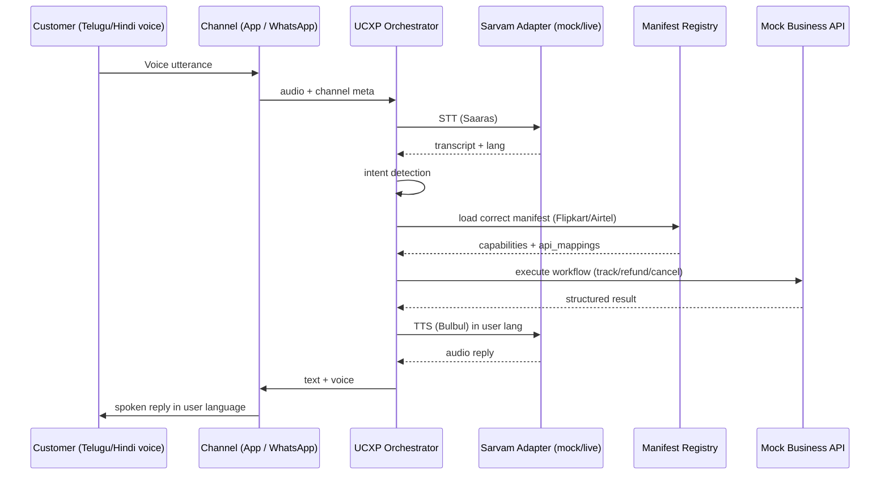

# 10. Demo Script, Pitch & Risk Plan

> Part of the **UCXP execution plan** · [Plan index](PLAN.md)

---

# Demo Script, Pitch & Risks

## 1. Minute-by-Minute Demo Narrative (~4:30 total)

**Golden rule for the operator:** never type on stage. Everything below is either a pre-loaded click or a spoken line into a mic that is already tested. Keep a **laptop (App + Business portal)** and a **phone (real WhatsApp)** both mirrored on the projector. Assign one **Driver** (clicks/speaks) and one **Narrator** (talks to judges). The runtime runs in whatever `SARVAM_MODE` the Driver last set — decided by the pre-flight check in §2.

### Pre-stage checklist (done in the 60s before you're called up)
- Backend up, `/health` green, both channels pointed at the same orchestrator.
- Run the **pre-flight probe** (§2) → it prints `MODE: LIVE` or `MODE: MOCK`. Announce nothing; just know which reality you're in.
- Two manifests already generated and cached: **Flipkart** (order tracking + refund) and **Airtel** (broadband cancellation). The portal generation in Act 1 is a *live re-generation* of a third or a re-run, so a cached copy exists as fallback.
- Phone volume max, laptop volume max, one Bluetooth speaker as backup audio out.
- WhatsApp thread with the Twilio sandbox already joined and scrolled to empty.

### Act 0 — The hook (0:00–0:30, Narrator, no clicks)
> "Every company rebuilds the same support bot from scratch, and almost none of them work in Telugu or Hindi by voice. We think support shouldn't be a bot each company builds — it should be a **protocol** every company *publishes*. We call it UCXP. Think **UPI, but for customer experience.** Let me show you a business go live in under a minute, and then the same AI assistant serve two different companies in two different languages."

### Act 1 — Business portal auto-generates a manifest (0:30–1:30)
**Screen:** Business portal on laptop.

| Step | Driver action | What judges see | Narrator line |
|---|---|---|---|
| 1 | Click **Upload** → select a pre-staged `flipkart_faqs.pdf` + `flipkart_openapi.json` (already in the file picker's recent list) | Files attach, "Generating manifest…" spinner | "A business drops in its FAQ PDF and its existing API spec — nothing custom." |
| 2 | Click **Generate** | Progress log streams: *Parsing PDF (Sarvam Vision) → Extracting capabilities → Mapping workflows → Writing support.manifest* | "Our generator uses Sarvam's document intelligence to read the PDF, and an LLM to write a machine-readable **support.manifest** — no human authors this." |
| 3 | Manifest renders in a code pane + a friendly "Capabilities" card list: *Track Order, Refund, Return* | JSON with `capabilities`, `auth`, `languages`, `workflows`, `api_mappings` | "This is the whole contract: what it can do, how to auth the customer, which languages, and how each intent maps to a real API call. That's it — Flipkart is now UCXP-live." |

**Fallback if generation is slow/fails:** the "Generate" button is wired to fall back to the cached manifest after a 4s timeout and still animate the log — see §2.

### Act 2 — Customer on the APP, Telugu voice, track + refund (1:30–3:00)
**Screen:** WhatsApp-styled web App on laptop.

**Utterance 1 (Track):**
- Driver taps mic, speaks Telugu:
  > **"నా ఫ్లిప్‌కార్ట్ ఆర్డర్ ఎక్కడ ఉంది?"**
  > *(gloss: "Where is my Flipkart order?")*
- **Expected pipeline:** Saaras STT → intent `track_order` → manifest picks Flipkart → runtime calls mock `GET /orders/latest` → status `Out for delivery, arriving today`.
- **Expected reply (Bulbul voice, Telugu, auto-plays):**
  > **"మీ ఆర్డర్ ఈరోజు డెలివరీ అవుతుంది. ఇది ప్రస్తుతం హైదరాబాద్‌లో ఉంది."**
  > *(gloss: "Your order will be delivered today. It's currently in Hyderabad.")*
- On-screen: chat bubble shows Telugu text + a waveform play button + a small "via Flipkart manifest" chip.

**Utterance 2 (Refund — shows a real workflow, not just a lookup):**
- Driver taps mic:
  > **"దీనికి రీఫండ్ కావాలి, వస్తువు పాడైంది."**
  > *(gloss: "I want a refund for this, the item is damaged.")*
- **Expected pipeline:** STT → intent `refund` → manifest says refund needs `order_id` (already in context) + `reason` → runtime calls mock `POST /refunds` → returns `refund_id: RF-8842, status: approved, 5–7 days`.
- **Expected reply (Telugu voice):**
  > **"మీ రీఫండ్ ఆమోదించబడింది. ₹1,299 5 నుండి 7 రోజుల్లో మీ ఖాతాకు జమ అవుతుంది."**
  > *(gloss: "Your refund is approved. ₹1,299 will be credited in 5–7 days.")*

**Narrator over this act:** "She spoke Telugu. The assistant transcribed with Saaras, read Flipkart's manifest to know refund needs a reason and an order ID, called the real refund API, and replied in Telugu voice with Bulbul. One interface, her language, an actual transaction — not a canned FAQ."

### Act 3 — SAME assistant, WhatsApp, SECOND business, Hindi (3:00–4:00) — **the punchline**
**Screen:** switch projector to the phone mirror. Real WhatsApp chat with the Twilio number.

- Driver sends a **WhatsApp voice note** (or taps a pre-staged mic in a companion app) in Hindi:
  > **"मेरा एयरटेल फाइबर कनेक्शन बंद करा दो।"**
  > *(gloss: "Please cancel my Airtel Fiber connection.")*
- **Expected pipeline:** *identical orchestrator*, Twilio inbound → STT (Hindi) → intent `cancel_service` → **Airtel** manifest loaded → mock `POST /cancellations` → returns ticket `AIR-3310`, effective end of billing cycle, confirmation step.
- **Expected reply (WhatsApp voice note + text, Hindi):**
  > **"आपका एयरटेल फाइबर कनेक्शन इस बिलिंग साइकल के अंत में बंद हो जाएगा। आपका रेफरेंस नंबर AIR-3310 है।"**
  > *(gloss: "Your Airtel Fiber connection will be cancelled at the end of this billing cycle. Your reference number is AIR-3310.")*

**Narrator (the money line):** "Nothing about the assistant changed. New company, new language, new channel — WhatsApp instead of the app. We didn't write a second bot. We just **loaded a second manifest.** That's the whole point: support becomes interoperable. Publish a manifest once, and *every* UCXP assistant can serve your customers, in *any* Indian language, by voice."

### Act 4 — Close (4:00–4:30, Narrator)
> "Two businesses, two languages, two channels, one protocol, zero custom bots. UPI made every bank interoperable for payments. UCXP makes every business interoperable for support — voice-first, and Indian-language-first, on Sarvam. Ship your manifest, and you're live."



---

## 2. Fallback Plan — "The Demo Never Dies"

Design principle: **every stage degrades one level, never to zero.** The orchestrator has one env switch and three input paths per utterance.

### The master switch
```bash
SARVAM_MODE=mock   # deterministic canned STT/translate/TTS, zero network
SARVAM_MODE=live   # real Sarvam calls
```
The Sarvam adapter is the *only* place that reads this. Flip it and restart in <5s, or better, expose `POST /admin/mode` so you flip it without a restart. **Mock mode is not the failure state — it is the guaranteed-good state.** If anything smells off in pre-flight, present the entire demo in mock; it looks identical on screen.

### Pre-flight probe (run 60s before going on stage)
```
GET /health/preflight
→ { sarvam_live: true/false, twilio_reachable: true/false,
    manifests_loaded: ["flipkart","airtel"], audio_out: ok }
```
Decision rule: if `sarvam_live==false` OR venue Wi-Fi ping >800ms → **set mock, don't gamble.** Judges cannot tell the difference; you narrate the same story.

### Failure-mode matrix

| # | Failure | Detection | Fallback (in order) | Who/how |
|---|---|---|---|---|
| 1 | **Venue network down / Sarvam API down** | pre-flight or first call timeout (2s cap) | `SARVAM_MODE=mock` — canned transcript + canned TTS audio for the exact scripted utterances | Automatic if `SARVAM_TIMEOUT` hit; adapter falls back to mock per-call |
| 2 | **Twilio/WhatsApp not delivering** | inbound webhook silent >5s | Switch projector to the **App** channel and run Act 3's Hindi utterance there instead — same orchestrator, so the interoperability point still lands ("same runtime, we're just showing the app view") | Driver switches screen |
| 3 | **Mic fails / venue too loud / accent misread** | no audio captured, or transcript ≠ expected | (a) tap **"Play sample"** to feed a **pre-recorded WAV** of the exact utterance into the pipeline; (b) if still bad, use the **typed input box** — type the same sentence, pipeline runs identically | Every channel has a hidden "▶ sample" button + a text box |
| 4 | **Wrong transcript** (STT returns garbage in live mode) | transcript confidence low / intent = `unknown` | Adapter is configured so live STT failures **auto-substitute the canned transcript** for known demo phrases (keyed by a phrase-hint the Driver pre-selects); orchestrator continues normally | Per-utterance `expected_hint` passed by the App's mic button |
| 5 | **Manifest generation (Act 1) hangs/fails** | 4s timeout on `/generate` | Animate the log anyway and load the **pre-cached manifest**; say "we cache generated manifests" (true) | Built-in timeout → cached copy |
| 6 | **Mock business API errors** | 500 from mock | Registry returns a static canned result object for the scripted intent | Mock API has a `?demo=1` deterministic path |
| 7 | **TTS audio won't play on venue AV** | no sound in 2s | Text reply is always shown on screen simultaneously; Driver switches audio out to the **Bluetooth speaker**; last resort read the gloss aloud | Text+audio always dual-rendered |
| 8 | **Laptop/phone dies or app crashes** | obvious | A **90-second screen-recording MP4** of the full happy-path demo sits on the desktop and on a phone; play it and narrate live | Pre-recorded video backup |

### The three input paths (every utterance supports all three)
1. **Live mic** (best) → 2. **Pre-recorded WAV of that exact line** (safe) → 3. **Typed text** (bulletproof). The pipeline downstream of STT is identical for all three, so the demo story is unchanged regardless of which you use.

**Non-negotiable prep tonight:** record all four scripted utterances as WAVs, generate their canned transcripts and canned TTS replies, and wire the "▶ sample" + text box on both channels. If those exist, **no single failure can end the demo.**

---

## 3. Pitch

### 30-second elevator pitch
> "Every business builds its own support bot, and almost none of them work by voice in Telugu or Hindi. UCXP flips that. Instead of each company building a bot, each company **publishes a support manifest** — a standard file that says what it can do, how to authenticate a customer, and how each request maps to its API. Then any UCXP assistant can serve that business, in any Indian language, by voice, over app or WhatsApp. We auto-generate the manifest from a company's existing FAQ PDFs and API docs — no authoring. It's **UPI for customer experience**: publish once, and you're interoperable everywhere. Built entirely on Sarvam's speech, translation, and document stack."

### 6–8 slide outline

| # | Slide | Content | One-liner on it |
|---|---|---|---|
| 1 | **Title** | UCXP — Unified Customer Experience Protocol. "UPI for customer support." Team + Sarvam Epoch Buildathon | Logo + tagline, nothing else |
| 2 | **Problem** | Every business rebuilds support from zero; bots are English-first and text-first; 90% of India isn't served in-language by voice | "Support is rebuilt N times and works for none of Bharat." |
| 3 | **Insight** | Support shouldn't be a *bot each company builds*; it should be a *protocol each company publishes*. Analogy: pre-UPI banking vs UPI | The reframe — the whole pitch turns on this slide |
| 4 | **How it works** | The manifest (show a trimmed JSON), the two sides (business portal auto-gen / customer runtime), the mermaid pipeline diagram | "One file makes a business interoperable." |
| 5 | **Sarvam-powered** | Saaras (STT, 22 Indic langs), Bulbul (TTS voice), Mayura/translate, Vision (PDF→manifest), Chat LLM (intent+generation) — one logo map | "We use the full Sarvam stack, end to end." |
| 6 | **Demo** | Live (or the video): Telugu refund on app → Hindi cancellation on WhatsApp, same assistant | "Watch one assistant serve two businesses." |
| 7 | **Why it matters / market** | Voice-first support for 1B+ non-English speakers; businesses go live in minutes not months; network effects — every new manifest makes every assistant more useful | Impact + defensibility (the network effect) |
| 8 | **Ask / vision** | An open protocol + registry of manifests; call to businesses to publish, to assistants to adopt. "Publish your manifest. Be everywhere." | Close on the protocol vision |

---

## 4. Judging Strategy

### What Sarvam + GrowthX judges likely reward (and how to hit each)
| Reward criterion | Why it matters to them | How we visibly demonstrate it |
|---|---|---|
| **Depth of Sarvam stack usage** | It's a Sarvam buildathon; they want their full platform exercised, not just one endpoint | Use **five** Sarvam surfaces on stage: Saaras (STT), Bulbul (TTS), Mayura/translate, Vision (PDF→manifest), Chat LLM. Show a slide that maps each to a moment in the demo. |
| **Indic-language voice, done well** | Their core differentiation is Indian languages + voice | Do the demo **in Telugu and Hindi by voice**, not English text. Auto-play spoken replies. Two languages > one shows generality. |
| **Real-world impact** | Judges reward things that could actually ship in India | Real intents with real consequences (refund issued, connection cancelled), WhatsApp as the channel 500M Indians actually use, "go live in minutes." |
| **Novel idea / not-a-chatbot** | Chatbots are commodity; a protocol is a platform | The interoperability punchline: *same assistant, second manifest, new business.* This is the single most memorable moment — protect it above all. |
| **Working end-to-end** | Demos that crash lose | Mock adapter guarantees a flawless run; the pipeline is genuinely end-to-end tonight with zero credits. |

### How to frame UCXP as a protocol, not a chatbot
Say these explicitly, repeatedly:
- **"We didn't build a bot; we built the file format that makes bots unnecessary."**
- Compare to things judges respect: **"MCP/OpenAPI for support," "UPI for customer experience."** These frames instantly signal *protocol, not product*.
- Emphasize the **two-sided, N-to-N** shape: many businesses publish, many assistants consume. A chatbot is 1-to-1; a protocol is a network.
- Land the **network effect**: each new manifest increases the value of every assistant, and vice-versa — that's a moat a chatbot can't have.
- Prove it live: the *only* thing that changes between Flipkart-Telugu-app and Airtel-Hindi-WhatsApp is **which manifest loads**. Point at that on screen. That is the proof it's a protocol.

### Top 5 risks & mitigations
| # | Risk | Impact | Mitigation |
|---|---|---|---|
| 1 | **No Sarvam credits / API down at demo time** | Pipeline can't call real STT/TTS | Everything sits behind the **mock adapter**; `SARVAM_MODE=mock` runs the whole demo credit-free and offline. Pre-flight probe decides mock-vs-live before we go on stage. We *rehearse in mock* so mock is the proven path. |
| 2 | **"This is just a chatbot" perception** | Idea gets undersold, judges anchor on commodity | Frame relentlessly as a **protocol** (UPI/MCP analogies); make the **interoperability swap** the climax; show the manifest JSON as the actual artifact. Never call it a chatbot ourselves. |
| 3 | **Live demo failure** (mic, network, WhatsApp, AV) | Loses the room in real time | Layered fallbacks (§2): mock mode → pre-recorded WAV → typed input → 90s backup video. Text + voice always dual-rendered. Twilio failure downgrades gracefully to the app channel. |
| 4 | **Manifest auto-generation looks like smoke-and-mirrors** | Judges doubt it's real | Show the **real generated JSON** and let a judge see it maps FAQ→capabilities and OpenAPI→api_mappings; keep a manifest we generated *from an unseen PDF* to offer on request. Cache-with-timeout so it never hangs, but the content is genuinely generated. |
| 5 | **Scope creep tonight/tomorrow** (auth, many intents, real APIs) | Nothing finishes, demo half-works | Freeze scope to the **exact 4 scripted utterances + 2 manifests + 2 channels**. Auth is mocked. Ship feature-by-feature with the happy path first; anything beyond the script is a stretch goal, not a dependency. |

**Single most important instruction to the team:** rehearse the full 4:30 in **mock mode** end-to-end tonight until it's boring. A boring, flawless run in mock beats a thrilling, fragile run in live every time — and if live works tomorrow, it's a free upgrade on an already-winning demo.

---

[← Execution Timeline & Task Board](09-timeline.md) · [Plan index →](PLAN.md)
