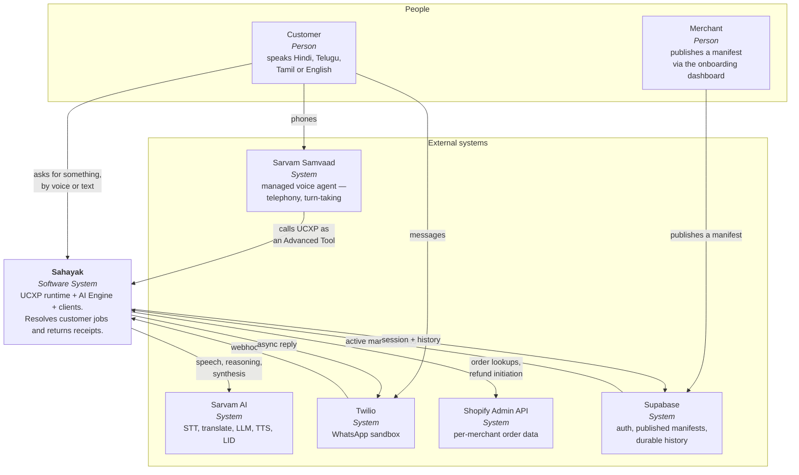
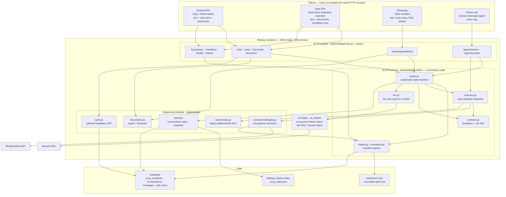
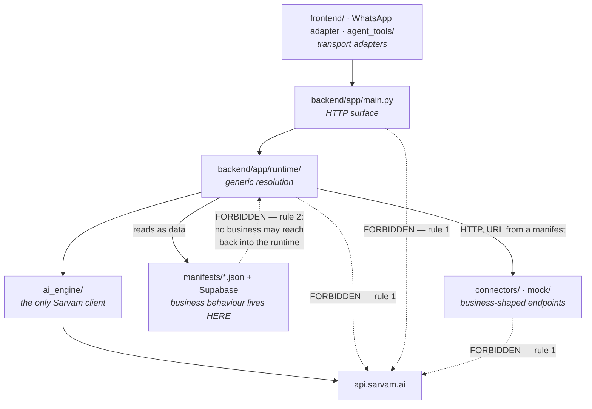
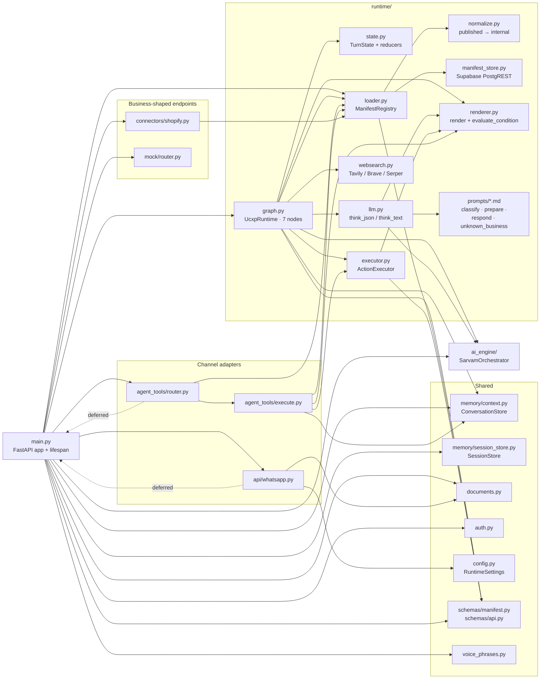
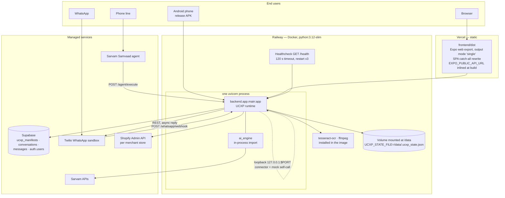

# Architecture

How Sahayak is put together, why the layers sit where they do, and how the two
rules that make UCXP a protocol are enforced rather than merely intended.

**Related:** [request lifecycle](./request-lifecycle.md) ·
[manifest spec](./manifest-spec.md) · [channels](./channels.md) ·
[data & memory](./data-and-memory.md) · [operations](./operations.md) ·
[decisions](./decisions.md)

---

## 1. The one-sentence version

A generic resolution runtime reads a business's capabilities out of a JSON
manifest at request time, executes one of them against a real API, and returns a
receipt. Four different clients drive it. One module, and only one, is allowed
to talk to Sarvam.

Everything below is a consequence of that sentence.

---

## 2. Context view

Who and what the system talks to. This is a C4-style context diagram drawn as a
Mermaid flowchart — GitHub does not render Mermaid's experimental `C4Context`
renderer reliably, so the C4 *shape* is kept and the notation is plain.



Two things to notice.

**Samvaad points at Sahayak, not the other way round.** On a phone call the
managed voice agent owns the conversation and calls UCXP as a tool. That makes
Samvaad *a UCXP client*, exactly like the mobile app — which is the protocol
thesis stated in the topology rather than in a slide.

**The merchant never touches this system.** They publish a manifest to Supabase
from a separate onboarding dashboard. The runtime discovers them. Adding a
merchant involves no deploy here.

---

## 3. Container view



### Why the runtime and the AI Engine are one container

They are imported in-process, not called over HTTP. `ai_engine/` does ship a
standalone FastAPI surface (`ai_engine.app`), but that exists to test the engine
alone.

Splitting them into two services would add a network hop to the hottest path in
the system, on a pipeline that is already latency-bound by a reasoning model,
and buy nothing — they have identical scaling characteristics and are released
together. [`PLAN.md`](../PLAN.md) §6 makes this explicit: *"Do not call the AI
Engine over HTTP from the runtime — they deploy together."*

### Why the connector lives outside the runtime

`backend/app/connectors/shopify.py` is mounted on the same FastAPI app, but it
is not `runtime/` code. The runtime reaches it the same way it reaches any
business endpoint: by rendering a URL out of a manifest and issuing an HTTP
request. In production that request goes over loopback to the same process,
which is an optimisation, not a coupling — point `UCXP_CONNECTOR_BASE_URL` at a
different host and nothing in `runtime/` changes.

That indirection is what lets a merchant's manifest declare a Shopify endpoint,
a legacy mock endpoint, or eventually someone else's API, without the graph
knowing which.

---

## 4. The layering rules, as a dependency graph

[`PLAN.md`](../PLAN.md) §2 states two directional rules. Here they are as an
allowed-import graph. Solid arrows are imports that exist; the dashed arrows are
the ones that must never appear.



**Rule 1 — nothing above the AI Engine knows Sarvam exists.** The runtime
imports the class `SarvamOrchestrator` and calls methods on it. It never names a
model, constructs an HTTP client for Sarvam, handles a retry, or reads
`SARVAM_API_KEY`. `runtime/llm.py` is the entire surface: two functions,
`think_json` and `think_text`, both of which return an empty result rather than
raising, so a model failure degrades into "ask the customer" instead of a 500.

**Rule 2 — nothing in the runtime knows a business exists.** Business behaviour
enters only as manifest data. There is no registry of handlers, no plugin
loader, no `if business ==`.

### Verifying both

```bash
# Rule 2 — no business name anywhere in the runtime.
grep -rniE "flipkart|airtel|apollo|ravi|lakshmi|meena|sri-pharma|anna-groceries" \
     backend/app/runtime/
# → no matches

# Rule 1 — no Sarvam wire access, model constant, or credential outside ai_engine/.
grep -rn "api\.sarvam\.ai\|SARVAM_API_KEY\|saarika\|bulbul\|sarvam-translate\|SARVAM_LLM_MODEL" \
     backend/
# → no matches

# Rule 1, positively — the runtime's complete set of model imports.
grep -rn "from ai_engine import" backend/app/runtime/
# → graph.py, llm.py; both import SarvamOrchestrator and nothing else
```

Both were run against the current tree and both return nothing. The runtime
*does* mention `sarvam-105b` in three code comments explaining measured latency
— comments, not behaviour, which is why the grep above targets wire access and
model constants rather than the string "sarvam".

### The nuance worth stating out loud

`runtime/normalize.py` contains the literal string `shopify`. It routes a
manifest whose `data_source.type` is `shopify` to
`/connectors/shopify/{business_id}/…`.

That is an *integration type*, not a business — five different merchants share
it, which is precisely the claim being made. But it is the seam where a second
integration type (WooCommerce, a bespoke REST API) would force a runtime edit,
and it should be named rather than glossed. The clean version pushes endpoint
resolution into the manifest itself so `normalize.py` only rewrites templates.
See [manifest-spec.md §6](./manifest-spec.md#6-what-the-published-schema-cannot-express).

---

## 5. Component view of `backend/app/`

Real imports, verified against the source. Deferred imports (used to break
import cycles) are dashed.



### Module responsibilities

| Module | Owns | Explicitly does not |
|---|---|---|
| `main.py` | HTTP surface, request/response shaping, singletons, lifespan | Any resolution logic |
| `runtime/graph.py` | Control flow and the seven nodes | HTTP clients, business names, model names |
| `runtime/state.py` | `TurnState` TypedDict and the two LangGraph reducers that merge per-node latency and degraded stages | — |
| `runtime/loader.py` | Loading, validating and indexing manifests; alias matching; classifier catalogues | Knowing what any manifest means |
| `runtime/normalize.py` | Mapping the published manifest shape onto the internal one | *Should not*, but currently does, infer semantics — see [manifest-spec.md §6](./manifest-spec.md#6-what-the-published-schema-cannot-express) |
| `runtime/executor.py` | Rendering and calling one declared endpoint; turning HTTP failures into an `ActionError` with a customer-safe message | Deciding which endpoint |
| `runtime/renderer.py` | `{{template}}` substitution and safe rule evaluation over an AST allow-list | `eval` |
| `runtime/llm.py` | The only route to a model; prompt loading from `.md`; tolerant JSON extraction from reasoning-model output | Raising — every failure returns an empty result |
| `connectors/shopify.py` | Credential resolution, real Admin API calls, deterministic mock fallback | Being reachable except through a manifest-declared URL |
| `documents.py` | Bytes → text (pypdf, Tesseract), and the framing that turns OCR noise into reference material | Any business logic; any channel specifics |
| `memory/context.py` | Live conversation state, pending confirmations, disk snapshot | Durable history |
| `memory/session_store.py` | Durable, fire-and-forget Supabase history | Being on the critical path |
| `auth.py` | Optional Supabase JWT verification, local or remote, cached 5 minutes | Being required — anonymous callers are served |

### Two deferred imports, on purpose

`api/whatsapp.py` and `agent_tools/router.py` both need the runtime singleton
from `main.py`, but `main.py` includes their routers at import time. Importing
`main` at module scope would be circular. Both defer it into a function
(`_get_runtime()` / `get_runtime_dep()`), which also lets tests override the
runtime. This is noted in both files.

### Every optional native dependency is imported lazily

`pypdf`, `pytesseract`, `PIL`, `twilio` and `jwt` are all imported inside the
function that uses them. A missing `tesseract-ocr` binary degrades one document
rather than failing app startup — which matters because the failure would
otherwise be a container that never becomes healthy, with the true cause three
layers down.

---

## 6. Deployment topology



That dashed self-loop is not decoration. The runtime calls its own Shopify
connector and mock APIs over loopback, at a port derived from `UCXP_PORT`. If
`UCXP_PORT` and the port uvicorn binds ever disagree, `/health` stays green and
every capability fails at `act` on a refused connection. It has a diagram and a
full write-up in [operations.md §4](./operations.md#4-railway).

### What is deliberately not in the topology

- **No separate AI Engine service** — §3.
- **No message queue.** The WhatsApp async reply uses a FastAPI `BackgroundTask`
  in the same process. At demo scale a queue would add an operational component
  and a failure mode without changing behaviour; the trade-off is that a
  container restart mid-resolution drops that one reply.
- **No cache layer.** The only caching is a 5-minute in-process auth-token cache
  and an `lru_cache` on prompt file reads.
- **Single node.** Conversation state is a process-local dict snapshotted to one
  file. Two replicas would split-brain the pending-confirmation state. This is
  an explicit demo-scale choice — see
  [data-and-memory.md §7](./data-and-memory.md#7-known-gaps).

---

## 7. Cross-cutting invariants

These hold everywhere and are worth knowing before changing anything.

| Invariant | Where it is enforced | Why |
|---|---|---|
| Public AI Engine methods **never raise** | `ai_engine/`, relied on by `runtime/llm.py` | Callers check `success` and a structured `error`. Wrapping in try/except and assuming exceptions is a bug |
| The runtime's LLM helpers **never raise either** | `think_json` returns `{}`, `think_text` returns `""` | A classifier that falls over degrades to "ask the customer", not a 500 |
| A missing template key is a **loud failure** | `renderer.render(strict=True)` raises `RenderError` | [`PLAN.md`](../PLAN.md) §5: a blank in the demo is worse than a visible error. The caller logs it and falls back |
| The model's `capability_id` is **validated against the manifest** before use | `graph.classify` | Never act on an id the manifest does not declare |
| The model's `business_id` is **ignored entirely** | `graph.classify` | The router owns the business decision, so no model output can move a customer to a store they did not ask for |
| Rules are evaluated over an **AST allow-list**, never `eval` | `renderer.evaluate_condition` | Manifests are third-party data. Unit-tested that `__import__('os').system(…)` is refused |
| Confirmation matching is **whole-word** | `graph.classify`, `CONFIRM_YES` | Substring matching once let the "ha" inside an ordinary word confirm a pending refund on a different business |
| Destructive actions are **initiated, never auto-committed** | `connectors/shopify.py:refund_order` | A real refund is destructive and write-scoped |
| Persistence failures are **logged and swallowed** | `ConversationStore.save`, `SessionStore._post` | The customer must never lose an answer to a database hiccup |
| Optional deps are **imported lazily** | `documents.py`, `whatsapp.py`, `auth.py` | A missing binary degrades one request, not startup |
| Chain-of-thought is **never serialised** | `ai_engine` `LLMResponse.reasoning` | It must not reach a user or a log verbatim |

---

## 8. Known architectural debt

Carried here deliberately rather than left for a reader to discover.

### 8.1 `normalize.py` infers semantics, not just structure

The adapter was meant to map one schema onto another. Because the published
schema has no `rules`, `confirm` or `response` field, it also has to invent
them: `confirm` from a destructive-verb wordlist matched against the capability
*name*, receipts from name substrings, response sentences from the declared
`response.example` fields, and `rules: []` for every merchant.

It is in the right place — one module, at the boundary, business-generic — but
the honest fix is in the published schema. Full detail and the mapping table in
[manifest-spec.md §6](./manifest-spec.md#6-what-the-published-schema-cannot-express).

**Consequence:** the manifest rule engine is inert in production. The evaluator
and its AST allow-list are unit-tested, and the denial branch is covered on the
`/agent/execute` path, but no live capability exercises them.

### 8.2 `/agent/execute` is a second implementation of the resolution semantics

`agent_tools/execute.py:run_capability()` reuses `ActionExecutor`, `render` and
`evaluate_condition`, but re-implements slot-filling, the confirmation gate and
receipt rendering outside the graph. Two consequences, both verified by reading
the source:

- it never calls `store.save()`, so the disk-persistence guarantee does not
  cover the fast call path;
- it never writes `last_<key>` context facts after a successful action, so
  memory diverges between `/chat` and a phone call.

The duplication exists for a real reason — the graph's `gather`/`act`/`compose`
are `async` node methods bound to `TurnState` and LangGraph, not callable
standalone — but the fix is to extract a capability-execution service both call,
not to keep two. See [channels.md §5](./channels.md#5-samvaad-agent-tools).

### 8.3 The connector reaches back into the runtime registry

`connectors/shopify.py` imports `runtime.loader.get_registry()` to read a
store's `data_source` and `credential_ref` from the raw manifest. The direction
is acceptable (connector → runtime, not the reverse), but it means the connector
is coupled to the registry singleton and cannot be lifted out of the process
without also moving manifest access. Passing the store config in the request, or
resolving it at normalize time, would decouple it.

### 8.4 WhatsApp turns never reach the durable session store

`/chat` and `/document` call `record_turn_later`; `api/whatsapp.py` does not,
despite `db/schema.sql` reserving `channel = 'whatsapp'` and an `external_id`
column clearly intended for `whatsapp:+91…`. `/agent/*` does not either. See
[data-and-memory.md §7](./data-and-memory.md#7-known-gaps).

### 8.5 The consistency harness does not exist

[`PLAN.md`](../PLAN.md) §3 lists `backend/app/harness/`, §6 lists
`POST /harness/run`, and §8 makes a consistency dashboard the seventh demo step.
The directory was never created and the route is absent from the live
`/openapi.json`. Multilingual consistency is currently demonstrated, not
measured.
