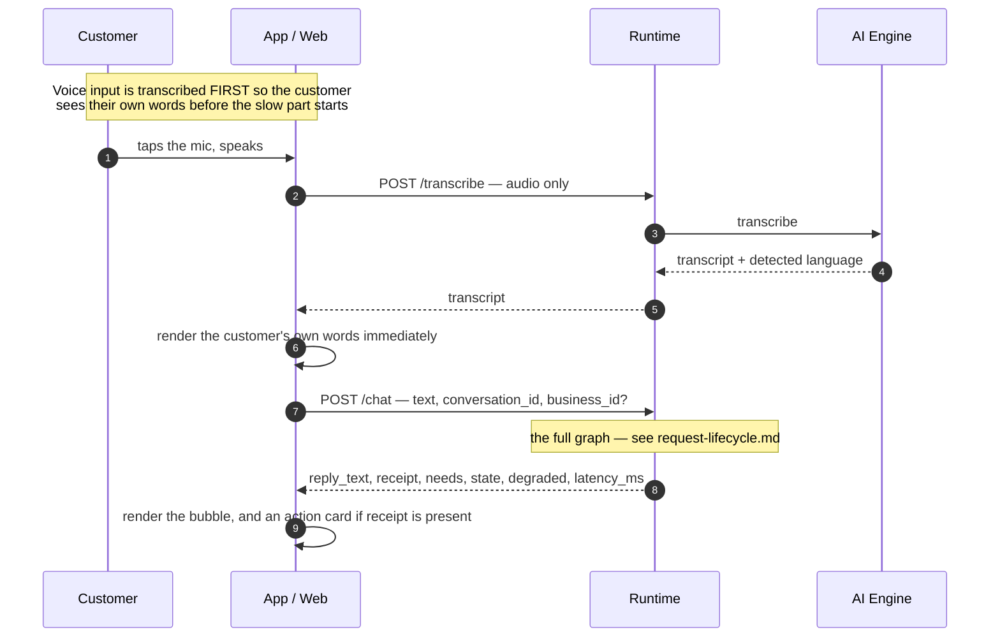
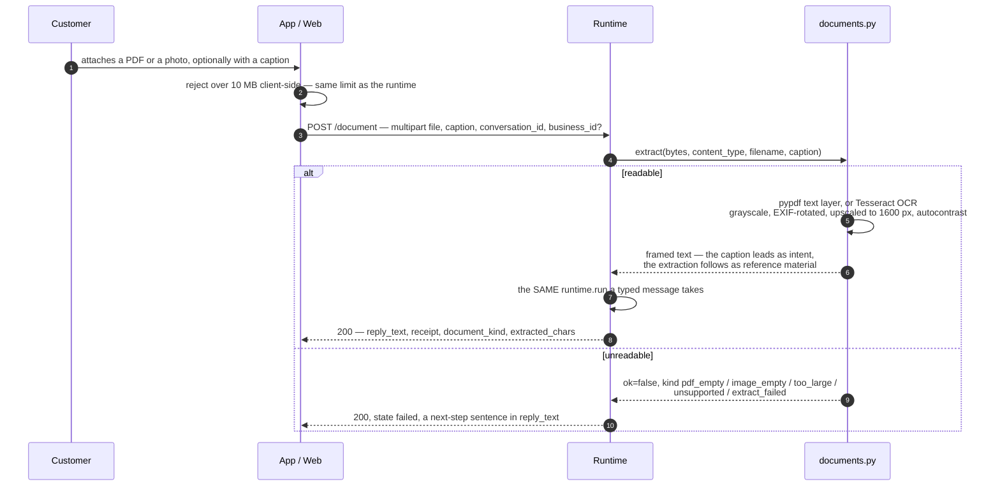
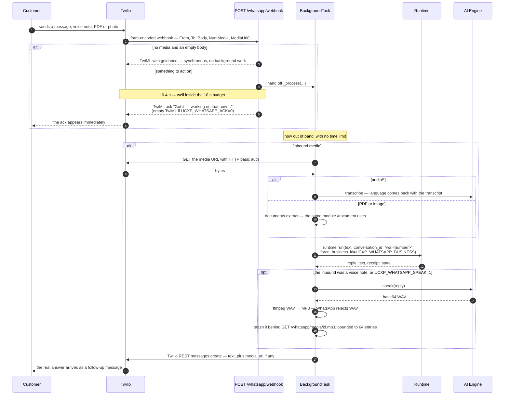
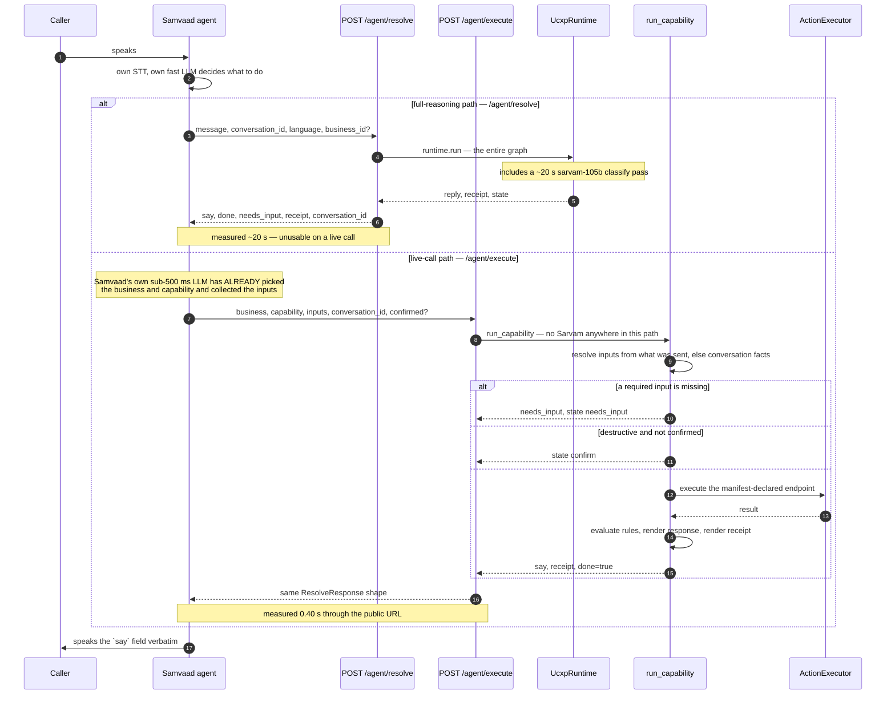
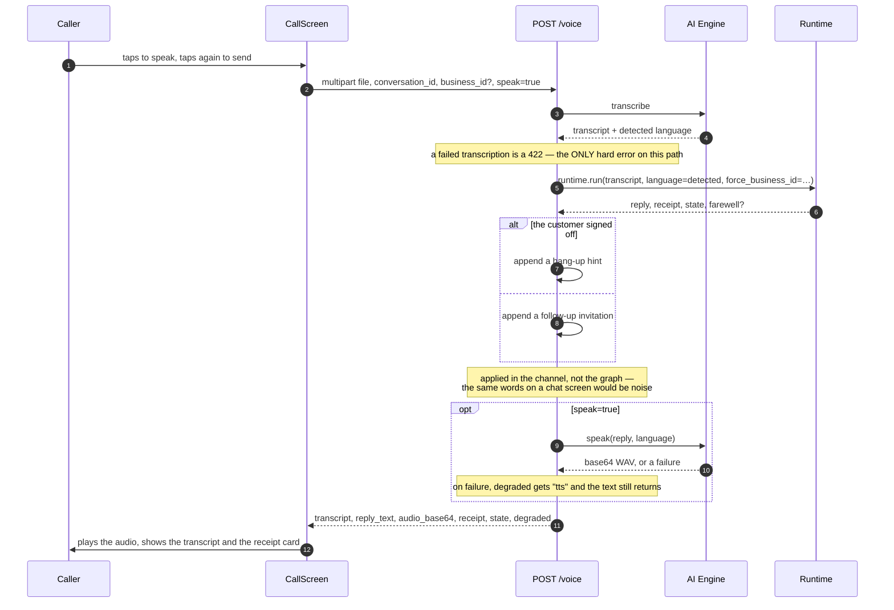
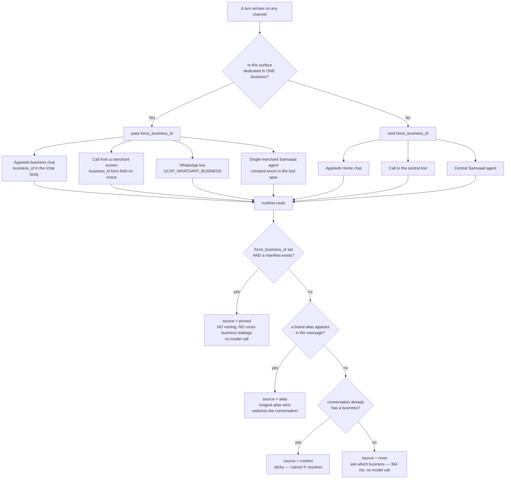

# Channels

Four clients, one brain. This document covers what each channel can do, how each
one reaches the runtime, and the one rule — business pinning — that is easiest to
get wrong.

**Related:** [architecture](./architecture.md) ·
[request lifecycle](./request-lifecycle.md) ·
[data & memory](./data-and-memory.md) · [operations](./operations.md)

---

## 1. The principle

Every channel is a **transport adapter**. Its job is to turn whatever arrived —
typed text, a voice note, a PDF, a phone call transcript — into plain text, and
hand it to `UcxpRuntime.run()`.

```python
final, conversation = await runtime.run(
    text,
    conversation_id=…,
    language=…,
    user_id=…,
    force_business_id=…,
)
```

Everything downstream — routing, capability resolution, slot-filling,
confirmation, rules, the action, the receipt, memory — is identical. That is why
a photographed order confirmation sent over WhatsApp and a typed message in the
app produce the same receipt.

The one exception is `POST /agent/execute`, which deliberately bypasses the graph
for latency reasons. It is the subject of §5, including what that costs.

---

## 2. Comparison

| | **Android APK** | **Web SPA** | **WhatsApp** | **Phone call** |
|---|---|---|---|---|
| Client | Expo / React Native | same codebase, `expo export -p web` | Twilio sandbox | Sarvam Samvaad agent |
| Entry point | `/chat`, `/voice`, `/transcribe`, `/document` | same | `/whatsapp/webhook` | `/agent/execute` (live), `/agent/resolve` (full) |
| Text chat | yes | yes | yes | n/a |
| Voice in | real Sarvam STT | **see §6** | voice notes, transcribed | Samvaad's own STT |
| Voice out | real Sarvam TTS | — | opt-in MP3 voice note | Samvaad's own TTS |
| Documents | PDF + photo via `/document` | PDF + photo via `/document` | PDF + photo inline | no |
| Receipt rendering | action card | action card | text only | spoken only — a caller has no screen |
| Memory key | `conversation_id` | `conversation_id` | `wa:<sender number>` | echoed `conversation_id` |
| Auth | optional Supabase JWT | optional Supabase JWT | none — the phone number is the identity | none — optional shared bearer |
| Business pinning | per-screen `business_id` | per-screen `business_id` | `UCXP_WHATSAPP_BUSINESS` | constant `enum` in the tool spec |
| Reply latency | ~13 s measured for a pinned lookup | same | 20–27 s, delivered async | **0.40 s** measured |
| Durable history | yes, `/chat` and `/document` record | yes | **no** — see [data-and-memory §7](./data-and-memory.md#7-known-gaps) | no |

---

## 3. App and web chat

Both surfaces are the same Expo codebase and hit the same endpoints. Client
details are in [`frontend/README.md`](../frontend/README.md).



**Why `/transcribe` exists as a separate endpoint.** Pointing the app at
`/voice` would execute the capability twice — once to get the transcript on
screen and once to resolve. Splitting speech-to-text out means the customer sees
their words in well under a second while the reasoning model works.
([`PLAN.md`](../PLAN.md) §7 #31.)

**Client timeouts are generous on purpose.** `postJson` defaults to 45 s and the
chat call raises it to 120 s. A multilingual turn is translate-in → classify →
act → compose → translate-out; showing a slow-but-successful turn as a network
failure is worse than waiting.

### Documents



**Why an unreadable file answers 200.** A 4xx reaches a mobile client as a
generic network error. The customer needs to be told "that PDF is a scan — send
a photo instead", in the same bubble every other reply appears in.
([`PLAN.md`](../PLAN.md) §6.)

**Why extraction is its own module.** It started inside `whatsapp.py`, which
meant only WhatsApp could read a file. Two copies would have drifted the moment
one got a fix, so extraction and the framing that turns OCR noise into
*reference material* rather than a user utterance both live in
`backend/app/documents.py`, and all three channels call it.

History records the caption or `"[pdf] filename"` — not the framed OCR text. A
wall of OCR in the transcript helps nobody.

---

## 4. WhatsApp

The interesting channel, because it has a hard constraint the others do not.

**A Twilio webhook must respond in about 10 seconds** or it times out with error
11200 and the reply is dropped. Measured resolution with `sarvam-105b` is
**20–27 s**. No configuration reconciles those two numbers.



### Consequences, stated honestly

- **`TWILIO_ACCOUNT_SID` and `TWILIO_AUTH_TOKEN` become mandatory**, not
  media-only. Without them resolution still runs and the answer is simply never
  delivered — the log says `whatsapp.no_credentials`.
- **The ack lingers forever.** WhatsApp cannot unsend a delivered message, so
  "⏳ Got it — working on that now…" stays in the transcript. `UCXP_WHATSAPP_ACK=0`
  trades that for a clean single-reply chat with ~20 s of silence. Both are
  defensible; the default is reassurance.
- **A container restart mid-resolution drops that one reply.** The background
  task is in-process, with no queue. At demo scale that is the right trade;
  see [architecture §6](./architecture.md#6-deployment-topology).
- **Reply modality matches the request.** A voice note gets a spoken reply, text
  and documents get text. `UCXP_WHATSAPP_SPEAK=1` voices everything. If TTS or
  the transcode fails, `media_url` stays `None` and the text still goes — the
  customer always gets an answer.
- **The sender's number is the identity**, keying both `conversation_id`
  (`wa:+91…`) and `user_id`. That is what makes "Cancel it." work with no
  repetition and no login.
- **Known gap:** WhatsApp turns are never written to the durable session store,
  despite `db/schema.sql` reserving `channel = 'whatsapp'` and an `external_id`
  column. WhatsApp memory exists only in the disk snapshot. See
  [data-and-memory §7](./data-and-memory.md#7-known-gaps).

---

## 5. Samvaad agent tools

A phone call is one more surface over the same brain. Sarvam Samvaad owns
telephony, STT, TTS, turn-taking and barge-in; UCXP is exposed as an **Advanced
Tool**. We do not rebuild any of the voice stack — rebuilding sub-500 ms
turn-taking is wasted effort, and doing it this way makes Samvaad *just another
compliant UCXP client*, which is the protocol thesis made literal.

There are two tool endpoints because there are two latency budgets.



### The tool specs are generated from live manifests

`GET /agent/tool-spec` and `GET /agent/execute-spec` emit ready-to-paste tool
definitions in which the business and capability `enum`s come from whatever
manifests are loaded. Adding a merchant changes the tool definition with no code
change. Passing `?business_id=<id>` scopes the spec to one merchant and turns
`business_id` into a constant one-value `enum`, which is what makes a
single-merchant support line impossible to route away from.

Verified live:

```bash
curl -s "$BASE/agent/execute-spec?business_id=ravi-electronics"
# → capability enum: ["refund", "track_order"], business enum: ["ravi-electronics"]
```

### What this trades away — say it plainly to judges

1. **Samvaad's LLM decides *when* to call the tool.** On `/agent/execute` it also
   decides *which* capability. UCXP still owns slot-filling, the confirmation
   gate, business rules, the action and the receipt — but any consistency claim
   covers `/chat`, not the call.
2. **No receipt card on a pure phone call.** A PSTN caller has no screen. The
   structured receipt is still returned and spoken; only the card is missing.
3. **`/agent/execute` is a second implementation.** It reuses `ActionExecutor`,
   `render` and `evaluate_condition`, but re-implements slot-filling,
   confirmation and receipt rendering outside the graph. Two verified
   consequences:
   - it never calls `store.save()`, so a pending confirmation created on the call
     path is **not** written to disk and will not survive a restart;
   - it never writes `last_<key>` facts after a successful action, so a follow-up
     on `/chat` will not know the order id the call just looked up.

   The duplication has a real cause — the graph's nodes are `async` methods bound
   to `TurnState` and LangGraph, not callable standalone — but the fix is to
   extract a shared capability-execution service, not to keep two.

### Status

Both endpoints are built, spec'd, unit-tested (`tests/test_agent_tools.py`, 19
tests, all passing) and verified over a tunnel and against the public URL.
**Not yet dialled from a real Samvaad agent** — the remaining work is dashboard
configuration. [`PLAN.md`](../PLAN.md) §12.6 defines done for this channel as a
real call resolving a real job in Telugu.

### Optional auth

Setting `UCXP_AGENT_TOOL_TOKEN` requires `Authorization: Bearer <token>` on both
`/agent/resolve` and `/agent/execute`. Unset, the gate is off. Neither endpoint
requires a Sarvam key — `/agent/execute` works with no key at all.

---

## 6. Voice: what works where

`POST /voice` is `/chat` with speech-to-text in front and text-to-speech behind.
One call turn = one request.



**The 30-second cap is real and enforced in three places.** Sarvam's realtime STT
rejects longer clips, so the AI Engine pre-checks WAV duration and fails in ~2 ms
with `speech_failed` rather than burning a round trip. Non-WAV uploads (`m4a`,
`webm`) cannot have their duration read cheaply, so the client caps recording
length too — `voice.ts` refuses anything over 30 s before uploading.

**Web voice:** [`PLAN.md`](../PLAN.md) §7 #27 and §11.4 record that
`useVoiceRecorder` flags `web-unsupported` because `expo-audio` has no web mic
capture, and that web should not be used to demo voice. Whether a browser-native
recorder has since been added is covered in
[`frontend/README.md`](../frontend/README.md), which documents the client as it
actually stands.

---

## 7. Business pinning

The single rule most likely to be implemented wrongly, so here it is as a
decision flow.



### Why it matters

A business's WhatsApp number is *its own support line*. Routing across five
merchants there would be a bug, not a feature. The same is true of a support
chat opened from a merchant's page and a call placed from that merchant's
screen.

One parameter expresses "this surface belongs to one business" for all four
channels at once, and the central experience is simply the case where it is
absent. ([`PLAN.md`](../PLAN.md) §7 #22, #39, #45.)

### Two consequences worth internalising

- **A pinned turn never pays for routing.** `route` returns immediately, and
  `classify` prompts against one manifest instead of the whole directory.
- **A pinned turn cannot be switched by the customer**, even if they name another
  brand. The alias branch is only reached when nothing is pinned.

And on the unpinned path, one safety property: naming a *different* business
while a confirmation is pending **cancels** the pending action rather than
letting it inherit. That was a real bug — see
[request-lifecycle §5.3](./request-lifecycle.md#53-a-confirmation-gated-destructive-action).

---

## 8. Adding a channel

The checklist, derived from how the existing four are built:

1. Turn your input into plain text. Reuse `documents.extract` for files and
   `engine.transcribe` for audio — do not write a second copy.
2. Pick a stable `conversation_id`. WhatsApp uses `wa:<number>`; a voice agent
   echoes back whatever the previous turn returned. Memory hangs off this.
3. Call `runtime.run(...)`, passing `force_business_id` if the surface belongs to
   one business.
4. Render `reply_text`. Render `receipt` if your surface has a screen. Read
   `needs` only if you want a targeted input field — `reply_text` already
   contains the question.
5. Respect your transport's timeout. If resolution can outlive it, ack and
   deliver out of band, as WhatsApp does.
6. Record the turn with `get_session_store().record_turn_later(...)` if you want
   it in durable history. WhatsApp and `/agent/*` currently do not, which is the
   gap in [data-and-memory §7](./data-and-memory.md#7-known-gaps).
7. Put **no business logic in the adapter**. If you find yourself writing an
   `if`, it belongs in a manifest.
