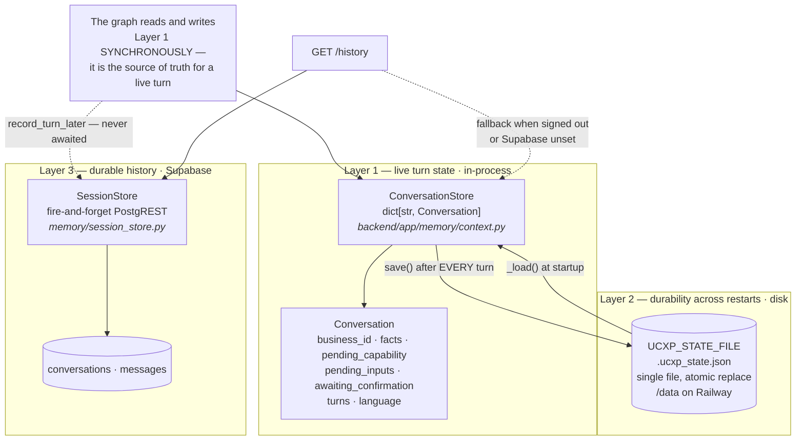
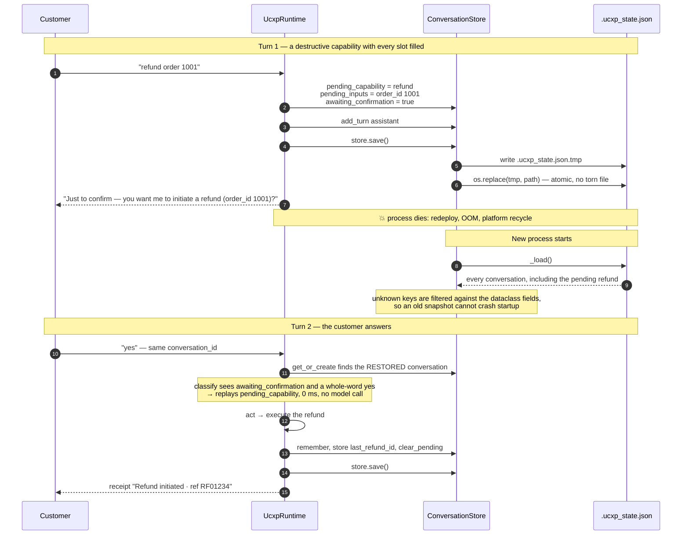
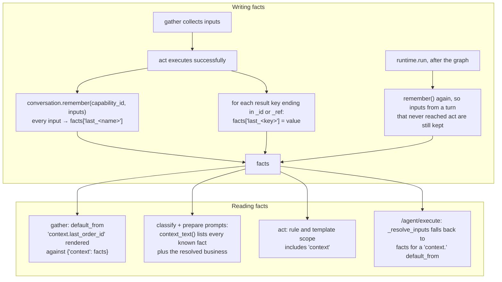
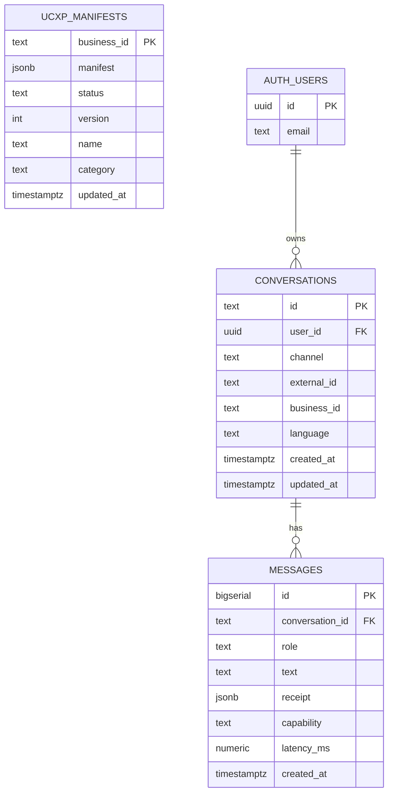
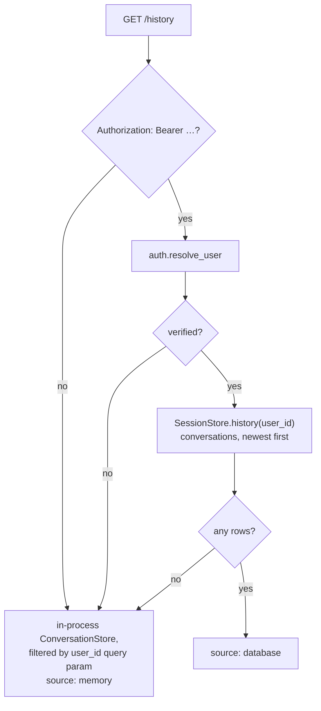

# Data and memory

What Sahayak remembers, where each kind of memory lives, and what happens to it
when the process dies.

**Related:** [architecture](./architecture.md) ·
[request lifecycle](./request-lifecycle.md) · [channels](./channels.md) ·
[operations](./operations.md)

Source: [`backend/app/memory/context.py`](../backend/app/memory/context.py),
[`backend/app/memory/session_store.py`](../backend/app/memory/session_store.py),
[`db/schema.sql`](../db/schema.sql).

---

## 1. Why memory is the product, not a feature

"Cancel it." has to work. A customer who has just been told where order 1001 is
should be able to say three words and have a refund initiated against that
order, at that business, without repeating either.

That single requirement is what forces every design decision below: sticky
business resolution, `last_<name>` facts, pending state that survives a restart,
and a conversation id that every channel can reconstruct from something it
already has.

---

## 2. Three layers

They serve different purposes and fail differently. Conflating them is the main
way this goes wrong.



| | Layer 1 | Layer 2 | Layer 3 |
|---|---|---|---|
| Holds | pending confirmations, slot state, facts, last 12 turns | a snapshot of all of Layer 1 | who said what, and what it resolved to |
| Written | synchronously, inside the graph | after every turn, via `store.save()` | asynchronously, fire-and-forget |
| Read | synchronously, by every node | once, at process start | by `GET /history` for a signed-in caller |
| On failure | — | logged and swallowed | logged and swallowed |
| Scope | one process | one container + volume | global |
| Required for correctness | **yes** | for multi-turn flows across restarts | no |

**The critical rule:** Layer 3 is never on the critical path. A database hiccup
must never cost a customer their answer, so `record_turn_later` creates a task,
holds a reference so it is not garbage-collected mid-flight, and returns
immediately.

---

## 3. The `Conversation` object

```python
@dataclass
class Conversation:
    id: str
    user_id: str | None = None
    business_id: str | None = None        # sticky — why "cancel it" works
    last_capability: str | None = None
    language: str = "en-IN"
    facts: dict[str, Any] = {}            # {"last_order_id": "1001", …}
    pending_capability: str | None = None # a capability waiting on a slot
    pending_inputs: dict[str, Any] = {}
    awaiting_confirmation: bool = False   # a capability waiting on yes/no
    turns: list[dict[str, str]] = []      # capped at UCXP_MAX_HISTORY_TURNS (12)
    created_at: float
    updated_at: float
```

| Field | Who writes it | Who reads it |
|---|---|---|
| `business_id` | `runtime.run` after every turn that resolved one | `route`, as the sticky fallback |
| `facts` | `Conversation.remember` and `act` | `gather` for `default_from`, and both classifier prompts as `context_text()` |
| `pending_capability` / `pending_inputs` | `gather`, on both short-circuits | `classify` on a yes, `gather` on the next turn |
| `awaiting_confirmation` | `gather` when `capability.confirm` | `classify`, to arm the yes/no branch |
| `turns` | `runtime.run`, both roles | the classifier prompt as `history_text()` (last 6) |
| `language` | `runtime.run` | — carried for continuity |

`turns` is bounded at 12 by `UCXP_MAX_HISTORY_TURNS`. Empty content is dropped
rather than stored.

### Conversation ids by channel

| Channel | Id | Consequence |
|---|---|---|
| App / web | server-generated `uuid4().hex`, echoed back and reused | a new chat starts fresh memory |
| WhatsApp | `wa:<sender number>` | one continuous conversation per number, forever, with no login |
| Voice call | whatever the client echoes back | Samvaad must return the previous `conversation_id` for memory to carry |
| `/agent/execute` | echoed, or generated | same |

WhatsApp's choice is the interesting one: the phone number *is* the identity, so
memory works with no auth at all, and a returning customer three days later
still has their context.

---

## 4. How a mid-flow confirmation survives a restart

This is the whole reason Layer 2 exists. Before it, a restart between "shall I
go ahead?" and "Yes" meant the follow-up landed with nothing pending and fell
through to small talk — the customer had said yes to nothing.



### Design notes

- **Atomic write.** `tmp.write_text(...)` then `os.replace(tmp, path)`. A crash
  mid-write leaves the previous good snapshot, never a truncated one.
- **Failures never reach the customer.** Both `save()` and `_load()` wrap
  everything in a bare `except`, log a warning and continue. A read-only disk
  degrades multi-turn flows; it does not break replies.
- **Corruption cannot block startup.** A malformed file is logged and ignored.
- **Schema drift is tolerated.** `_load()` filters each record's keys against
  `fields(Conversation)`, so a snapshot written by an older build loads with the
  unknown keys dropped instead of raising `TypeError`.
- **The whole store is rewritten every turn.** O(conversations) per turn.
  At demo scale that is microseconds, and the simplicity is worth more than a
  database. [`PLAN.md`](../PLAN.md) §9 says SQLite would be acceptable; a file
  was enough.

**On Railway this requires a volume mounted at `/data`.** The Dockerfile sets
`UCXP_STATE_FILE=/data/.ucxp_state.json`; without the volume the snapshot lands
on the ephemeral container filesystem and every redeploy silently resets
mid-flow state. This is the single most important deployment step nobody
notices, because everything looks fine until someone confirms a refund across a
deploy.

---

## 5. Fact propagation

How `last_order_id` gets there, and what uses it.



The `_id` / `_ref` suffix convention is how a *result* becomes reusable input
without the runtime knowing what any field means:

```python
for key, value in result.items():
    if isinstance(value, (str, int, float)) and key.endswith(("_id", "_ref")):
        conversation.facts[f"last_{key}"] = value
```

A connector returning `refund_id` therefore makes `context.last_refund_id`
available to any later capability whose manifest declares that
`default_from` — with no coordination between the connector and the manifest
beyond the naming convention.

**Caveat worth knowing:** `normalize.py` never sets `default_from`, so the five
published merchants get no automatic slot-filling from facts. The facts are
still written, and still shown to the classifier as context, but a manifest
would have to declare `default_from` to have a slot auto-filled. See
[manifest-spec §5](./manifest-spec.md#input-mapping).

---

## 6. Durable history



Three concerns, deliberately separate: `ucxp_manifests` is written by the
onboarding dashboard and read by the runtime; `conversations` and `messages` are
written by the runtime.

### Write path

`record_turn_later(...)` upserts the conversation (`Prefer:
resolution=merge-duplicates`, `on_conflict=id`) and then appends **both** turns
in one request.

One non-obvious detail, and the comment in the source earns its place: PostgREST
requires every object in a batch insert to carry the *same* keys. A shorter user
row is rejected outright with `PGRST102 "All object keys must match"`, so the
columns that only apply to the assistant turn (`capability`, `receipt`,
`latency_ms`) are sent explicitly as `null` on the user row.

### Read path



The fallback matters: the endpoint keeps working signed-out, and before Supabase
is configured at all. `source` in the response says which path answered, so a
client can tell durable history from this-process-only.

### RLS

- `ucxp_manifests` — **public read**. A published manifest is a protocol
  document, and the directory screen shows it to signed-out users. Writes are
  service-role only, which only the dashboard holds.
- `conversations` / `messages` — a user sees only their own rows. The runtime
  writes with the service role and bypasses RLS; the policies protect direct
  client access.

### Auth

Optional by design — [`backend/app/auth.py`](../backend/app/auth.py) serves an
anonymous caller rather than rejecting them, because WhatsApp has no bearer
token at all and requiring one would break a working channel.

Two verification paths: local HS256 verification when `SUPABASE_JWT_SECRET` is
set (a few hundred microseconds, no network), otherwise `GET /auth/v1/user`
against Supabase. Results are cached for 5 minutes keyed by token.

What it never does is decode without verifying. A forged `user_id` would let one
customer read another's history, and "it's only a demo" is exactly how that
ships.

---

## 7. Known gaps

Verified by reading the source, not inferred.

### 7.1 `/agent/execute` does not persist to disk

`run_capability()` mutates the conversation — it sets `business_id`,
`pending_capability`, `pending_inputs`, calls `remember()` and `clear_pending()`
— but **never calls `store.save()`**. Only `UcxpRuntime.run()` does.

**Consequence:** a confirmation gate reached on the live-call path is not
snapshotted. If the process restarts between "shall I go ahead?" and the
caller's "yes", the pending refund is lost — exactly the failure §4 was built to
eliminate, still present on one path.

**Fix:** call `get_store().save()` at the end of `run_capability`, or extract the
shared capability-execution service that both paths call.

### 7.2 `/agent/execute` does not learn `last_<key>` facts

`graph.act` writes result ids into `conversation.facts`. `run_capability` calls
`conversation.remember(capability, collected)` — which records the *inputs* — but
never scans the result for `_id`/`_ref` fields.

**Consequence:** a phone call that looks up order 1001 leaves no
`last_order_id`, so a follow-up in the app on the same conversation cannot use
it, and the cross-channel memory story is weaker on the call path than in the
app.

### 7.3 WhatsApp turns never reach the durable store

`/chat` and `/document` both call `record_turn_later`. `api/whatsapp.py` does
not — verified by grep. Neither does `/agent/resolve` or `/agent/execute`.

**Consequence:** `db/schema.sql` reserves `channel text not null default 'app'
-- app | web | whatsapp` and an `external_id` column commented
`-- e.g. whatsapp:+9198…`, and neither is ever populated. WhatsApp memory exists
only in the disk snapshot, so a customer's WhatsApp history is invisible in the
app even when the same person signs in.

**Fix:** one `record_turn_later(channel="whatsapp", external_id=sender, …)` call
at the end of `_process`. The `user_id` would stay `None` until a phone number
can be linked to a Supabase user, which is a product decision, not a code one.

### 7.4 Single-node by construction

`ConversationStore` is a process-local dict snapshotted to one file. Two
replicas would each hold half the pending confirmations and overwrite each
other's snapshot. The current deployment is one container, so this is correct
today and would need a shared store (Redis, or the Supabase tables promoted to
Layer 1) before scaling out.

### 7.5 The snapshot grows without bound

Nothing evicts old conversations. `turns` is capped per conversation, but the
number of conversations is not, and the entire store is rewritten on every turn.
At demo scale this is invisible; a TTL or an LRU bound would be the first thing
to add.
