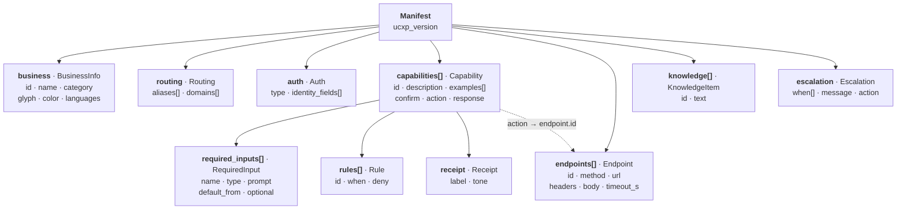
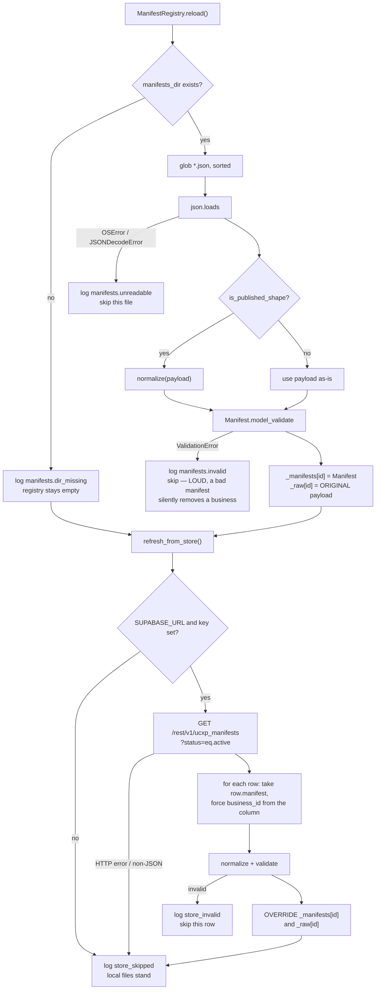

# The UCXP manifest

The contract that makes the runtime generic. Everything a business can do is
described here as **data**; the runtime reads these models and nothing else
about a business.

**Related:** [architecture](./architecture.md) ·
[request lifecycle](./request-lifecycle.md) ·
[publishing contract](./manifest-sync.md) · [decisions](./decisions.md)

Source: [`backend/app/schemas/manifest.py`](../backend/app/schemas/manifest.py),
[`backend/app/runtime/normalize.py`](../backend/app/runtime/normalize.py),
[`backend/app/runtime/loader.py`](../backend/app/runtime/loader.py).

---

## 1. Two shapes, one internal model

There are two manifest shapes in play, and understanding why is most of
understanding this file.

| | **Classic** ([`PLAN.md`](../PLAN.md) §5) | **Published** (what merchants actually emit) |
|---|---|---|
| Author | hand-written for the original three businesses | the UCXP onboarding dashboard, Shopify-connected |
| `business` | an object with `id`, `name`, `category`, … | a **name string**, with `business_id` alongside |
| Capabilities | `id`, `action`, `required_inputs`, `rules`, `confirm`, `response`, `receipt` | `name`, `endpoint`, `method`, `parameters`, `response.example` |
| Endpoints | a separate `endpoints[]` array | inline on each capability |
| Extra | — | `profile`, `policies`, `faq`, `sla`, `escalation[]`, `data_source` |
| Loaded by the runtime | directly | via `normalize.py` |

The internal Pydantic model is the classic shape. The published shape is mapped
onto it **at load time**, so the graph, executor and renderer never learn there
are two. `registry.raw(id)` still returns the original document, which is what
`GET /manifests/{id}` serves — so what a judge reads is what the merchant
published, not a rewritten copy.

All five shipped merchants use the published shape.

---

## 2. The internal model

Exactly the Pydantic classes in `schemas/manifest.py`. This is what every node
in the graph actually sees.



Lookup helpers on `Manifest`: `id`, `capability(id)`, `endpoint(id)`,
`knowledge_text()`, `capability_catalogue()`.

### Field reference

| Field | Default | Read by | Purpose |
|---|---|---|---|
| `business.id` | required | everything | The slug. Primary key across the whole system |
| `business.name` | required | `route`, `compose` | Also an implicit routing alias |
| `business.category` | `"Other"` | client UI | Also drives the derived glyph and colour |
| `business.glyph`, `.color` | `🏢`, `#64748B` | client UI | Presentation only |
| `business.languages` | `["en-IN"]` | client UI | Advertised, not enforced — the engine detects |
| `routing.aliases` | `[]` | `route` | Free-text brand mentions. Longest match wins |
| `routing.domains` | `[]` | classifier catalogues | Topic hints |
| `auth.type` | `"none"` | — | `none · otp · token`. Demo is always `none` |
| `auth.identity_fields` | `[]` | — | Declarative only today |
| `capability.id` | required | `classify`, `gather`, `act` | The value the classifier must return |
| `capability.description` | required | classifier prompt, confirmation wording | |
| `capability.examples` | `[]` | classifier prompt | Up to 4 shown |
| `capability.required_inputs` | `[]` | `gather` | The slots |
| `capability.rules` | `[]` | `act` | Evaluated **against the result** |
| `capability.confirm` | `false` | `gather` | `true` ⇒ ask yes/no before executing |
| `capability.action` | `null` | `act` | `endpoints[].id`. Null ⇒ no HTTP call |
| `capability.response` | `""` | `compose` | The sentence. Empty ⇒ prompt 3 fires |
| `capability.receipt` | `null` | `compose` | Null ⇒ the job never reports "done" |
| `required_input.prompt` | required | `gather` | Asked verbatim, never paraphrased |
| `required_input.default_from` | `null` | `gather` | Dotted path, e.g. `context.last_order_id` |
| `required_input.optional` | `false` | `gather` | Optional slots never block |
| `rule.when` | required | `act` | Expression over `{inputs, result, context}` |
| `rule.deny` | required | `compose` | Returned verbatim |
| `endpoint.url` | required | `act` | Template over inputs + `mock_base` + `connector_base` |
| `endpoint.timeout_s` | `5.0` | `act` | Falls back to `UCXP_ACTION_TIMEOUT` |
| `knowledge[].text` | required | `gather` prompt 2, `compose` prompt 3 | Retrieval-lite. Not a substitute for an action |
| `escalation.message` | a default sentence | `compose` | Shown when an action fails |

### Two derived helpers the classifier depends on

`capability_catalogue()` renders the candidate list handed to prompt 1:

```
- id: "track_order" — Live status for "Where is my order?"
  examples: where is my order; मेरा ऑर्डर कहाँ है
  inputs: order_id
```

The prompt is generic; the candidates are data. That single fact is what makes
capability resolution business-agnostic.

`full_catalogue()` and `routing_catalogue()` do the same across every manifest,
for the unscoped case.

---

## 3. Template and rule grammar

One renderer serves URLs, request bodies, response strings and receipts —
[`renderer.py`](../backend/app/runtime/renderer.py).

### Templates

```
{{name}}            a collected input
{{result.status}}   a field from the action result
{{context.last_order_id}}   a remembered fact
{{mock_base}}       the mock API root, injected by the executor
{{connector_base}}  the connector root, injected by the executor
```

Resolution walks a dotted path through dicts **and objects**. Whitespace inside
the braces is tolerated. After substitution, runs of whitespace are collapsed
and the result is stripped.

**A missing key raises `RenderError`.** This is deliberate and stated in
[`PLAN.md`](../PLAN.md) §5: a blank in a demo is worse than a loud failure.
Callers decide what to do — `compose` logs it and falls through to prompt 3,
`_receipt` drops the card, and `executor` turns it into an `ActionError` rather
than issuing a request to a half-rendered URL.

`render_value` applies the same rules recursively through dicts and lists, which
is how request bodies are templated.

### Rules

`when` is parsed with `ast.parse(mode="eval")` and walked against an
**allow-list of node types** — comparisons, boolean operators, unary and binary
operators, literals, names and attribute access. Anything else is rejected.
There is no `eval`, no `__builtins__`, no function calls.

```jsonc
"rules": [
  { "id": "refund_window",
    "when": "result.days_since_delivery > 7",
    "deny": "Refunds are only available within 7 days of delivery. I can raise a support ticket instead." }
]
```

Supported forms, from the passing unit tests:

```
result.days_since_delivery > 7
result.status == 'delivered'
result.a > 1 and result.b == 'x'
```

Refused, also unit-tested:

```
__import__('os').system('echo hi')     → RuleError
result.missing_field == 1              → RuleError (unknown name, not False)
```

An unevaluable rule is **logged and skipped**, not treated as a denial. A rule
that references a field the API stopped returning must not silently block every
refund.

---

## 4. The published shape

Trimmed from [`manifests/ravi-electronics.json`](../manifests/ravi-electronics.json).

```jsonc
{
  "ucxp_version": "0.1",
  "business": "Ravi Electronics",           // a STRING, not an object
  "business_id": "ravi-electronics",
  "category": "Electronics",
  "profile": {
    "tagline": "…", "description": "…",
    "support_email": "…", "support_phone": "…",
    "website": "…", "hours": "Mon-Sat 10:00-19:00 IST", "city": "Bengaluru"
  },
  "primary_language": "en-IN",
  "languages": ["en-IN", "hi-IN", "kn-IN", "te-IN", "ta-IN", "ml-IN"],
  "data_source": {
    "type": "shopify",
    "store_subdomain": "ravi-electronics-bmxitv46.myshopify.com",
    "credential_ref": "vault://ravi-electronics",
    "reads": ["read_orders", "read_products"],
    "pii_available": false
  },
  "identify_by": "order_number",
  "capabilities": [{
    "name": "track_order",                  // → capability.id AND endpoint.id
    "source": "shopify_default",
    "endpoint": "/connectors/shopify/orders/{order_id}",   // SINGLE braces
    "method": "GET",
    "description": "Live status for \"Where is my order?\"",
    "parameters": {
      "path": [{ "name": "order_id", "type": "string",
                 "required": true, "example": "1001",
                 "description": "Shopify order number…" }]
    },
    "request": { "headers": { "X-Shopify-Access-Token": "{{credential_ref}}" } },
    "response": {
      "example": { "order_id": "1001", "status": "being prepared",
                   "payment": "PAID", "amount": "1299.0", "currency": "INR",
                   "items": [{ "title": "boAt Airdopes 141 Earbuds", "qty": 1 }] },
      "mapping": { "status": "$.displayFulfillmentStatus",
                   "amount": "$.totalPriceSet.shopMoney.amount" }
    },
    "errors": [{ "code": "404", "meaning": "Order not found",
                 "customer_message": "Sorry, we couldn't find that order number" }],
    "notes": "Auto-configured from Shopify store ravi-electronics-bmxitv46."
  }],
  "policies": { "return_policy": "…", "refund_policy": "…",
                "shipping_policy": "…", "warranty": "…" },
  "faq": [{ "q": "Where is my order?", "a": "Share your order number…" }],
  "sla": { "first_response": "48h", "resolution": "30d", "auto_escalate": true },
  "escalation": [
    { "level": 1, "to": "support agent", "after": "0h" },
    { "level": 2, "to": "grievance officer", "after": "48h",
      "name": "Ravi Kumar", "contact": "grievance@ravielectronics.in" },
    { "level": 3, "to": "National Consumer Helpline 1915", "after": "30d" }
  ],
  "created_at": "…", "status": "active",
  "published": { "version": 1, "at": "…", "url": "…" }
}
```

Detection is one line:

```python
def is_published_shape(raw):
    return isinstance(raw.get("business"), str) or "business_id" in raw
```

---

## 5. How `normalize.py` maps one onto the other

Complete and verified against the source. "**derived**" means the value does not
exist in the published document and is computed; "**inferred**" means it is
guessed from a name or a wordlist, which is the part worth arguing about (§6).

| Internal field | Source | Rule |
|---|---|---|
| `business.id` | `business_id` | else the name lowercased with whitespace → `-` |
| `business.name` | `business` (string) | else `business_id` |
| `business.category` | `category` | default `"Other"` |
| `business.glyph`, `.color` | **derived** | substring match of the lowercased category against a 15-entry style table; default `🏢 / #64748B` |
| `business.languages` | `languages` | else `[primary_language]` |
| `routing.aliases` | **derived** | the set `{name, business_id, business_id with - → space, first word of name}`, sorted, blanks dropped |
| `routing.domains` | **derived** | `[category.lower()]` + each capability name with `_`/`-` → space |
| `auth.type` | **fixed** | always `"none"` |
| `auth.identity_fields` | `identify_by` | default `["order_number"]` |
| `capability.id` | `capabilities[].name` | capabilities with no `name` are skipped entirely |
| `capability.description` | `capabilities[].description` | else the friendly name, capitalised |
| `capability.examples` | **fixed** | always `[]` — the published shape has none |
| `capability.required_inputs[]` | `parameters.path` → `parameters.query` → `parameters.body`, in that order | see below |
| `capability.rules` | **fixed** | always `[]` |
| `capability.confirm` | **inferred** | `true` if the capability name contains `refund`, `cancel`, `delete`, `return`, `close` or `unsubscribe` |
| `capability.action` | `capabilities[].name` | identical to the endpoint id |
| `capability.response` | **derived** from `response.example` | see below |
| `capability.receipt` | **inferred** from the capability name | see below |
| `endpoints[].id` | `capabilities[].name` | one endpoint per capability |
| `endpoints[].method` | `capabilities[].method` | uppercased, default `GET` |
| `endpoints[].url` | `capabilities[].endpoint` + `data_source` | see below |
| `endpoints[].headers` | **dropped** | `{}` — "auth is a connector concern" |
| `endpoints[].body` | **dropped** | `null` — identifiers travel in the path |
| `endpoints[].timeout_s` | **fixed** | `8.0` |
| `knowledge[]` | `profile.description` → id `about`; each `policies.<key>` → id `<key>`; each `faq[i]` → id `faq_<i>`, text `"<q> <a>"` | |
| `escalation.message` | first entry in `escalation[]` that has a `contact` | else a default sentence |
| `escalation.when` | **fixed** | `["action_failed", "user_asks_human"]` |

**Not mapped at all** (present in the document, invisible to the runtime, still
served verbatim by `GET /manifests/{id}`): `sla`, `created_at`, `status`,
`published`, `notes`, `source`, `request.headers`, `request.body`,
`response.mapping`, `errors[]`, `profile.*` other than `description`,
`data_source.reads`, `data_source.pii_available`.

`data_source` is a special case: `normalize` reads `type` to build the URL, and
`connectors/shopify.py` later reads `store_subdomain` and `credential_ref`
straight off the **raw** document through `registry.raw(business_id)`.

### Input mapping

```python
required_inputs.append({
    "name":     param["name"],
    "type":     param.get("type", "string"),
    "prompt":   f"What's your {friendly_name}?" + (f" (for example {example})" if example else ""),
    "optional": not param.get("required", group == "query"),
})
```

Note the default: a `query` parameter with no explicit `required` is treated as
optional, a `path` or `body` parameter is not. Also note `default_from` is never
set by the adapter, so published manifests get **no** memory-backed slot
defaults — `context.last_order_id` will not auto-fill. The turn still works
because `classify` extracts the id from the message and pending inputs carry
across turns, but it is a real capability difference from the classic shape.

### URL mapping

```python
templated = re.sub(r"\{(\w+)\}", r"{{\1}}", path)      # single → double braces

if data_source["type"] == "shopify":
    tail = re.sub(r"^/connectors/shopify", "", templated)
    return f"{{{{connector_base}}}}/connectors/shopify/{business_id}{tail}"
return "{{mock_base}}" + templated
```

So `/connectors/shopify/orders/{order_id}` becomes
`{{connector_base}}/connectors/shopify/ravi-electronics/orders/{{order_id}}`.
The business id is injected into the path, which is how one connector route
serves every merchant while still resolving the right store's credential.

### Response sentence synthesis

The published shape describes an API response, not a sentence. Without a
template, `compose` falls through to a full reasoning call on **every** turn —
measured at 44–52 s. So a sentence is built from the fields the manifest already
declares:

```python
subject = first of ("order_id", "refund_id", "booking_ref", "ticket_id") present in example
lead    = "Your order {{order_id}}"          if subject == "order_id"
        | "Your request {{result.<subject>}}" if subject
        | "Your request"

parts   = in this order, for whichever keys the example declares:
          status   → "is {{result.status}}"
          eta      → "arriving {{result.eta}}"
          amount   → "for {{result.amount}} {{result.currency}}"   (only if currency is also declared)
          eta_days → "and should complete in {{result.eta_days}} days"

response = f"{lead} {', '.join(parts)}."     # "" if no parts matched
```

This is data-driven — no business and no capability is named in the table — but
it is a heuristic, and its output is only as good as the declared example. See
§6.3 for what that costs in production today.

### Receipt inference

```python
"track" | "status" | "order" | "where" in name  →  {{result.status}}                              , success
"refund"                          in name  →  Refund {{result.status}} · ref {{result.refund_id}} , success
"cancel"                          in name  →  {{result.status}}                                   , warning
otherwise                                  →  no receipt
```

A receipt whose label fails to render is dropped by `compose`, so a wrong guess
degrades to "no card" rather than a broken one. But since `done` is defined as
`receipt is not None`, a capability the table does not recognise never reports as
completed.

---

## 6. What the published schema cannot express

This is the sharpest piece of architectural debt in the repo, and it is here
rather than buried.

### 6.1 Rules

The published schema has no rules field, so `normalize` emits `rules: []` for
every merchant. **The manifest rule engine is therefore inert in production.**

The machinery is real and tested: `evaluate_condition`, its AST allow-list and
the refusal of `__import__` are covered by passing unit tests, and the denial
branch is covered on the `/agent/execute` path. But no live capability exercises
it, and the `refund_window` example everyone quotes comes from the classic
schema, not from anything currently deployed.

### 6.2 Confirmation

`confirm` is inferred from a six-verb wordlist matched against the capability
*name*. It happens to be correct for `refund` and `cancel`. It would be wrong
for a capability named `process_return_request` in a language other than
English, or for a destructive action named something neutral like `apply_credit`.

Guessing whether an action is destructive is exactly the decision that should be
declared, not inferred.

### 6.3 Response wording

Because the sentence is synthesised from `response.example`, its quality depends
on what the merchant's dashboard happened to emit.

**Live example, verified today.** The Supabase-published `ravi-electronics` row
declares `track_order`'s example as `{courier, eta, status, tracking_url}` — no
`order_id`. So `subject` is `None`, the lead becomes the generic "Your request",
and the deployed reply is:

> "Your request is shipped, arriving Wednesday, 29 July."

Correct, but it does not name the order the customer asked about. The committed
file in `manifests/` declares `{order_id, status, payment, amount, currency,
items}`, which would produce "Your order 1001 is …" — a good illustration of how
much rides on a field the schema treats as documentation.

### 6.4 The fix

All three are the same fix: let the published schema carry `rules`, `confirm`
and `response`, and let `normalize.py` go back to mapping structure only. Until
then, the inference lives in one module at the boundary, is business-generic,
and is documented here — which is the best available position, not a good one.

---

## 7. The load path



Three properties worth stating:

- **Local files are the floor, not the truth.** They are loaded first so an
  unreachable database degrades to the committed demo set rather than an empty
  directory. That fallback is why `GET /manifests/{id}` keeps working with the
  DB down.
- **A published row wins over a file of the same id.** This is intentional — the
  dashboard is the source of truth — but it means the file you read in the repo
  is not necessarily what the deployed runtime is using. See §8.
- **`_raw` always holds the original document.** Never the normalized one. The
  introspection endpoint must not show a rewritten manifest.

`POST /manifests/reload` re-runs `refresh_from_store()` on a live server, so a
newly published business appears without a restart.

### Alias matching

```python
for manifest in registry:
    for alias in [manifest.business.name, *manifest.routing.aliases]:
        if alias.lower() in text.lower():
            keep the LONGEST match
```

Case-insensitive substring, longest wins so a two-word brand beats the single
word it contains. Deterministic and free — it runs before any model call,
because if the customer named the business there is nothing to infer.

---

## 8. Operational gotcha: the deployed manifest is not the committed one

Because Supabase rows override files, **the manifest in `manifests/` may not be
the manifest that is running.**

This is currently biting. Verified against the live deployment today:

```bash
curl -s $BASE/manifests/ravi-electronics | jq .data_source
```

```jsonc
{ "type": "shopify",
  "credential_ref": "vault://ravi-electronics",
  "reads": ["read_orders", "read_products"],
  "pii_available": false }
  // ← no store_subdomain
```

The committed file has `store_subdomain`. The published row does not. In
`connectors/shopify.py`, `_store_domain()` returns `None` without it, so the
connector takes the **mock** branch regardless of whether a valid
`SHOPIFY_TOKEN_RAVI_ELECTRONICS` is set. Live order lookups are therefore
currently returning deterministic mock data, with `/health` green and a
plausible-looking reply.

Symptom, cause and fix are in the
[operations troubleshooting table](./operations.md#8-troubleshooting).

---

## 9. Adding a business

The whole point. No runtime change, no deploy.

1. Write a manifest in either shape. The minimum viable one:

```jsonc
{
  "ucxp_version": "0.1",
  "business": "Acme Traders",
  "business_id": "acme-traders",
  "category": "Shopping",
  "languages": ["en-IN", "hi-IN"],
  "data_source": { "type": "shopify",
                   "store_subdomain": "acme.myshopify.com",
                   "credential_ref": "vault://acme-traders" },
  "identify_by": "order_number",
  "capabilities": [{
    "name": "track_order",
    "endpoint": "/connectors/shopify/orders/{order_id}",
    "method": "GET",
    "description": "Live order status",
    "parameters": { "path": [{ "name": "order_id", "type": "string",
                               "required": true, "example": "1001" }] },
    "response": { "example": { "order_id": "1001", "status": "shipped",
                               "eta": "Wednesday" } }
  }],
  "policies": { "refund_policy": "Refunds within 5 working days." },
  "faq": [{ "q": "Where is my order?", "a": "Share your order number." }]
}
```

2. Either drop it in `manifests/` and restart, or publish it to
   `ucxp_manifests` with `status = 'active'` and call `POST /manifests/reload`.
3. Set `SHOPIFY_TOKEN_ACME_TRADERS` for live data, or omit it for deterministic
   mock.
4. It now appears in `GET /businesses`, in the app's Companies screen, and is
   routable by alias in every channel.

Nothing in `backend/app/runtime/` was edited. That is the claim, and it is
checkable — see
[architecture §4](./architecture.md#4-the-layering-rules-as-a-dependency-graph).

---

## 10. Publishing contract

The dashboard↔runtime column contract, the Supabase table definition, and the
exact upsert the dashboard should perform live in
[`manifest-sync.md`](./manifest-sync.md) and
[`db/schema.sql`](../db/schema.sql). If the two codebases disagree on a column
name, nothing loads and it looks like a runtime bug — so change that document
first, then both sides.
