# Operations

Running Sahayak locally, deploying it, and diagnosing it when something is
quietly wrong.

**Related:** [architecture](./architecture.md) · [channels](./channels.md) ·
[data & memory](./data-and-memory.md) ·
[frontend guide](../frontend/README.md)

---

## 1. Prerequisites

| | Needed for |
|---|---|
| Python 3.12+ | runtime + AI Engine |
| Node 20+, on `PATH` | any Expo build; a **release** Android build shells out to `node` |
| `tesseract-ocr` | image OCR in `/document` and WhatsApp photos |
| `ffmpeg` | WhatsApp spoken replies (WAV → MP3) |
| Docker | reproducing the deployed image |
| Android SDK + `adb` | device builds |
| `railway` CLI | pushing environment variables |

The Dockerfile installs `tesseract-ocr` and `ffmpeg`. Locally, without them, PDF
reading still works and image OCR / spoken WhatsApp replies degrade with a
logged warning — both dependencies are imported lazily precisely so a missing
binary costs one request, not startup.

---

## 2. Local development

```bash
python3 -m venv .venv && .venv/bin/pip install -r requirements.txt
cp .env.example .env          # add SARVAM_API_KEY

.venv/bin/python -m uvicorn backend.app.main:app --reload --port 8000
```

Verify:

```bash
curl -s localhost:8000/health
curl -s localhost:8000/businesses
curl -s -X POST localhost:8000/chat -H 'content-type: application/json' \
     -d '{"text":"where is my order 1001","business_id":"ravi-electronics"}'
```

A reply carrying a `receipt` proves the loopback self-call works — the runtime
reached its own connector. See §4.1.

### Tests — no API key required

```bash
.venv/bin/python -m pytest                        # all four suites
.venv/bin/python -m pytest tests/test_ai_engine.py
```

Current state, verified: **91 passing, 11 failing (102 total)**.
`tests/test_runtime.py` is red — 11 failed, 8 passed — because it still targets
the retired Flipkart/Airtel/Apollo manifests. `test_ai_engine.py` (45),
`test_agent_tools.py` (19) and `test_documents.py` (19) are green.

### AI Engine against a fake Sarvam

```bash
.venv/bin/python tools/mock_sarvam.py                          # :8099
SARVAM_BASE_URL=http://127.0.0.1:8099 SARVAM_API_KEY=mock \
  .venv/bin/python tools/demo.py text "मेरा ऑर्डर कहाँ है?"

MOCK_FAIL_RATE=0.5 MOCK_LATENCY_MS=400 \
  .venv/bin/python tools/mock_sarvam.py                        # exercise retries
```

> Exported shell variables beat `.env`. Run
> `unset SARVAM_BASE_URL SARVAM_API_KEY` before testing against the real API, or
> you will silently keep hitting the mock.

### Frontend

See [`frontend/README.md`](../frontend/README.md) for the full client guide. The
short version:

```bash
cd frontend
npm install
npm run dev              # adb reverse + expo start
```

---

## 3. Docker

The image is deliberately Docker rather than a Python buildpack: the WhatsApp
path shells out to `ffmpeg` and `tesseract`, both imported lazily. A buildpack
build goes green and then silently loses OCR and voice notes at runtime.

```bash
docker build -t sahayak .
docker run --rm -p 8000:8000 \
  -e SARVAM_API_KEY=… \
  -e PORT=8000 \
  -v "$PWD/.data:/data" \
  sahayak
```

The image copies `ai_engine/`, `backend/` and `manifests/` only —
`.dockerignore` keeps `frontend/`, `.venv/`, `.git/` and `.env` out.

The `CMD` is the important line:

```dockerfile
CMD UCXP_PORT=${PORT:-8000} uvicorn backend.app.main:app --host 0.0.0.0 --port ${PORT:-8000}
```

Shell form, so `$PORT` expands at runtime, and **both** variables are set from
it. §4.1 explains why that matters more than it looks.

---

## 4. Railway

Live: `https://sahayak-ucxp-sarvam-production.up.railway.app`

1. **Deploy from the repo root.** `railway.json` selects the Dockerfile builder
   and healthchecks `/health` with a 120 s timeout, restarting on failure up to
   three times. Nothing to configure.
2. **Attach a volume mounted at `/data`.** The Dockerfile sets
   `UCXP_STATE_FILE=/data/.ucxp_state.json`. Without the volume, conversation
   memory resets on every redeploy and mid-flow refund confirmations die — see
   [data-and-memory §4](./data-and-memory.md#4-how-a-mid-flow-confirmation-survives-a-restart).
   This is the step most likely to be skipped, because everything looks fine
   until someone confirms something across a deploy.
3. **Push variables with the script, not by hand:**

```bash
./scripts/sync-railway-env.sh --dry-run
./scripts/sync-railway-env.sh
```

   `.env` is git-ignored, so Railway can only learn secrets manually. A hand
   copy once truncated: the Shopify and Twilio keys sit at the end of a 78-line
   file, the paste stopped short, `/health` came up green, `/chat` resolved, and
   **every order lookup quietly returned mock data** — ₹3049 instead of the real
   ₹1299. Nothing failed loudly. The script pushes a fixed key list in one call,
   prints only a 4-character prefix and a length, and deliberately omits
   `PORT` / `UCXP_PORT` / `*_BASE_URL`.

4. **Generate a public domain.** HTTPS is automatic, which Android 9+ requires
   anyway.

### 4.1 The `UCXP_PORT` loopback trap

The single worst failure shape in this system, because every obvious signal
stays green.

```mermaid
flowchart TB
    subgraph ok["Correct — CMD exports UCXP_PORT=$PORT"]
        A1["Platform injects PORT=4732"] --> B1["uvicorn binds 0.0.0.0:4732"]
        A1 --> C1["UCXP_PORT=4732"]
        C1 --> D1["config.from_env derives<br/>connector_base_url = http://127.0.0.1:4732<br/>mock_base_url = http://127.0.0.1:4732/mock"]
        B1 --> E1["/health → 200 ✅"]
        D1 --> F1["act renders the manifest URL<br/>→ http://127.0.0.1:4732/connectors/shopify/…"]
        F1 --> G1["loopback hits THIS process ✅"]
        G1 --> H1["receipt returned ✅"]
    end

    subgraph bad["Broken — uvicorn honours PORT, UCXP_PORT does not"]
        A2["Platform injects PORT=4732"] --> B2["uvicorn binds 0.0.0.0:4732"]
        A2 --> C2["UCXP_PORT still defaults to 8000"]
        C2 --> D2["connector_base_url = http://127.0.0.1:8000"]
        B2 --> E2["/health → 200 ✅ STILL GREEN"]
        D2 --> F2["act renders → http://127.0.0.1:8000/connectors/…"]
        F2 --> G2["nothing is listening on 8000 ❌"]
        G2 --> H2["ActionError: connection refused<br/>EVERY capability fails at act<br/>the manifest and the graph look blameless"]
    end
```



**Rule:** never set `PORT`, `UCXP_PORT`, `UCXP_MOCK_BASE_URL` or
`UCXP_CONNECTOR_BASE_URL` by hand on a platform that injects `PORT`. The `CMD`
derives all of them.

**Why loopback rather than the public origin.** Pointing the connector base at
the public URL also works, but sends every action out to the internet and back,
and makes the runtime depend on knowing its own deploy URL at boot. Loopback has
neither problem.

**Diagnosis:** `/health` green + `/chat` returning an escalation message ⇒ check
the deploy logs for a refused connection to `127.0.0.1`.

### 4.2 Verify a deployment

```bash
BASE=https://<app>.up.railway.app

curl -s $BASE/health                        # manifests loaded, engine configured
curl -s $BASE/businesses                    # 5 merchants, read from manifests
curl -s $BASE/manifests/ravi-electronics    # the raw published document

# The real test — exercises route → classify → gather → act → compose.
curl -s -X POST $BASE/chat -H 'content-type: application/json' \
     -d '{"text":"where is my order 1001","business_id":"ravi-electronics"}'

# And the Sarvam-free fast path, which should return in well under a second.
curl -s -X POST $BASE/agent/execute -H 'content-type: application/json' \
     -d '{"business":"ravi-electronics","capability":"track_order","inputs":{"order_id":"1001"}}'
```

Measured today against the live deployment: `/chat` **13.3 s**,
`/agent/execute` **0.40 s**, both returning the same receipt.

### 4.3 Before any deploy: verify the committed tree

Railway builds from git, not your working tree. A file that exists only locally
produces a `ModuleNotFoundError` at container start — `/health` unreachable, no
application logs, and the CLI keeps showing the *last successful* deployment,
which hides the cause.

```bash
git archive HEAD | tar -x -C /tmp/x && (cd /tmp/x && python -c 'import backend.app.main')
```

Same shape as an undeclared dependency: `langgraph`, `twilio`, `pypdf`,
`pytesseract` and `pillow` were once installed in `.venv` but missing from
`requirements.txt`, so everything worked locally and a clean container died on
`import langgraph` before serving one request. **Re-run an import cross-check
whenever a new import lands.**

### 4.4 WhatsApp webhook

Twilio Console → Messaging → Try it out → Send a WhatsApp message → **Sandbox
settings** → `WHEN A MESSAGE COMES IN` =
`https://<app>.up.railway.app/whatsapp/webhook`, method POST.

Console-only: no REST API exposes the WhatsApp sandbox webhook
(`IncomingPhoneNumbers` is empty on a trial account, `/Sandbox.json` 404s, and
there are no Messaging Services).

Retire any Cloudflare/ngrok tunnel from the demo checklist — it dies whenever
the laptop sleeps, which is the single most likely way a live demo breaks.

---

## 5. Vercel

| Field | Value |
|---|---|
| Root directory | `frontend` |
| Install command | `npm install --legacy-peer-deps` |
| Build command | `npx expo export -p web --output-dir dist && node scripts/finalize-web-head.mjs` |
| Output directory | `dist` |
| Env var | `EXPO_PUBLIC_API_URL=https://<app>.up.railway.app` |

`vercel.json` in `frontend/` already carries all of this, plus:

- a **SPA catch-all rewrite** — Expo Router deep links 404 on a static host
  without a rewrite to `/`. Web output is pinned to `output: "single"` in
  `app.json` so the config matches the build rather than assuming it;
- an immutable cache header on `/_expo/static/*`.

`EXPO_PUBLIC_*` is inlined at **build** time on Vercel too, so the env var must
be set in the project, not just locally.

`scripts/finalize-web-head.mjs` runs after the export to finish the document
`<head>` — title, description, OG tags, `theme-color`, and a no-flash dark
script. It exists because `app/+html.tsx` only applies to static rendering, and
`output: "single"` makes Expo emit a fixed template. It is idempotent and fails
loudly if Expo's template stops matching.

Live: `https://sahayak-ucxp.vercel.app` (the older `sahayak-ochre` alias 307s to
it).

---

## 6. Android release APK

```bash
cd frontend
echo 'EXPO_PUBLIC_API_URL=https://<app>.up.railway.app' > .env.local
node -v                                   # must be on PATH
npx expo run:android --variant release
# → android/app/build/outputs/apk/release/app-release.apk
```

Four things that are not obvious:

1. **A debug APK contains no JS bundle.** It fetches from Metro over
   `adb reverse`. Unplug and there is nothing to load. Release compiles the
   bundle in.
2. **`build.gradle` already signs release with the debug keystore**, so there is
   no keystore to generate.
3. **`node` must be on `PATH`** — the release build runs it to produce the
   bundle. Debug builds do not, which is why this has never failed before.
   A terminal where `node -v` works, not Android Studio's GUI.
4. **HTTPS is required.** Android 9+ blocks cleartext by default, so an
   `http://<LAN-IP>` URL is refused silently.

Test properly: **unplug the phone, kill the app, relaunch.**

### The `node_modules` patch constraint

Fifteen files under `node_modules` are hand-patched to read
`System.getProperty("NODE_EXECUTABLE")` so Gradle can find nvm's node. Any
`npm install` or `expo install` reverts them and the Android build fails with
`command 'node' not found`.

```bash
cd frontend
./scripts/android-patches.sh save      # BEFORE any install
npm install …
./scripts/android-patches.sh restore
./scripts/android-patches.sh check     # exits 1 if the patches are gone
```

The backup exists because the patch marker disappears after an install, so
`restore` works from a recorded manifest rather than a live search — after the
install there is nothing left to find. The script matches `.gradle`, `.gradle.kts`
**and** `.kt` files; an earlier `--include="*.gradle"` matched only 5 of 15 and
would have silently under-restored.

**Ordering rule:** build the APK *before* installing web dependencies. A broken
install then costs the web build, never the APK already on disk.

---

## 7. Environment variables

Names and purposes only. No values, ever — `.env` is git-ignored and
`.env.example` is annotated.

### Runtime

| Variable | Default | Purpose |
|---|---|---|
| `UCXP_PORT` / `PORT` | 8000 | Bind port. **Must equal what uvicorn binds** — loopback self-calls derive from it (§4.1) |
| `UCXP_HOST` | `0.0.0.0` | Bind address |
| `UCXP_MANIFESTS_DIR` | `./manifests` | Where manifest files are read from |
| `UCXP_MOCK_BASE_URL` | `http://127.0.0.1:$PORT/mock` | Root for `{{mock_base}}`. Leave unset in a container |
| `UCXP_CONNECTOR_BASE_URL` | `http://127.0.0.1:$PORT` | Root for `{{connector_base}}`. Leave unset in a container |
| `UCXP_STATE_FILE` | `.ucxp_state.json` | Conversation snapshot path. `/data/…` on a volume |
| `UCXP_COMPOSE_WITH_LLM` | `auto` | When prompt 3 runs: `auto` · `always` · `never` |
| `UCXP_MIN_CONFIDENCE` | `0.35` | Floor below which a classified capability is discarded |
| `UCXP_ACTION_TIMEOUT` | `8` | Executor timeout in seconds |
| `UCXP_MAX_HISTORY_TURNS` | `12` | Conversation turns kept for context |
| `UCXP_LOG_LEVEL` | `INFO` | Runtime log level |
| `UCXP_PUBLIC_BASE_URL` | — | Public origin, used to build absolute agent tool-spec URLs |
| `UCXP_AGENT_TOOL_TOKEN` | — | Optional bearer required on `/agent/*`. Unset ⇒ gate off |
| `UCXP_WHATSAPP_BUSINESS` | — | Pin the WhatsApp line to one merchant |
| `UCXP_WHATSAPP_SPEAK` | `0` | Send a spoken reply to every message (needs ffmpeg) |
| `UCXP_WHATSAPP_ACK` | `1` | Instant "working on it" ack. `0` ⇒ clean chat, ~20 s of silence |
| `UCXP_PERSIST_SESSIONS` | `1` | Write durable history to Supabase |
| `UCXP_MANIFEST_TABLE` | `ucxp_manifests` | Published-manifest table |
| `UCXP_CONVERSATIONS_TABLE` / `UCXP_MESSAGES_TABLE` | `conversations` / `messages` | History tables |
| `UCXP_SUPABASE_TIMEOUT` | `10` | PostgREST timeout |
| `UCXP_SEARCH_PROVIDER` | inferred | Force a provider when several keys exist |
| `UCXP_SEARCH_TIMEOUT` | `10` | Web-lookup timeout |

### Credentials and integrations

| Variable | Purpose |
|---|---|
| `SARVAM_API_KEY` | The AI Engine's key. **Nothing else reads it** |
| `SARVAM_BASE_URL` | Point the engine at the mock Sarvam for offline work |
| `SARVAM_REQUEST_TIMEOUT` | Raised to 90 s — `sarvam-105b` legitimately reasons past 30 s |
| `SARVAM_LLM_MODEL`, `SARVAM_STT_MODEL`, `SARVAM_TTS_MODEL`, `SARVAM_TTS_SPEAKER`, … | Engine tuning; `.env.example` has the annotated list. Change TTS model and speaker **together** — v3 rejects v2 voices |
| `SHOPIFY_TOKEN_<STORE>` | Per-store Admin API token, resolved from `credential_ref: vault://<store>`. Omit ⇒ deterministic mock |
| `SHOPIFY_TOKEN` | Single-store fallback when no suffixed key matches |
| `TWILIO_ACCOUNT_SID`, `TWILIO_AUTH_TOKEN` | Required for WhatsApp — inbound media download **and** the async reply |
| `SUPABASE_URL` | Project URL |
| `SUPABASE_SERVICE_KEY` / `SUPABASE_SERVICE_ROLE_KEY` / `SUPABASE_KEY` / `SUPABASE_ANON_KEY` | Server key, first match wins. Service role on the server — it reads every manifest row and writes history. **Never ship this to a client** |
| `SUPABASE_JWT_SECRET` | Verify caller tokens locally instead of over the network |
| `TAVILY_API_KEY` / `BRAVE_API_KEY` / `SERPER_API_KEY` | Web lookup for a business with no manifest. Provider inferred from whichever is set; none ⇒ feature off |

### Frontend — inlined at build time, never put a secret here

| Variable | Purpose |
|---|---|
| `EXPO_PUBLIC_API_URL` | Backend origin. Unset ⇒ `isMockMode()` |
| `EXPO_PUBLIC_FORCE_MOCK` | Force mock mode even with a URL set |
| `EXPO_PUBLIC_SUPABASE_URL` | Auth project URL |
| `EXPO_PUBLIC_SUPABASE_ANON_KEY` | **Anon key only.** It is public by design; RLS is what protects data |

---

## 8. Troubleshooting

Every row is a failure that actually happened.

| Symptom | Likely cause | Fix |
|---|---|---|
| `/health` green, `/chat` returns an escalation message | `UCXP_PORT` ≠ the bound port; loopback self-call refused | Unset `PORT`/`UCXP_PORT`/`*_BASE_URL` overrides and let the `CMD` derive them (§4.1) |
| Order lookups return plausible but **wrong** amounts | Serving deterministic mock instead of the live Shopify API | Two causes: (a) the Supabase-published manifest has no `store_subdomain`, so `_store_domain()` returns `None`; (b) `SHOPIFY_TOKEN_<STORE>` was never pushed. **Currently cause (a) on the live deployment** — see below |
| Container never becomes healthy, no application logs | `ModuleNotFoundError` — a file exists locally but was never committed, or a dependency is missing from `requirements.txt` | `git archive HEAD \| tar -x -C /tmp/x && (cd /tmp/x && python -c 'import backend.app.main')` (§4.3) |
| Railway CLI shows a healthy deploy that does not match reality | It is showing the last *successful* deployment | Check the failed build's logs directly |
| WhatsApp never replies; Twilio shows error 11200 | The webhook took longer than ~10 s | Already fixed by the async ack + REST reply. If it recurs, the ack path is throwing before `background.add_task` |
| Resolution runs (visible in logs) but nothing is delivered | `TWILIO_ACCOUNT_SID` / `AUTH_TOKEN` missing | Log line is `whatsapp.no_credentials`. Push both |
| Twilio error 21212 | Invalid `To` number — e.g. a fake test number | Use a sandbox-joined number |
| A spoken WhatsApp reply never arrives, text does | `ffmpeg` missing, or TTS failed | Deliberate: `media_url` stays `None` and text still sends |
| Sign-in succeeds but lands on `localhost:3000` | Supabase falls back to its Site URL when `redirect_to` is not allow-listed | Add `onesupport://` and the web origin to Supabase → Auth → Redirect URLs |
| History is empty for a signed-in user | `UCXP_PERSIST_SESSIONS=0`, Supabase unset, or the caller's token failed verification | `GET /history` reports `source: "memory"` vs `"database"` — check that first |
| WhatsApp history never appears in the app | **Known gap** — WhatsApp turns are not written to the durable store | [data-and-memory §7.3](./data-and-memory.md#73-whatsapp-turns-never-reach-the-durable-store) |
| History write rejected with `PGRST102 "All object keys must match"` | PostgREST requires identical keys across a batch insert | Already handled — the user row sends `capability`/`receipt`/`latency_ms` explicitly as `null` |
| A pending confirmation is lost after a redeploy | No volume mounted at `/data` | Attach it. Also occurs by design on `/agent/execute` — [data-and-memory §7.1](./data-and-memory.md#71-agentexecute-does-not-persist-to-disk) |
| A business disappears from `/businesses` after an edit | Its manifest failed validation and was skipped | Look for `manifests.invalid` or `manifests.store_invalid` in the logs — both are logged loudly for exactly this reason |
| `GET /manifests/{id}` does not match the file in `manifests/` | A Supabase row with the same id overrides the file | Expected. The dashboard is the source of truth — [manifest-spec §8](./manifest-spec.md#8-operational-gotcha-the-deployed-manifest-is-not-the-committed-one) |
| APK works over USB, dies when unplugged | It is a debug build with no JS bundle | `npx expo run:android --variant release` |
| App shows canned "not connected" replies | `isMockMode()` — no `EXPO_PUBLIC_API_URL` and no Settings override | Set the URL, or Settings → Backend → paste + Test |
| Shipped APK or web build silently falls back to mocks | `EXPO_PUBLIC_API_URL` was a bare port; it resolves against the Metro host, which does not exist in a standalone build, and falls back to `http://localhost:8000` | Use a full `https://` URL for anything shipped |
| App "stuck on splash" / "could not reach the backend" in dev | `adb reverse` is wiped every time the device reconnects | `npm run forward`, or `npm run dev` which does it for you |
| Android build fails with `command 'node' not found` | An `npm install` reverted the 15 hand-patched `node_modules` files | `./scripts/android-patches.sh restore && ./scripts/android-patches.sh check` |
| Web deep links 404 on refresh | Missing SPA catch-all rewrite | Already in `frontend/vercel.json`; check the project is using it |
| Web page renders half-invisible until you scroll | Reanimated `entering` animations stall under react-native-web | Handled per-component by disabling entrance animations on web |
| Voice call on web fails immediately | **Known bug** — the web recorder hook's API does not match its callers | [frontend README](../frontend/README.md) |
| Every Sarvam call is suspiciously fast and fake | Exported `SARVAM_BASE_URL` still points at the mock | `unset SARVAM_BASE_URL SARVAM_API_KEY` — exported variables beat `.env` |
| LLM returns `content: null` | `sarvam-105b` spent its whole `max_tokens` budget reasoning | The engine retries once with a doubled budget, then returns an actionable error. Raise `SARVAM_LLM_MAX_TOKENS` |

### The live Shopify issue, in full

Verified today against the deployed runtime:

```bash
curl -s $BASE/manifests/ravi-electronics | jq .data_source
# → { "type": "shopify", "credential_ref": "vault://ravi-electronics", … }
#   with NO store_subdomain
```

`connectors/shopify.py:_store_domain()` returns `None` without
`store_subdomain`, so `if domain and token:` is false and the connector takes
the mock branch — regardless of whether the token is set. The reply is
plausible (`"shipped"`, an ETA) but the data is seeded, not real. The committed
file in `manifests/` *does* carry `store_subdomain`, but Supabase rows override
files.

**Fix:** republish the `ucxp_manifests` row with `store_subdomain` in
`data_source`, then `POST /manifests/reload`.

**Detection:** the deterministic mock returns an `eta` field; the real Admin API
mapping never does. An `eta` in the result means mock. The connector also logs
`shopify.track … source=live` or `source=mock` on every call.

---

## 9. Health and observability

`GET /health` distinguishes "not wired up" from "wired up but empty", which
otherwise look identical:

```json
{
  "status": "ok",
  "manifest_store": {"configured": true, "persist_sessions": true,
                     "jwt_local_verify": false, "url_set": true,
                     "key_set": true, "table": "ucxp_manifests"},
  "runtime": "ucxp", "version": "0.1.0",
  "manifests": ["anna-groceries", "lakshmi-fashion", "meena-kitchen-store",
                "ravi-electronics", "sri-pharma"],
  "ai_engine": {"status": "ok", "configured": true, "llm": "sarvam-105b"}
}
```

Booleans only — a key is never echoed.

### Log lines worth grepping

| Line | Means |
|---|---|
| `manifests.loaded count=… ids=…` | Files loaded at startup |
| `manifests.store_loaded adopted=N` | N manifests taken from Supabase, overriding files |
| `manifests.invalid` / `manifests.store_invalid` | A manifest failed validation and was **skipped** |
| `route business=… source=pinned\|alias\|context\|none` | How the business was decided |
| `classify confirmation=yes\|no` | A confirmation short-circuit fired — no model call |
| `classify.low_confidence` / `classify.invalid_capability` | The model's answer was rejected |
| `gather.needs input=…` | Turn ended asking for a slot |
| `action.call … METHOD url` / `action.ok` / `action.rejected` | The outbound business call |
| `shopify.track … source=live\|mock` | **Whether real data was used** |
| `compose.template_error` | A response template referenced a missing key |
| `chat.done … total_ms=… steps={…}` | Per-node latency breakdown for the turn |
| `sarvam.call OK service=… latency_ms=…` | One AI Engine call |
| `conversation.save_failed` / `conversation.load_failed` | Snapshot problems — degraded, not fatal |
| `session_store.rejected \| failed` | Durable history write problems |

Set `UCXP_LOG_LEVEL=DEBUG` for more, `AI_ENGINE_LOG_JSON=true` for
machine-readable engine logs. Transcripts are truncated to 80 characters and
audio is never logged.

---

## 10. Pre-demo checklist

- [ ] `curl $BASE/health` — 5 manifests, `ai_engine.configured: true`
- [ ] `curl $BASE/businesses` — the directory is non-empty
- [ ] `POST /chat` returns a **receipt** (proves the loopback self-call)
- [ ] `POST /agent/execute` returns in well under a second
- [ ] Check `shopify.track … source=` in the logs — `live` or `mock`, know which
- [ ] Volume mounted at `/data`
- [ ] Twilio sandbox webhook points at Railway, not a tunnel
- [ ] **Pre-warm the backend** — the first request pays cold start on top of ~5 s
      reasoning
- [ ] `GET /manifests/<merchant>` open in a browser tab, ready to show
