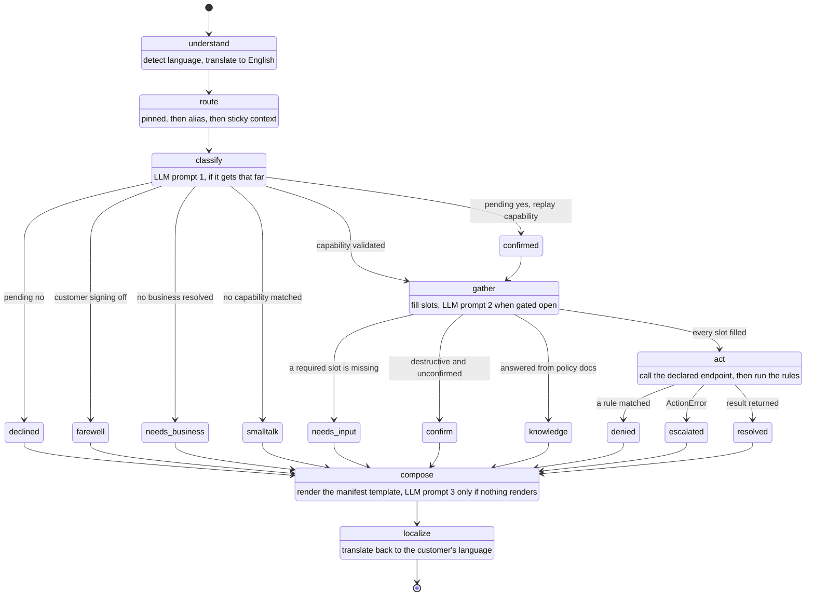
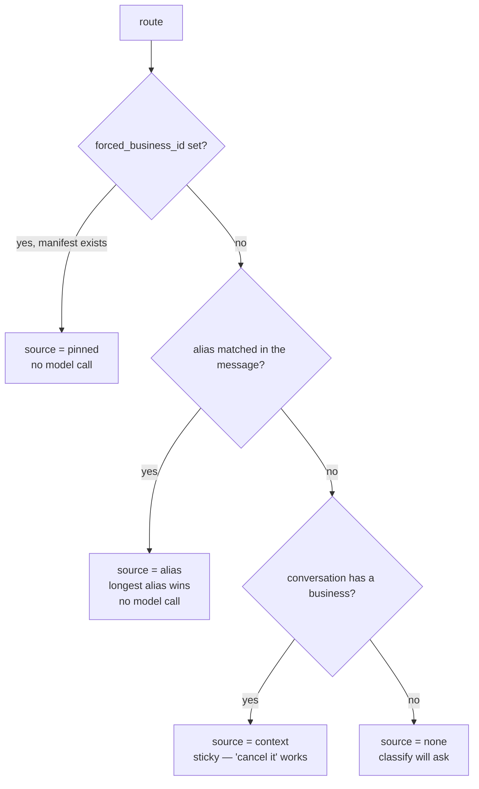
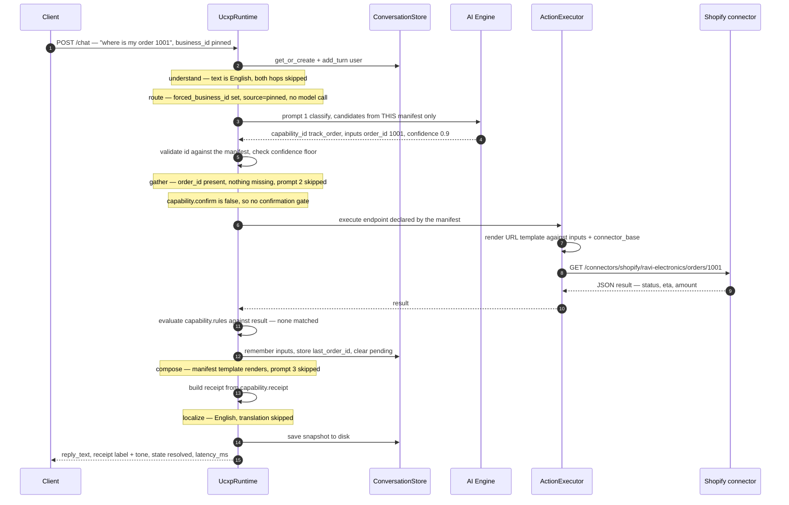
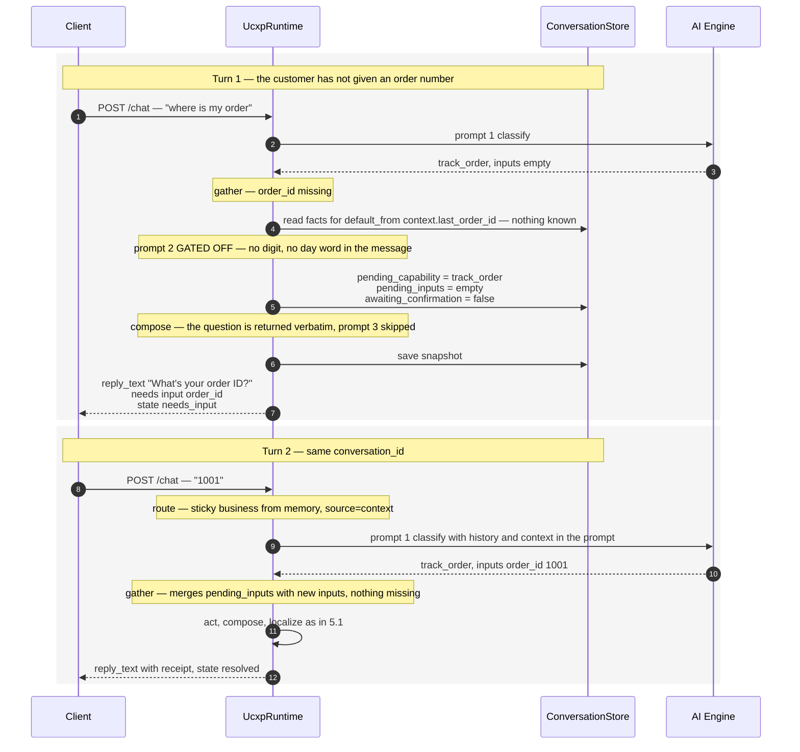
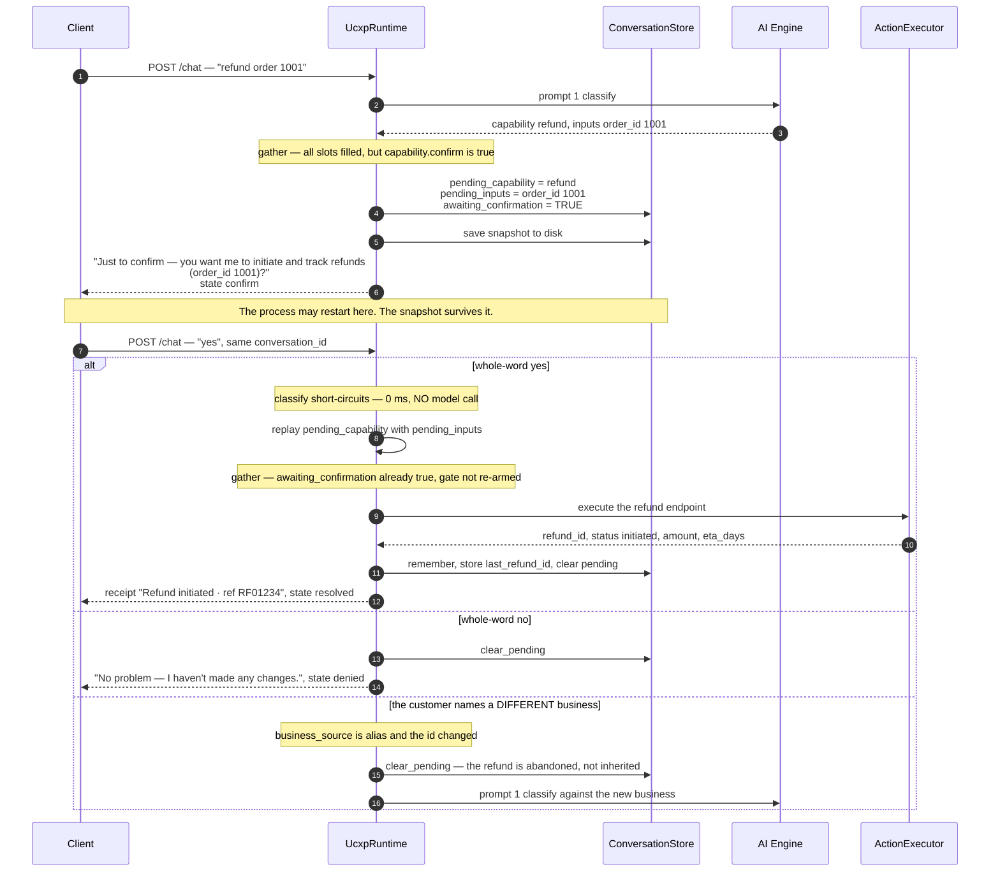
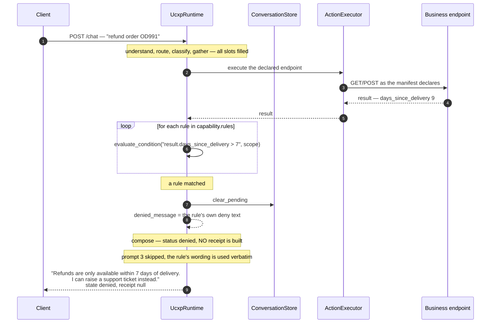

# Request lifecycle

One turn through the UCXP runtime, node by node, with every short-circuit drawn
and every LLM call accounted for.

**Related:** [architecture](./architecture.md) ·
[manifest spec](./manifest-spec.md) · [channels](./channels.md) ·
[data & memory](./data-and-memory.md) · [decisions](./decisions.md)

Source: [`backend/app/runtime/graph.py`](../backend/app/runtime/graph.py) and
[`backend/app/runtime/state.py`](../backend/app/runtime/state.py).

---

## 1. Why a graph at all

A turn looks linear until you write it down. It is not: three different nodes
can end the turn early, each for a different reason, and each has to persist
different state before it returns.

- `gather` ends the turn when a required slot is missing — after writing the
  pending capability and everything collected so far.
- `gather` also ends it when a destructive capability needs confirmation — after
  setting `awaiting_confirmation`.
- `act` ends it when a manifest rule denies — after *clearing* the pending
  state, because there is nothing left to confirm.
- `classify` ends it three more ways before any of that, all without a model
  call.

Written as a straight-line function with early `return`s, "did we persist the
pending capability on this path?" becomes a question you answer by reading
carefully. As a graph, the conditional edges *are* the specification, and the
node that causes a transition is the node that writes the state for it.

LangGraph is used purely as a state machine. It never sees a Sarvam credential;
every model call leaves through `runtime/llm.py`, so
[architecture rule 1](./architecture.md#4-the-layering-rules-as-a-dependency-graph)
survives the dependency.

---

## 2. The state machine

Terminal states are the `status` field the client receives.



Note that the graph's own conditional edges are coarser than the diagram — the
compiled graph has exactly two decision points:

```python
# classify → gather when a capability survived validation, else straight to compose
lambda s: "gather" if s.get("capability_id") else "compose"

# gather → compose when we must ask something, else act
lambda s: "compose" if s.get("missing_input") or s.get("knowledge_answer") else "act"
```

Everything else in the diagram is a *status* set inside a node. That is
deliberate: the edges express control flow, the status expresses outcome, and
they are not the same taxonomy.

---

## 3. Nodes

| # | Node | Reads | Writes | May call the model |
|---|---|---|---|---|
| 1 | `understand` | `raw_text`, `language_hint` | `language`, `english_text`, `degraded` | `detect_language`, `translate` — both skipped for English |
| 2 | `route` | `english_text`, `forced_business_id`, conversation | `business_id`, `manifest`, `business_source` | **Never** |
| 3 | `classify` | `english_text`, manifest, conversation | `capability_id`, `inputs`, `confidence`, or a terminal flag | prompt 1, **gated** |
| 4 | `gather` | capability, `inputs`, conversation facts | `inputs`, `missing_input`, `missing_prompt`, `knowledge_answer` | prompt 2, **gated** |
| 5 | `act` | capability, `inputs` | `result`, `denied_message`, `action_error` | **Never** |
| 6 | `compose` | everything | `reply_en`, `receipt`, `status` | prompt 3, **gated** |
| 7 | `localize` | `reply_en`, `language` | `reply_text`, `degraded` | `translate` — skipped for English |

### 3.1 `understand`

Detects the language (or trusts a caller-supplied hint — `/voice` passes what
Sarvam's STT heard, so no second detection is paid) and translates to English,
the reasoning language.

Both hops are skipped entirely when the text is already `en-IN`. If translation
fails, `translate_in` is appended to `degraded` and reasoning proceeds on the
original text — `sarvam-105b` is multilingual, so degrading beats failing.

### 3.2 `route`

The only node that decides which business a turn belongs to, in strict priority
order:



There is no LLM branch here. `business_source` is carried forward because
`classify` needs it to decide whether a newly named business should cancel a
pending confirmation.

**Security property:** whatever the classifier later echoes back as
`business_id` is discarded. The router owns the decision, so no model output can
move a customer to a store they did not ask for.

### 3.3 `classify`

Four short-circuits fire before the model is considered:

1. **Pending confirmation + a whole-word yes** → replay `pending_capability`
   with `pending_inputs`, confidence 1.0, `classify_ms = 0`.
2. **Pending confirmation + a whole-word no** → clear pending, reply "No problem
   — I haven't made any changes."
3. **Pending confirmation + a *different* business named by alias** → cancel the
   pending action rather than inheriting it.
4. **Farewell** → a fixed reply, checked *after* the yes/no branch so that "no"
   answering a confirmation is a decline, not a goodbye.
5. **No business resolved** → ask which one, and optionally extract a plausible
   brand name for a web lookup. Deliberately no model call: classifying a
   five-business catalogue to conclude "I don't know which" cost ~38 s and told
   us nothing the router had not already established.

Only then does prompt 1 run — and it runs against **one manifest**, not the
directory, because the router has already resolved the business. That keeps the
prompt small.

The returned `capability_id` is then validated three ways: it must exist in the
manifest, there must *be* a manifest, and `confidence` must clear
`UCXP_MIN_CONFIDENCE` (default 0.35). Any failure drops it to `None`, which
routes the turn to `compose` as small talk.

### 3.4 `gather`

Slots are filled in this order:

1. anything already pending from a previous turn,
2. whatever `classify` extracted,
3. manifest-declared defaults (`default_from: context.last_order_id`) resolved
   against conversation facts through the same renderer used for URLs.

Then, and only if something is still missing **and** the message plausibly
contains a value, prompt 2 runs. See §4.

Three exits: a knowledge answer (the policy docs answered them, no action
needed), a missing slot, or a confirmation gate. All three persist the pending
state before returning so the next turn can pick it up.

### 3.5 `act`

Renders and calls the endpoint the manifest declares, via `ActionExecutor`. Then
evaluates the capability's rules **against the result** — which is why rules need
no LLM: they are expressions over data that already exists.

On success it writes back to memory: `conversation.remember(...)` stores every
collected input as `last_<name>`, and any result field whose key ends in `_id`
or `_ref` becomes `last_<key>`. That is what makes a follow-up turn work without
the customer repeating anything.

An `ActionError` is caught and turned into `action_error`, which `compose`
renders as the manifest's escalation message. A failed action must never be a
500 — the customer needs a sentence, not a stack trace.

### 3.6 `compose`

Decides what to say, in this order:

1. an unknown business named in the message → optional web lookup (§6),
2. `_outcome()` classifies the turn into `(outcome, facts, template, status)`,
3. questions back to the user (`needs_input`, `confirm`, `needs_business`) return
   **immediately, unparaphrased** — they are already correctly worded and pushing
   them through a model risks losing the ask,
4. otherwise the manifest template is rendered, and prompt 3 runs only if
   nothing rendered.

The receipt is built here too, and only when `status == "resolved"`. A receipt
whose label fails to render is dropped rather than shown broken.

### 3.7 `localize`

Translates the reply back into the customer's language. Skipped for English. A
failure appends `translate_out` to `degraded` and returns the English reply —
the customer gets an answer in the wrong language rather than no answer.

---

## 4. The three prompts, and where they are gated

Prompts are `.md` files in
[`backend/app/runtime/prompts/`](../backend/app/runtime/prompts/), loaded through
an `lru_cache` and rendered with the same `{{placeholder}}` engine the manifests
use — so they can be edited without touching code.

| Prompt | Node | Runs when | Gated because |
|---|---|---|---|
| `classify.md` | `classify` | a business is resolved and no short-circuit fired | five cheaper branches answer first |
| `prepare.md` | `gather` | a required slot is missing **and** `_might_contain_value(text)` | if the message has no digit and no day-word there is nothing for an extractor to find — asking is faster and better |
| `respond.md` | `compose` | no manifest template rendered | the business already wrote the sentence; paraphrasing it is slower *and* non-deterministic |
| `unknown_business.md` | `compose` | a brand with no manifest was named and web search is configured | otherwise the ordinary "which business?" reply stands |

### The measurements that produced the gates

| Change | Before | After |
|---|---|---|
| Three ungated prompts per turn ([`PLAN.md`](../PLAN.md) §7 #16) | **58 s** | **~10 s** |
| Synthesising response templates so `compose` stops falling through (#37) | greeting 52 s, lookup 44 s | greeting **2.1 s**, lookup **8.6 s** |
| Small talk answered from a manifest-built welcome instead of prompt 3 (#38) | ~40 s | instant |
| Skipping the classifier when no business is resolved (#39) | 38 s | **364 ms** |

`UCXP_COMPOSE_WITH_LLM=always` restores unconditional prompt 3 for comparison;
`never` forces template-only.

### `_might_contain_value`, in full

```python
_VALUE_LIKE = re.compile(
    r"\d|\b(today|tomorrow|tonight|monday|...|sunday)\b", re.I
)
```

Identifiers, dates and amounts all contain a digit or a day word. It is a
deliberately crude gate: a false negative costs one extra question, a false
positive costs one wasted round trip. Both are cheap; a 20-second wasted round
trip on every turn is not.

### Model output is treated as untrusted

`think_json` asks for strict JSON and tolerates what reasoning models actually
return: fenced blocks, a sentence of preamble, or braces embedded in prose. It
tries the fence, then the raw string, then the outermost `{…}` span. Anything
unparseable returns `{}` and the turn degrades gracefully.

Tool-calling is deliberately **not** used. Structured JSON output is the
contract, and it is validated against the manifest before anything executes —
which is the only place the validation can be guaranteed.

---

## 5. Sequence diagrams

### 5.1 A completed job with a receipt

The happy path: one model call, one HTTP call, a rendered template.



Measured live on the deployed runtime: **13.3 s** end to end, of which the
single classify call dominates.

### 5.2 A slot-filling turn, across two requests



`needs` exists so a client *can* render a targeted input field. A client that
only renders `reply_text` is already correct.

### 5.3 A confirmation-gated destructive action

`confirm` is set on a capability whose name contains a destructive verb —
`refund`, `cancel`, `delete`, `return`, `close`, `unsubscribe`. See
[manifest-spec.md §6](./manifest-spec.md#6-what-the-published-schema-cannot-express)
for why that is inferred rather than declared.



The third branch exists because of a real bug. `CONFIRM_YES` originally matched
as a substring, so the "ha" inside an ordinary word confirmed a refund pending
on a *different* business — a destructive action executed with no yes given.
Matching is now whole-word, and a business switch cancels the pending action.
([`PLAN.md`](../PLAN.md) §7 #40.)

### 5.4 A rule denial



Three things this shows:

- **Rules run after the action, not before.** They are expressions over the
  result, which is the only place the data exists. The action is a read or an
  initiation, never an irreversible commit, so this ordering is safe.
- **The rule's own text is returned unchanged.** The business wrote the refusal;
  the runtime does not soften it.
- **No receipt.** A denial is not a completed job, and the client will not render
  an action card for it.

An unevaluable rule (a missing field, a syntax error) is logged and **skipped**,
not treated as a denial — `evaluate_condition` raises `RuleError` and `act`
continues to the next rule. A broken rule must not silently block every refund.

---

## 6. The unusual paths

### Knowledge answers

If prompt 2 finds the answer in the manifest's `knowledge` (built from the
merchant's `policies` and `faq`), `gather` returns it directly with
`status = "resolved"` and no action runs. A policy question — "how long do
refunds take?" — is legitimately resolved by quoting policy.

### Unknown businesses

If a capitalised brand name is present that no manifest matches, `compose` tries
a web lookup (Tavily, Brave or Serper, provider inferred from whichever key is
set) and answers usefully before inviting them to onboard.

**Unverified:** no key was available when this was written, so it has never run
against a live provider. With no key configured the feature is off and the
ordinary "which business?" reply stands. ([`PLAN.md`](../PLAN.md) §7 #41.)

### Farewells

`_is_farewell` matches whole phrases and a small set of standalone words. `"bye"`
alone ends the conversation; `"bye"` inside a sentence does not. `/voice` appends
a hang-up hint to a farewell and a follow-up invitation to anything else —
applied in the channel, not the graph, because the same reply shown in a chat
window would just be noise.

---

## 7. `TurnState`

The dict every node reads and adds to. Two fields use LangGraph reducers so
per-node contributions **accumulate** instead of the last writer winning:

```python
degraded: Annotated[list[str], merge_degraded]   # union, order preserved
latency:  Annotated[dict[str, float], merge_latency]  # merge, not overwrite
```

Without those, `latency` would only ever hold the last node's timing.

| Group | Fields |
|---|---|
| Input | `conversation_id`, `user_id`, `raw_text`, `language_hint`, `forced_business_id` |
| `understand` | `language`, `english_text` |
| `route` | `business_id`, `manifest`, `business_source` |
| `classify` | `capability_id`, `confidence`, `inputs`, `needs_business`, `unknown_business`, `farewell` |
| `gather` | `missing_input`, `missing_prompt`, `knowledge_answer` |
| `act` | `result`, `denied_message`, `action_error` |
| `compose` | `reply_en`, `receipt` |
| Output | `reply_text`, `status`, `degraded`, `latency` |

`status` values: `resolved · needs_input · confirm · denied · escalated ·
smalltalk · needs_business · unknown_business · failed`.

---

## 8. Failure and degradation

| Failure | Behaviour | Surfaced as |
|---|---|---|
| Language detection fails | assume `en-IN` | — |
| Inbound translation fails | reason on the original text | `degraded: ["translate_in"]` |
| Prompt 1 fails or returns junk | `{}` → no capability → small talk | `state: smalltalk` |
| Model returns an id the manifest lacks | dropped, logged | `state: smalltalk` |
| Confidence below the floor | dropped, logged | `state: smalltalk` |
| Endpoint times out or 4xx/5xx | `ActionError` with a customer-safe message | `state: escalated`, escalation message |
| Response template references a missing key | `RenderError`, logged loudly, empty template → prompt 3 fires | usually invisible |
| Receipt label fails to render | receipt dropped | `receipt: null` |
| Prompt 3 fails | fall back to the manifest template | — |
| Nothing renders at all | "I couldn't complete that. Let me get a human to help." | `state: escalated` |
| Outbound translation fails | return the English reply | `degraded: ["translate_out"]` |
| TTS fails (`/voice`) | return text only | `degraded: ["tts"]` |

`degraded` is part of the response contract on every channel, so a client can
show that something was partial rather than pretending it was clean.

---

## 9. Where this differs on other channels

`/voice`, `/document` and WhatsApp all call the same `UcxpRuntime.run()` and get
exactly this lifecycle. `/agent/execute` **does not** — it is a separate,
Sarvam-free implementation that skips `understand`, `route`, `classify`,
`compose` and `localize` entirely. See
[channels.md §5](./channels.md#5-samvaad-agent-tools) for what that gains and
what it costs.
