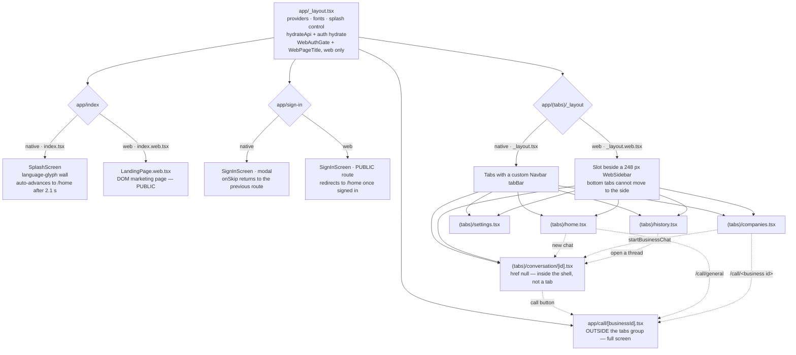
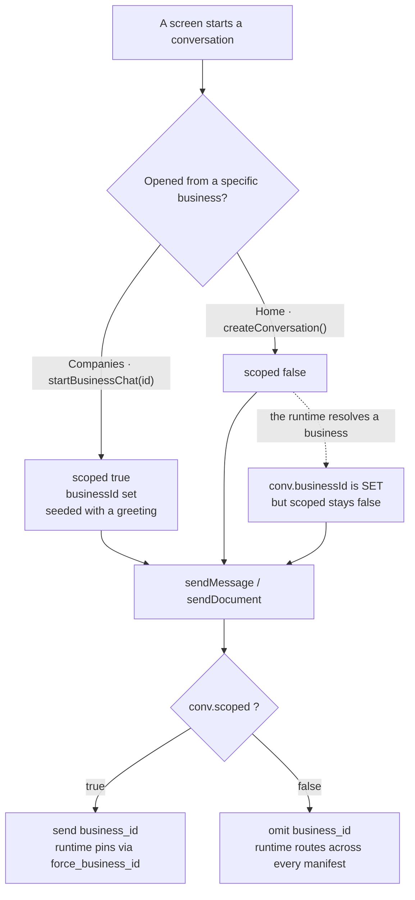

# Sahayak — client

The client side of Sahayak. One Expo codebase, three shipped surfaces, talking
to the hosted UCXP Runtime.

**This is the companion to the [root README](../README.md).** For what UCXP is,
why the runtime contains no business-specific code, and how the backend works,
read [`docs/architecture.md`](../docs/architecture.md) — none of that is
repeated here.

---

## 1. What this actually is

> **It is no longer mocked.** An earlier version of this file said "every network
> call is mocked behind a clean API layer". That stopped being true when the app
> was wired to the runtime. There are **no fixture files and no canned replies
> left** in `src/` — `chat.ts` and `documents.ts` return an explicit
> "not connected" message, `voice.ts` and `call.ts` **throw**, `businesses.ts`
> returns `[]`, and `history.ts` returns the user's own local threads.

Three surfaces are built from this one directory:

| Surface | Built by | Notes |
|---|---|---|
| **Android APK** | `npx expo run:android --variant release` | Real mic, real playback, documents |
| **Web SPA** | `npx expo export -p web` → Vercel | Landing page at `/`, app at `/home` |
| **Voice call screens** | shared | `app/call/[businessId]` — the same screens both surfaces use |

The app talks to the runtime over the HTTP contract described in
[`docs/channels.md`](../docs/channels.md). Business routing, memory, receipts and
multilingual replies all live server-side; the client carries a
`conversation_id` and, for a scoped chat, a `business_id`.

### The one remaining mock path

`isMockMode()` in `src/api/client.ts`:

```ts
export function isMockMode(): boolean {
  if (process.env.EXPO_PUBLIC_FORCE_MOCK === "1") return true;
  // An override makes us live even when nothing was compiled in — that is the
  // whole point of shipping with a placeholder.
  return !overrideUrl && !RAW_BASE_URL;
}
```

Mock mode therefore means: **no `EXPO_PUBLIC_API_URL` compiled in, and no
Settings → Backend override stored**. In that state the app does not fabricate
outcomes — it says it is not connected. That was a deliberate change: returning a
canned transcript once made a broken microphone look like a working demo and cost
real debugging time.

> The dev-console banner still prints `"[api] MOCK mode — canned replies."` The
> wording is stale; there are no canned replies.

---

## 2. Stack

| Concern | Choice |
|---|---|
| Framework | Expo SDK `~57.0.8` · React Native `0.86.0` · React `19.2.3` |
| Language | TypeScript, strict |
| Navigation | Expo Router `~57.0.8`, typed routes |
| Styling | NativeWind `^4.2.6` (Tailwind 3.4), light + dark |
| Client state | Zustand `^5.0.14` |
| Server state | TanStack Query `^5.101.4` |
| Animation | Reanimated `4.5.0` + `react-native-worklets` |
| Audio | `expo-audio ~57.0.3` (native) · `MediaRecorder` (web) |
| Auth | `@supabase/supabase-js ^2.110.9` — pure JS, no native module |
| Files | `expo-document-picker ~57.0.1` |
| Icons / fonts | `lucide-react-native` · Inter via `@expo-google-fonts` |

`react-hook-form` is declared in `package.json` but **imported nowhere**.

`@supabase/supabase-js` was chosen specifically because it is pure JS: a native
auth module would require `expo prebuild`, which would wipe the hand-patched
`android/` directory (§8).

---

## 3. Screen and navigation map



### Route files

| Route | Renders | Web variant |
|---|---|---|
| `app/_layout.tsx` | root layout | — |
| `app/index.tsx` | `SplashScreen` | `index.web.tsx` → `LandingPage.web` |
| `app/sign-in.tsx` | `SignInScreen`, modal | `sign-in.web.tsx` |
| `app/(tabs)/_layout.tsx` | `<Tabs>` + `Navbar` | `_layout.web.tsx` → `<Slot>` + sidebar |
| `app/(tabs)/home.tsx` | `HomeScreen` | screen-level `.web.tsx` |
| `app/(tabs)/companies.tsx` | `CompaniesScreen` | screen-level `.web.tsx` |
| `app/(tabs)/history.tsx` | `HistoryScreen` | screen-level `.web.tsx` |
| `app/(tabs)/settings.tsx` | `SettingsScreen` | screen-level `.web.tsx` |
| `app/(tabs)/conversation/[id].tsx` | `ConversationScreen` | screen-level `.web.tsx` |
| `app/call/[businessId].tsx` | `CallScreen` | none — one implementation |

Note the split: **route files have almost no web variants; the screens do.**
Metro resolves `src/screens/Foo.web.tsx` automatically, so routing stays
single-source while layout diverges where it must.

`conversation/[id]` is registered with `options={{ href: null }}` so a thread
renders *inside* the tab shell without becoming a tab. `call/[businessId]` sits
outside `(tabs)` deliberately — a call is full-screen, and on web it renders
with no sidebar.

### Root layout, in order

1. `import "../global.css"` (NativeWind).
2. `SplashScreen.preventAutoHideAsync()`.
3. `hydrateApi()` — reads the stored backend override from AsyncStorage
   **before anything can issue a request**.
4. `useAuthStore.hydrate()` — restores the Supabase session and pushes the token
   into the transport.
5. Fonts, with a **1200 ms timeout fallback** and `fontError` also treated as
   ready — a font CDN hiccup must not leave the app on a blank splash forever.
6. Gate: `mustSignIn = authConfigured && !user && !WEB`.
7. Providers: `GestureHandlerRootView > SafeAreaProvider > QueryClientProvider >
   ThemeSync + (SignInScreen | Stack)`.

`WebAuthGate` and `WebPageTitle` both live inside `app/_layout.tsx` and render
only on web. The gate keeps `/` and `/sign-in` public and bounces every other
route to sign-in — so a web visitor sees the landing page before a password
form, while an installed app (whose user has already been sold) is gated at the
root. `WebPageTitle` sets `document.title` per route, because the web tab layout
renders a `Slot`, not `Tabs`, so per-screen `title` options never reach it.

---

## 4. The API layer

Every module has a stable exported signature and routes through `client.ts`, so
the transport can change in one place.

| Module | Endpoint | Returns | Mock-mode behaviour |
|---|---|---|---|
| `chat.ts` | `POST /chat`, 120 s | one assistant `Message`, with `action` when a receipt is present | a "not connected, set `EXPO_PUBLIC_API_URL`" message |
| `voice.ts` | **`POST /transcribe`** | `{ transcript }` | **throws** `ApiError("Voice needs the backend…")` |
| `call.ts` | `POST /voice`, 120 s, `speak=true` | `{ transcript, reply, audioBase64, receipt, businessId, conversationId, state, language }` | **throws** |
| `documents.ts` | `POST /document`, 150 s | a `Message` plus `document_kind` / `extracted_chars`; `status: "error"` when `state === "failed"` | a "not connected, can't read that file" message |
| `businesses.ts` | `GET /businesses` | `Business[]`, and populates the synchronous `getBusiness()` cache | `[]` |
| `history.ts` | `GET /history`, 10 s | `ConversationSummary[]` — server rows merged with local threads, local winning on id collisions | local threads only |
| `client.ts` | — | transport, errors, auth, base URL | — |

> `voice.ts`'s own docstring says `POST /voice`. It calls **`/transcribe`**.
> `/voice` is what `call.ts` posts to. The comment is wrong, the code is right —
> the split exists so the app can show the customer their own words before the
> slow part starts. See
> [`docs/channels.md`](../docs/channels.md#3-app-and-web-chat).

`documents.ts` also special-cases a 404 into a clearer message —
*"This backend doesn't support document upload yet — it needs to be redeployed
with the /document endpoint"* — because a bare 404 on an upload is
indistinguishable from a routing bug. `history.ts` swallows any throw and falls
back to local threads, so being offline or signed out never surfaces an error on
that screen.

### Transport decisions in `client.ts`

**Base URL resolution accepts two forms.**

```ts
if (!RAW_BASE_URL) return "http://localhost:8000";
if (/^\d+$/.test(RAW_BASE_URL)) {
  const host = metroHost() ?? "localhost";     // from Constants.expoConfig.hostUri
  return `http://${host}:${RAW_BASE_URL}`;
}
return RAW_BASE_URL.replace(/\/+$/, "");
```

A **bare port** (`8000`) is resolved against the machine serving Metro. That is
for LAN development only: a laptop's LAN IP changes with the network, and a
stale IP is indistinguishable from a broken backend, whereas Metro's host is
reachable by definition — the bundle came from it.

**Anything shipped must use a full `https://` URL.** In a standalone APK or a
Vercel build there is no Metro host, so the bare form falls back to
`http://localhost:8000` — the device itself — and silently drops to mocks.
Android 9+ also refuses cleartext.

**The Settings override exists because `EXPO_PUBLIC_*` is inlined at bundle
time.** A shipped APK could otherwise never be repointed; every backend change
would mean a full Gradle rebuild.

```ts
const OVERRIDE_KEY = "sahayak.apiBaseUrl";
let overrideUrl: string | null = null;         // module-level, kept in memory

export function getApiBaseUrl(): string {
  return overrideUrl ?? COMPILED_BASE_URL;
}
```

`loadApiOverride()` runs once at startup, before any request, and the value is
held in a module-level variable so `getApiBaseUrl()` stays **synchronous** on
every request path. `setApiOverride()` normalises a bare host to `https://` and
persists it. Settings → Backend has a **Test** button that pings `/health` and
reports the manifest count.

**Auth tokens are pushed in, never pulled.**

```ts
let authToken: string | null = null;
export function setAuthToken(token: string | null): void { authToken = token; }
```

The auth store calls this on hydrate, on every `onAuthStateChange`, and on sign
out. The transport therefore has **no dependency on Supabase** — the same reason
the base URL is injectable rather than imported.

**Uploads use `XMLHttpRequest`, not `fetch`.** Deliberate and non-obvious:

> Expo SDK 57's global `fetch` is WinterCG-compliant and rejects React Native's
> `{uri, name, type}` FormData part with *"Unsupported FormDataPart
> implementation"*. Its supported alternatives (`Blob`, or an object with
> `bytes()`) mean reading the whole file into JS memory, and on a bare workflow
> that needs a native module the existing dev build does not have. React
> Native's own XHR networking accepts the URI part and streams the file
> natively — no rebuild, no copy.

`postForm` also sets no `Content-Type`, so React Native fills in the multipart
boundary itself.

**Error normalisation.** The AI Engine answers `{success: false, error: {…}}`;
the runtime raises FastAPI's `{detail: "…"}`. Both are folded into one
`ApiError` carrying `message`, `status` and `code`, by a single extractor shared
by the `fetch` and XHR paths. The XHR path previously read only `error.message`
and dropped `detail`, so every runtime error arrived as a bare
`"Request failed (HTTP 404)"` — precisely the information needed to diagnose it.

---

## 5. State management

Three Zustand stores. **None use `persist`.** The only AsyncStorage keys in the
app are `client.ts`'s `sahayak.apiBaseUrl` and Supabase's own session storage.

### `useConversationStore`

| State | |
|---|---|
| `conversations: Conversation[]` | in-memory only — a restart loses every thread |
| `activeId: string \| null` | the open thread |
| `selectedBusinessId?: BusinessId` | defined, but never read outside the store |

Actions: `createConversation`, `startBusinessChat`, `setActive`,
`setSelectedBusiness`, `sendMessage`, `sendDocument`, `recordVoiceTurn`,
`getConversation`.

A shared `beginTurn()` helper appends the user message plus a `pending: true`
assistant bubble and returns a patcher, so all three send paths render optimistic
state identically.

Because threads are not persisted, **History depends on `GET /history`** — which
is why the runtime records turns durably at all.

### `useAuthStore` (Supabase)

State: `user`, `ready`, `busy`, `error`. Actions: `hydrate`, `signIn`, `signUp`,
`signInWithGoogle`, `signOut`, `clearError`.

The token flows **outward**:

```ts
const { data } = await supabase.auth.getSession();
setAuthToken(data.session?.access_token ?? null);

supabase.auth.onAuthStateChange((_event, next) => {
  setAuthToken(next?.access_token ?? null);
  set({ user: next?.user ? { id: next.user.id, email: next.user.email ?? "" } : null });
});
```

`hydrate()` sets `ready: true` in a `finally` on every path, so a Supabase outage
cannot leave the app stuck before the gate. `signInWithGoogle` is **web-only** —
the native OAuth flow was removed deliberately so one code path serves both, and
so no native sign-in module forces an `expo prebuild`.

### `useSettingsStore`

State: `theme` (**default `"dark"`**), `apiOverride`, `apiReady`. Actions:
`setTheme`, `hydrateApi`, `saveApiOverride`.

That is the entire settings surface: theme and backend URL. **There is no
language setting** — language is detected server-side per turn, so a client
preference would be a lie. Theme is **not persisted** (§10.3).

### What deliberately does *not* live in a store

- **The business directory.** Server-driven from `GET /businesses` and cached in
  `src/constants/businesses.ts` via `setBusinesses()`, so the synchronous
  `getBusiness(id)` works everywhere. Hardcoding it would put business data in
  the client, which is exactly what the protocol exists to avoid.
- **History.** Read from the runtime through TanStack Query, merged with local
  threads.
- **Conversation memory.** Entirely server-side. The client carries only a
  `conversation_id`.

---

## 6. The business-scoping rule

The thing most likely to be got wrong, so here it is exactly.



The distinction that matters:

```ts
// src/types/index.ts
/**
 * True when the chat was opened *against* one business (from the directory).
 * Distinct from `businessId`, which a general chat also acquires once the
 * runtime resolves one — a general chat must stay able to switch businesses,
 * so only a scoped chat pins the runtime.
 */
scoped?: boolean;
```

```ts
// src/store/useConversationStore.ts — sendMessage and sendDocument, identically
// Pin only a scoped chat. A general chat acquires `businessId` once the
// runtime resolves one, but must stay switchable, so it is not sent.
businessId: conv?.scoped ? businessId ?? conv?.businessId : undefined,
```

**A conversation's `businessId` alone never leaves the device. Only
`scoped === true` sends it.** Get this wrong and a general chat becomes
un-switchable after its first answer.

| Where | Result |
|---|---|
| `CompaniesScreen` → `startBusinessChat(id)` | **scoped** — pinned |
| `CompaniesScreen` → `/call/<id>` | **pinned call** |
| `HomeScreen` → `createConversation()` | general |
| `HomeScreen` → `/call/general` | central line |
| `ConversationScreen` → send | inherits the thread's `scoped` |
| `recordVoiceTurn` creating a thread from a Home call | `scoped: false` |

At the wire, all three senders share one guard:

```ts
req.businessId && req.businessId !== "generic" ? req.businessId : undefined
```

The call route derives its target the same way:

```ts
// ConversationScreen — pinned call only for a scoped thread
conversation?.scoped && conversation.businessId ? conversation.businessId : "general"
```

> **Two sentinels, easy to confuse.** `"generic"` is the no-business *business
> id* used by `types`, `constants/businesses.ts`, `chat.ts`, `call.ts` and
> `documents.ts`. `"general"` is the no-business *route segment* in
> `/call/[businessId]`. Different namespaces, consistent code, near-identical
> words — a documentation trap.

Server-side, `business_id` becomes `force_business_id` — see
[`docs/channels.md`](../docs/channels.md#7-business-pinning).

---

## 7. Platform differences

| Area | Native | Web | Why |
|---|---|---|---|
| Voice capture | `expo-audio` `useAudioRecorder`, HIGH_QUALITY preset, `.m4a` | `useVoiceRecorder.web.ts` — `getUserMedia` + `MediaRecorder` with codec negotiation across webm/opus → webm → mp4 (Safari) → ogg, plus `AudioContext` + `AnalyserNode` RMS metering every 100 ms | `expo-audio` has no web mic capture. **Currently broken — §10.1** |
| Upload part | `{uri, name, type}` streamed over XHR | `blob:` URL read back into a real `Blob`; the DOM `File` for documents | RN has no `File`; the browser has no file URI |
| Playback | `createAudioPlayer` on `data:audio/wav;base64,…`, completion polled every 200 ms with a 30 s ceiling | same code path, no web branch | `pause()` **then** `remove()` — `remove()` alone left the reply playing after navigation. **Web playback is unverified (§10.2)** |
| Navigation shell | `<Tabs>` + custom `Navbar` | `<Slot>` + 248 px `WebSidebar` | bottom tabs cannot move to the side, and a floating pill nav in a wide window made web look like a stretched phone |
| Root route | `SplashScreen` → `/home` | public `LandingPage.web` | a web visitor must learn what Sahayak is before meeting a password form |
| Auth gate | the whole tree is replaced when signed out | the router mounts; `WebAuthGate` bounces non-public routes | §3 |
| Google sign-in | refused with a message | OAuth redirect via the browser | one code path, no native module, no `expo prebuild` |
| Supabase session | default | `detectSessionInUrl: true` | OAuth returns tokens in the URL on web only |
| Entering animations | Reanimated `FadeIn` / `FadeInUp` / `FadeInDown` | **disabled** | *"Reanimated `entering` animations stall under react-native-web: the view mounts at its initial opacity and never advances until something forces a repaint, so the screen sits there greyed out or invisible."* Documented in 7 files |
| Composer submit | multiline `TextInput` | `onKeyPress` — Enter sends, Shift+Enter newlines | on web a multiline `TextInput` is a `<textarea>`, where Enter is a newline and the submit event never fires |
| Z-order | default | explicit `zIndex: 1` on composer and voice-button icons | the absolutely-positioned gradient paints over static siblings on web |
| Content width | `MAX_CONTENT_WIDTH = 640` | 640, plus per-screen measures: Home 720, Conversation 760, History 860, Settings 960, Companies 1100 | without a cap every screen stretches edge to edge on a desktop browser — inputs a metre wide. Below the cap, phones are unaffected |
| "Open settings" button | `Linking.openSettings()` | hidden | native-only API |
| Marquee | default flex wrap | explicit `nowrap` | the duplicated strip wrapped onto a second line on web |

Entrance animations are disabled two ways — a conditional prop, and component
swapping:

```ts
const Row   = (Platform.OS === "web" ? View : Animated.View) as typeof Animated.View;
const ENTER = Platform.OS === "web" ? undefined : FadeInDown.duration(260);
```

### Native recorder notes

- **No metering.** A long comment explains why: no dB threshold survives across
  handsets, so end-of-turn is driven by an explicit tap.
- `settle()` guards `recorder.isRecording` before `stop()`, because a stale flag
  causes a native `IllegalStateException` crash on Android backgrounding.
- The AppState listener tears down on `"background"` only, never `"inactive"` —
  `"inactive"` fires for something as harmless as a notification-shade pull.
- Clip limits: `MIN_CLIP_MS = 700` and `MAX_CLIP_MS = 25000` in `CallScreen`
  (deliberately under Sarvam's 30 s cap), with a hard 30 s reject in `voice.ts`.

---

## 8. Build and run

### Development

```bash
cd frontend
npm install
npm run dev            # scripts/dev.sh — adb reverse, then expo start
```

`npm run dev` resolves `adb` from `$ANDROID_HOME` (default
`~/Library/Android/sdk`), picks the first attached device, runs
`adb reverse tcp:8081 tcp:8081` and `tcp:8000 tcp:8000`, probes
`localhost:8000/health`, then execs `npx expo start`.

**The `adb reverse` mapping is wiped every time the device reconnects** — that is
the usual cause of "stuck on splash" or "could not reach the backend". Re-apply
it with:

```bash
npm run forward
```

Point it at a backend:

```bash
echo 'EXPO_PUBLIC_API_URL=8000' > .env.local                      # LAN dev, bare port
echo 'EXPO_PUBLIC_API_URL=https://<app>.up.railway.app' > .env.local   # or a full URL
```

Type-check:

```bash
npx tsc --noEmit
```

> `tsc` resolves `@/hooks/useVoiceRecorder` to the `.ts` file and **never
> type-checks the `.web.ts` variant against its consumers.** That is how §10.1
> shipped.

All scripts, verbatim:

```json
"start":   "expo start",
"android": "expo run:android",
"ios":     "expo run:ios",
"web":     "expo start --web",
"dev":     "bash scripts/dev.sh",
"forward": "adb reverse tcp:8081 tcp:8081 && adb reverse tcp:8000 tcp:8000 && adb reverse --list"
```

There is no `export`, `build` or `lint` script — the web build command lives only
in `vercel.json`.

### Release APK

```bash
echo 'EXPO_PUBLIC_API_URL=https://<app>.up.railway.app' > .env.local
node -v                                   # must be on PATH
npx expo run:android --variant release
# → android/app/build/outputs/apk/release/app-release.apk
```

A **debug** APK contains no JS bundle — it pulls from Metro over `adb reverse`,
so unplugging kills it. Release compiles the bundle in. `build.gradle` already
signs release with the debug keystore, so there is no keystore to generate.
`node` must be on `PATH` because the release build shells out to it to produce
the bundle; debug builds do not, which is why this has never failed before.

Test properly: **unplug, kill the app, relaunch.**

### Web export

```bash
npx expo export -p web --output-dir dist && node scripts/finalize-web-head.mjs
```

`app.json` pins `web.output: "single"` (SPA), and `vercel.json` carries the
matching catch-all rewrite, a `/dashboard/*` rewrite, an
`npm install --legacy-peer-deps` install command, and an immutable cache header
on `/_expo/static/*`.

`scripts/finalize-web-head.mjs` post-processes `dist/index.html` — title,
description, OG and Twitter tags, light/dark `theme-color`, and a no-flash dark
script. It exists because `app/+html.tsx` applies only to static rendering, and
`output: "single"` makes Expo emit a fixed template. It is idempotent (guarded by
a `sahayak-head` marker) and exits 1 rather than guessing if Expo's template
stops matching.

### The build-order constraint

**Build the APK before installing web dependencies.**

Fifteen files under `node_modules` are hand-patched to read
`System.getProperty("NODE_EXECUTABLE")` so Gradle can find nvm's node. Any
`npm install` or `expo install` reverts them, and the Android build then fails
with `command 'node' not found`.

```bash
./scripts/android-patches.sh save      # BEFORE any install
npm install …
./scripts/android-patches.sh restore
./scripts/android-patches.sh check     # exits 1 if the patches are missing
```

The backup exists because `restore` cannot search for the patch after an install
— the `NODE_EXECUTABLE` marker is gone, so there is nothing left to find. It
works from a recorded manifest instead, and `save` refuses to write an empty
backup. The script matches `.gradle`, `.gradle.kts` **and** `.kt` (the Expo/RN
Gradle plugins are Kotlin); an earlier `--include="*.gradle"` matched only 5 of
15 and would have silently under-restored.

Building the APK first means a disturbed install costs the web build, never the
APK already on disk.

---

## 9. Environment variables

Names and purposes only. `EXPO_PUBLIC_*` values are **inlined into the bundle at
build time** — never put a secret here.

| Variable | Purpose |
|---|---|
| `EXPO_PUBLIC_API_URL` | Backend origin. A bare port resolves against the Metro host (LAN dev only); a full `https://` URL is required for anything shipped. Unset ⇒ `isMockMode()` |
| `EXPO_PUBLIC_FORCE_MOCK` | Force mock mode even when a URL is set |
| `EXPO_PUBLIC_SUPABASE_URL` | Auth project URL. Unset ⇒ the app runs signed-out and Settings hides the Account section |
| `EXPO_PUBLIC_SUPABASE_ANON_KEY` | **Anon key only.** It is public by design and safe in a shipped bundle; row-level security is what protects data. The `service_role` key must never appear here |

`app.json` identity: `scheme: "onesupport"`, and `com.ucxp.onesupport` for both
the iOS bundle id and the Android package. These were **deliberately not
renamed** with the product — they are invisible to users, and `android/` is
hand-patched under a standing "do not re-run `expo prebuild`" constraint.

Supabase redirect URLs must include `onesupport://` and the web origin. Supabase
silently falls back to its Site URL when `redirect_to` is not allow-listed,
which once made a working sign-in land on `localhost:3000`.

---

## 10. Known issues and limitations

Verified against the source. Nothing here is speculative.

### 10.1 Web voice is broken — the recorder hook's API does not match its callers

A real browser recorder exists (`src/hooks/useVoiceRecorder.web.ts`, using
`getUserMedia` + `MediaRecorder` + `AnalyserNode`), but the two hooks export
different shapes:

| | `useVoiceRecorder.ts` (native) | `useVoiceRecorder.web.ts` |
|---|---|---|
| `start()` | `Promise<StartResult>` — `{ok, issue?}` | `Promise<void>` |
| stop | **`stop(): Promise<Clip>`** | **`finish(): Promise<VoiceResult>`** |
| extras | — | `isPreparing`, `loudness`, `issue` |

Both consumers destructure the **native** shape:

```ts
// src/screens/CallScreen.tsx:121  and  src/components/VoiceOverlay.tsx:40
const { isRecording, durationMs, start, stop, cancel } = useVoiceRecorder();
```

On web `stop` is `undefined`, and `start()` resolves to `undefined` while
`CallScreen:147` does `if (!result.ok)`. The result: the microphone genuinely
opens, then the call screen throws and never leaves `"connecting"`. Nothing in
the codebase references `finish` or `loudness`.

This is a regression, not an unfinished feature — the native hook was rewritten
around an explicit turn loop and both call sites were updated; the `.web.ts`
sibling was not. `tsc --noEmit` passes because TypeScript resolves the import to
the `.ts` file and never checks the `.web.ts` against its consumers.

**For documentation purposes:** [`PLAN.md`](../PLAN.md) §7 #27 and §11.4 say web
voice is unsupported and simulated. That is now **stale as to intent** (a real
recorder was written) and **accidentally accurate as to behaviour** (it does not
work). Do not demo voice from a browser.

**Fix:** rename web `finish` → `stop`, return `{ok, issue}` from web `start()`,
or have both call sites consume one normalised interface.

### 10.2 Web audio playback is unverified

`CallScreen` plays a base64 WAV through `expo-audio`'s `createAudioPlayer` with
**no web branch**. Whether that works under `react-native-web` has not been
tested — reported here as unknown, not as working.

### 10.3 Theme does not persist

`useSettingsStore.theme` defaults to `"dark"` with no storage, so a user who
picks Light gets Dark back on relaunch. `finalize-web-head.mjs` also hard-codes
`classList.add('dark')` for first paint — consistent with the default, not with a
user's choice.

### 10.4 Conversations are not persisted on-device

`useConversationStore` is in-memory. A restart loses every local thread, and
History then shows only what the runtime returns — which, signed out or with
Supabase unconfigured, is nothing.

### 10.5 Stale comments that contradict the code

| File | Says | Reality |
|---|---|---|
| `src/api/client.ts` header | "Live mode talks to the **AI Engine** directly… interim" | It talks to the runtime |
| `src/api/client.ts:148` | `"[api] MOCK mode — canned replies."` | There are no canned replies left |
| `src/api/voice.ts:52` | `POST /voice` | It calls `/transcribe` |
| `src/api/voice.ts:68-75` | "on web, recording is disabled" | Recording is implemented on web; it is broken at the call site (§10.1) |
| `src/hooks/useHistory.ts:4` | "the mocked GET /history" | Not mocked |
| `src/types/index.ts:4` | "shapes the future backend will return" | Present tense |
| `app/sign-in.tsx` | "Not a gate: the app is usable signed-out" | With Supabase configured, native is fully gated by `_layout.tsx` |
| `.env.example` | "Leave this UNSET to run fully mocked — the app works with no backend at all" | Voice and calls throw; Companies is empty |
| `src/hooks/useVoiceRecorder.ts:72` | `Platform.OS === "web"` early return | Unreachable now that a `.web.ts` sibling exists |

### 10.6 Dead code and unused dependencies

`react-hook-form` is a dependency with no imports.
`useConversationStore.selectedBusinessId` / `setSelectedBusiness` are defined but
never read outside the store. `expo-web-browser` and `expo-linking` remain
dependencies although the native Google OAuth flow that used them was removed.

### 10.7 The deploy depends on an untracked directory

`frontend/public/dashboard/` holds a prebuilt bundle that the landing page links
to in two places and that `vercel.json` rewrites for. It is **untracked and not
gitignored**, so a clean checkout would deploy without it and those links would
404.

### 10.8 `app.json` colour drift

Splash and adaptive-icon background are `#0A0E17`; the app's actual dark canvas
in `constants/theme.ts` — and the one `finalize-web-head.mjs` injects — is
`#12100C`. Cosmetic, but it shows as a flash on cold start.

---

## 11. Where to read next

| For | Read |
|---|---|
| What UCXP is, and the backend | [root README](../README.md) · [`docs/architecture.md`](../docs/architecture.md) |
| The HTTP contract this client calls | [`docs/channels.md`](../docs/channels.md) |
| What happens to a message after it leaves here | [`docs/request-lifecycle.md`](../docs/request-lifecycle.md) |
| Deploying the web build and the APK | [`docs/operations.md`](../docs/operations.md) |
| Why the client is shaped this way | [`docs/decisions.md`](../docs/decisions.md) §5 |
